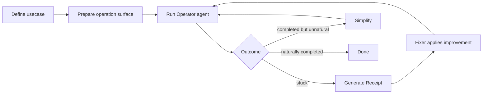

# Agent Operation Driven Development (AODD)

A development practice that places **a stuck agent's operation log**, not a failing test, at the center of the loop. The agent's lived attempt to use the product is what *drives* the next change — hence "operation driven", in the same sense that TDD is "test driven".

```text
TDD:  test fails       → implement → test passes
AODD: agent operates   → inspect   → improve product → agent completes naturally
      (and gets stuck)
```

The deliverable is not `pass / fail`. It is a **Usecase Receipt**: a structured record of how an autonomous user actually experienced the product — where they hesitated, retried, guessed, or gave up.

This skill is the methodology, not a specific tool. Apply it to any product that has a user-facing operation surface (browser, CLI, API consumed by humans, etc.).

---

## When to invoke this skill

Use AODD when the user asks for any of:

- "Run an agent through this product and tell me where it gets stuck."
- "Evaluate the onboarding / signup / first-use experience as if you were a real user."
- "Try to complete <user goal> using only the UI and report frictions."
- "What should we fix next based on actually using the product?"
- Any framing that prioritizes **felt user friction** over **assertion-based correctness**.

Do **not** invoke this skill for:

- Writing or running unit / integration / E2E tests against known specifications.
- Reproducing a bug that already has a known repro path.
- Code review or static analysis tasks.

---

## The five principles

These are non-negotiable. If a step in the loop violates one, stop and reframe.

1. **Real Surface First** — operate through the same surface a real user touches. No internal RPC shortcuts, no pre-seeded auth bypass, no dev-only overlays.
2. **Getting Stuck Is Signal** — friction is product input, not test failure. Treat each stuck moment as a feature request candidate.
3. **Receipts Over Assertions** — record the full transcript: actions, observations, hesitations, retries, error text, screenshots, network/log snapshots. `pass/fail` discards 90% of the value.
4. **Operator and Inspector Are Separate** — the agent that *operates* the product must not be allowed to *inspect server internals* or *edit code* during the run. Mixing roles lets the agent bypass UX problems instead of feeling them.
5. **Completion Is Not Enough** — finishing the goal does not mean success. If the agent had to retry, guess at error meanings, read internal logs, or accept dangerous prompts, mark the run `degraded` or `suspicious`.

---

## The cycle: stuck → complete → simplify

Mirrors TDD's `red → green → refactor`.

```text
stuck      — agent fails to progress; capture why
complete   — product is changed so the agent finishes naturally
simplify   — remove residual workarounds, retries, or guess-paths
```



---

## Phase 1 — Define the usecase

Before any agent runs, agree on these with the user. Do not assume.

| Field | Description | Example |
|---|---|---|
| `usecase` | One-line goal in user language | "New user signs up and reaches the dashboard" |
| `actor` | Who is being simulated | "first-time user / coding agent with no prior context" |
| `goal` | Success criterion in user-observable terms | "Account created and first project opened" |
| `entry_point` | Where the run starts | "Public landing page, logged out, fresh session" |
| `out_of_scope` | What the agent must *not* do | "No internal admin routes; no API direct calls" |
| `time_budget` | Soft limit before run is killed | "10 minutes" |

Record these. They are the contract for the run.

---

## Phase 2 — Prepare the operation surface

This is where most AODD attempts go wrong. The point is to make the agent feel what a real user feels.

### Use a production-equivalent build

- **Avoid** dev servers with hot reload, dev overlays that show stack traces, mocked auth, seeded test users with magic privileges.
- **Prefer** a staging deploy of the production build, real auth provider, real CDN behavior, real error pages.

If only a dev environment is available, explicitly note this as a confound in the Receipt.

### Split tools into three layers

The Operator agent must only see layer 1. Layers 2 and 3 belong to other roles.

**Layer 1 — User-equivalent tools (Operator only)**

Things a real user can do. This is the entire interface the Operator sees.

```text
browser.screenshot
browser.get_dom_snapshot
browser.get_accessibility_tree
browser.click
browser.type
browser.navigate
browser.wait_for_text
browser.go_back
```

**Layer 2 — Inspector tools (Inspector only, post-hoc)**

Things only used to *explain* what happened, never to drive progress.

```text
inspector.read_server_logs
inspector.get_network_trace
inspector.get_console_errors
inspector.get_db_snapshot
inspector.get_session_state
```

**Layer 3 — Controlled internal tools (Runner harness only)**

Test scaffolding. Never exposed to Operator or Inspector during a run.

```text
runner.reset_state
runner.seed_data
runner.force_logout
```

If your environment lacks Layer 2 tools, the Receipt will still be useful — it just leans more on Operator transcript and screenshots for evidence.

---

## Phase 3 — Role separation

Run as three logical agents. They can be the same model with different prompts and tool sets, but the **tool boundary must be enforced**.

| Role | Sees | Can do | Forbidden |
|---|---|---|---|
| **Operator** | Layer 1 only | Operate the product as a user | Read logs, edit code, call internal APIs |
| **Inspector** | Operator transcript + Layer 2 | Diagnose root cause | Touch the live product, edit code |
| **Fixer** | Receipt (Operator + Inspector output) | Edit code / docs / UI to remove the friction | Re-run Operator on the same session |

Why this matters: an unconstrained agent will "solve" a confusing signup form by calling the signup API directly, and you lose the entire signal that the form was confusing.

---

## Phase 4 — Operator loop

```text
observe → think → act → wait → observe → ... → report
```

- `observe` is **wide**: DOM, accessibility tree, visible text, console errors, network state.
- `act` is **narrow**: click, type, navigate, wait. No hidden inputs, no devtools execution.
- The Operator narrates intent before each action ("I expect this button to submit the form") so hesitation and surprise are recoverable later.
- If the Operator retries the same action more than twice, or pauses to re-read the same screen more than twice, mark the moment as a **stuck candidate** even if it eventually proceeds.

Stop conditions:

- Goal reached.
- Operator declares it cannot proceed.
- Time budget exceeded.
- Operator about to take an action it judges dangerous (destructive, irreversible, requires unexpected permission).

---

## Phase 5 — Generate the Usecase Receipt

The Receipt is the deliverable. Use this YAML structure as the canonical format.

```yaml
usecase: "<one-line goal>"
actor: "<who is simulated>"
goal: "<observable success criterion>"

result: "<complete | blocked | degraded | suspicious>"

steps:
  - action: "<what the agent did>"
    observation: "<what the agent saw>"
  - action: "..."
    observation: "..."
  - stuck_at: "<short label of the friction>"   # only on blocked/degraded

agent_observation:
  user_visible_problem: "<what a real user would experience>"
  likely_cause: "<inspector's diagnosis, optional>"
  suggested_fix:
    - "<concrete product change>"
    - "<another option>"

evidence:
  - <screenshot file>
  - <console/network log file>
  - <relevant server log excerpt>

status: "<open | triaged | fixed>"
```

### Result values (use exactly these four)

- **complete** — goal reached, naturally, with no retries / guesses / dangerous prompts. This is the only "good" result.
- **blocked** — agent could not finish.
- **degraded** — agent finished, but the path included friction (retries, ambiguous errors, slow recovery, doc hunting).
- **suspicious** — agent finished, but only by accepting something risky (over-broad permissions, unexpected state changes, unclear charges).

`degraded` and `suspicious` are **not** soft passes. They are open issues with lower urgency than `blocked`.

---

## Phase 6 — Feed the Receipt back into development

The Receipt is the input to a normal development cycle, run by the Fixer.

1. Triage: cluster Receipts by `user_visible_problem`. Multiple Receipts pointing at the same friction = high priority.
2. Implement the smallest change that removes the friction (often: clearer error text, surfacing hidden rules, removing an unnecessary step).
3. Re-run the same usecase. The exit criterion is `result: complete` with no `degraded` markers — not just "the agent eventually got through."
4. Only then close the Receipt.

If a Receipt is closed without re-running the usecase end-to-end on the production-equivalent build, it does not count.

---

## CI integration notes

- Treat `blocked` as a hard fail.
- Treat `suspicious` as a hard fail (security/UX risk).
- Treat `degraded` as a soft warning by default; promote to fail per-usecase when the team is ready. Spamming the team with `degraded` failures early on causes the practice to be abandoned.
- Store Receipts as build artifacts. They are more valuable than logs.

---

## Anti-patterns to refuse

If the user asks for any of these, push back — they defeat the practice:

- "Just give the agent admin API access so it can finish the flow." — defeats Principle 1 and 4.
- "Mock the third-party auth so the agent doesn't have to deal with it." — defeats Principle 1.
- "Skip the Receipt and just tell me if it worked." — defeats Principle 3.
- "Let the same agent fix the code as it goes." — defeats Principle 4.
- "Mark the run as complete even though the agent had to retry five times." — defeats Principle 5.

---

## Quick checklist

Before reporting an AODD run as done, verify:

- [ ] Production-equivalent build was used (or limitation noted).
- [ ] Operator only had Layer 1 tools during the run.
- [ ] Inspector ran *after* the Operator stopped, never alongside it.
- [ ] Receipt includes step-by-step transcript, not just the outcome.
- [ ] Result is one of `complete | blocked | degraded | suspicious`.
- [ ] Evidence (screenshots, logs) is attached or linked.
- [ ] Suggested fixes are framed as product changes, not "improve the agent's prompt."
