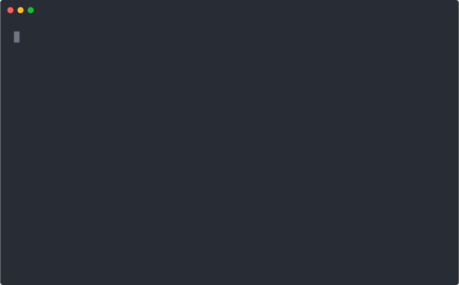

# ato

[](https://github.com/ato-run/ato-cli/actions/workflows/build-multi-os.yml)
[](https://github.com/ato-run/ato-cli/releases)
[](https://github.com/ato-run/ato-cli/stargazers)
[](LICENSE)

**Run any project instantly. Share it with one URL.**

Point `ato` at a Python script, a Node app, a Rust binary, or a GitHub repo — it figures out the runtime, bootstraps only what's needed, and runs in a sandboxed environment. No Dockerfile. No setup guide. No manual environment.

[Install](#install) · [Quick start](#quick-start) · [Why Ato](#why-ato) · [Commands](#core-commands) · [Contributing](#contributing)

## Demo



## Install

```bash
curl -fsSL https://ato.run/install.sh | sh
```

Or download a prebuilt binary from the [Releases page](https://github.com/ato-run/ato-cli/releases/latest) and place `ato` on your `PATH`.

## Quick start

```bash
# Install (one line)
curl -fsSL https://ato.run/install.sh | sh

# Run a Python script — no venv, no pip install
printf 'print("hello from ato")\n' > hello.py
ato run hello.py

# Capture the workspace and get a shareable URL
ato encap
# → Share URL: https://ato.run/s/hello-ato@r1

# Anyone can rebuild it from the URL
ato decap https://ato.run/s/hello-ato@r1 --into ./copy
ato run ./copy
```

## Why Ato

Every time you share a project, someone has to set up an environment before they can run it — virtualenvs, `node_modules`, container builds, README instructions that drift. Ato removes that layer entirely.

Ato reads your project directly — `pyproject.toml`, `package.json`, `deno.json`, `Cargo.toml`, a bare script — and materializes only the runtime it needs. No config to write. For Python and native binaries, execution routes through [Nacelle](https://github.com/ato-run/nacelle), a sandboxed runtime that blocks unapproved filesystem and network access by default. `ato encap` captures a reproducible workspace descriptor that anyone can restore with `ato decap`.

| Without Ato | With Ato |
|---|---|
| Clone → read README → install deps → run | `ato run github.com/owner/repo` |
| Write Dockerfile or setup script to share | `ato encap` |
| Follow multi-step setup to reproduce | `ato decap <share-url>` |

Supported runtimes today: Python (`pyproject.toml`, `uv.lock`, single-file PEP 723), Node / TypeScript / Deno, Rust, Go, static web, WebAssembly, and shell scripts.

## Core commands

### Run something now with `ato run`

`ato run` accepts a local path, a share URL, or a GitHub repository reference.

```bash
ato run .
ato run hello.py
ato run github.com/owner/repo
ato run https://ato.run/s/demo@r1
```

For local filesystem paths, Ato also supports `--watch` and `--background`.

```bash
ato run . --watch
ato run . --background
ato ps
ato logs --id <capsule-id> --follow
ato stop --id <capsule-id>
```

`ato run <share-url>` does not support `--watch` or `--background` in the current MVP path.

### Share a workspace with `ato encap`

`ato encap` captures the current workspace as a portable share descriptor, uploads it, and prints a share URL. Run it from the project directory — no arguments needed.

```bash
ato encap
```

To control visibility:

```bash
ato encap --internal   # organisation-internal access
ato encap --private    # authenticated owner only
ato encap --local      # local save only, no upload
```

Local capture output is written under `.ato/share/`:

- `share.spec.json`
- `share.lock.json`
- `guide.md`

Secrets are never uploaded. Ato records contracts such as required environment files, but not secret values.

### Rebuild a workspace with `ato decap`

`ato decap` materializes a share into a target directory, verifies the share, and runs declared install steps.

```bash
ato decap https://ato.run/s/myproject@r1 --into ./my-project
ato decap .ato/share/share.spec.json --into ./my-project
```

## Security and isolation

Ato is fail-closed by default.

- Sandbox isolation: Tier 2 targets such as `source/python`, `web/python`, and `source/native` run through Nacelle.
- Filesystem protection: unknown code does not get unrestricted host access by default.
- Network control: unapproved network access is blocked under strict enforcement.
- Environment handling: missing required environment variables stop execution before launch, and `--prompt-env` can collect them interactively.

For normal local runs, Ato usually bootstraps a compatible Nacelle release automatically when Tier 2 execution requires it. In CI or offline environments, auto-bootstrap is intentionally restricted, so preinstall or register Nacelle ahead of time if needed.

## From source

```bash
cargo build -p ato-cli
./target/debug/ato --help
./target/debug/ato run .
```

## Contributing

Bug reports and feature requests are welcome in [GitHub Issues](https://github.com/ato-run/ato-cli/issues).

If you are contributing code, use the standard Rust checks before opening a pull request:

```bash
cargo fmt --all -- --check
cargo clippy --workspace --all-targets --all-features -- -D warnings
cargo test -p ato-cli
```

## License

Apache License 2.0 (SPDX: Apache-2.0). See [LICENSE](LICENSE).

## capsule.toml reference

Every capsule is declared by a `capsule.toml` manifest in the project root.

| Field | Required | Description |
|-------|----------|-------------|
| `schema_version` | ✓ | Manifest schema version, e.g. `"0.3"` |
| `name` | ✓ | Unique capsule identifier (lowercase, hyphens allowed) |
| `version` | ✓ | Semver string, e.g. `"0.1.0"` |
| `type` | ✓ | `"app"`, `"service"`, or `"tool"` |
| `run` | ✓ | Command to execute, e.g. `"python main.py"` |
| `runtime` | | Runtime hint, e.g. `"source/python"` or `"source/node"` |
| `runtime_version` | | Pinned version, e.g. `"3.12"` |
| `description` | | Human-readable description |

Minimal example:

```toml
schema_version = "0.3"
name           = "my-capsule"
version        = "0.1.0"
type           = "app"
run            = "python main.py"
runtime        = "source/python"
```
