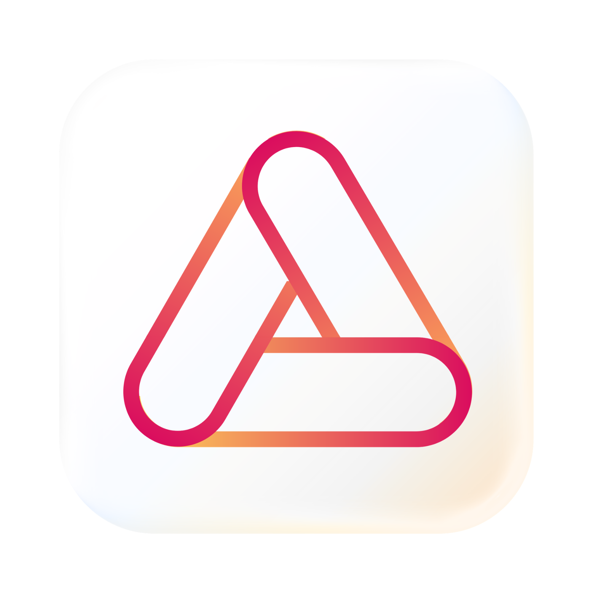

<div align="center">
  <br />
  
  <h1>Ato</h1>
  <p>
    <strong>GitHub projects, runnable without setup.</strong>
  </p>
  <p>
    A local-first, source-native execution runtime for apps and developer workflows.<br />
    Discover. Run. Share. All without leaving your machine.
  </p>

  <p>
    <a href="https://github.com/ato-run/ato/actions/workflows/rust-ci.yml">
      
    </a>
    
    
    
    
  </p>

  <p>
    <a href="#install"><strong>Install</strong></a> ·
    <a href="#quick-start"><strong>Quick start</strong></a> ·
    <a href="#how-it-works"><strong>How it works</strong></a> ·
    <a href="#safety-model"><strong>Safety</strong></a> ·
    <a href="#develop"><strong>Develop</strong></a>
  </p>
  <br />
</div>

---

## Why Ato?

<table>
  <tr>
    <td width="25%">
      <h3>Run GitHub projects</h3>
      <p>Try a repository before you clone, install, or patch your machine.</p>
    </td>
    <td width="25%">
      <h3>Share capsules</h3>
      <p>Turn a project into a runnable recipe that someone else can inspect and run.</p>
    </td>
    <td width="25%">
      <h3>Repeatable environments</h3>
      <p>Record the resolved runtime setup so a run can be inspected and repeated.</p>
    </td>
    <td width="25%">
      <h3>Desktop + CLI</h3>
      <p>Use the terminal for speed or the desktop app as a visual control plane.</p>
    </td>
  </tr>
</table>

Ato is a desktop app and command-line runtime for trying local projects, GitHub repositories, and shared app links in a controlled local runtime. It detects what the project needs, prepares missing tools, and runs it without asking you to manually install Python, Node, Rust, or other project-specific dependencies first.

```bash
ato run .                      # run the current project
ato run github.com/owner/repo  # try a GitHub repository
ato run https://ato.run/s/demo # open a shared Ato recipe
```

Ato is useful when you want to try a repository without reading its setup instructions first, share a runnable project with someone else, run a project with a repeatable setup, or keep the project's runtime separate from your machine as much as possible.

> Ato is still pre-1.0. Some sandboxing and network controls are still being completed. See [Known limitations](crates/cli/docs/known-limitations.md) before using Ato with untrusted code.

## Supported ecosystems

Ato currently focuses on source-native projects and local app recipes.

<p>
  
  
  
  
  
</p>

## Install

### macOS / Linux

Default install:

```bash
curl -fsSL https://ato.run/install.sh | sh
```

On a graphical macOS or Linux session, the default installer installs **Ato Desktop**. The Desktop bundle includes the private helper binaries it needs: `ato`, `nacelle`, and `ato-netd`. It does not separately install the standalone CLI archive or expose every helper as a user command.

To also make `ato` available in your terminal:

```bash
curl -fsSL https://ato.run/install.sh | sh -s -- --with-cli
```

`--with-cli` exposes the bundled `ato` helper on `PATH`. It does not download a second copy of `ato-cli`, and it does not expose `nacelle` or `ato-netd` as user-facing commands.

For headless environments, SSH sessions, CI, or CLI-only usage:

```bash
curl -fsSL https://ato.run/install.sh | sh -s -- --cli-only
```

`--cli-only` installs `ato` plus a private `nacelle` sidecar. It does not install Ato Desktop.

To install a specific version:

```bash
curl -fsSL https://ato.run/install.sh | sh -s -- --version 0.5.5
curl -fsSL https://ato.run/install.sh | sh -s -- --version 0.5.5 --with-cli
curl -fsSL https://ato.run/install.sh | sh -s -- --version 0.5.5 --cli-only
```

### Windows PowerShell

Default install:

```powershell
irm https://ato.run/install.ps1 | iex
```

On normal Windows desktop sessions, this installs the **Ato Desktop MSI**. The Desktop bundle includes private `ato.exe`, `nacelle.exe`, and `ato-netd.exe` helpers.

To also make `ato` available from PowerShell:

```powershell
irm https://ato.run/install.ps1 | iex -WithCli
```

For CI, server/headless environments, or CLI-only usage:

```powershell
irm https://ato.run/install.ps1 | iex -CliOnly
```

`-CliOnly` installs `ato.exe` plus a private `nacelle.exe` sidecar. It does not install Ato Desktop.

### Homebrew

```bash
brew install ato-run/ato/ato-cli
```

Homebrew installs the CLI, not Ato Desktop.

### From source

```bash
cargo build -p cli --release
```

### Verify installation

If you installed Ato Desktop only, launch **Ato Desktop** from your applications menu.

If you used `--with-cli`, `-WithCli`, `--cli-only`, `-CliOnly`, Homebrew, or a source build, verify the terminal command:

```bash
ato --help
```

### Uninstall

If `ato` is available on `PATH`:

```bash
ato uninstall
ato uninstall --purge
ato uninstall --purge --include-config --include-keys --yes
```

If you installed Desktop only and did not expose the CLI, remove Ato Desktop through the normal OS app removal flow, or re-run the installer with CLI exposure before using `ato uninstall`.

## Quick Start

The examples below use the `ato` terminal command. If you installed Desktop only, either run projects from Ato Desktop or reinstall with `--with-cli` / `-WithCli` to expose the CLI on `PATH`.

<table>
  <tr>
    <td width="50%">
      <h3>Run the current directory</h3>

```bash
cd my-project
ato run .
```

Ato inspects the project, prepares the required tools, and starts the app or command.
    </td>
    <td width="50%">
      <h3>Run a GitHub repository</h3>

```bash
ato run github.com/owner/repo
```

Useful for examples, demos, small tools, or projects you do not want to install globally.
    </td>
  </tr>
</table>

### What you should see

Ato prints the plan and phase progress as it resolves the project, prepares dependencies, and launches the process.

```text
$ ato run github.com/owner/repo
✓ Resolving source
✓ Detecting project type
✓ Preparing runtime
✓ Installing dependencies
✓ Starting project

Running at http://localhost:5173
```

For a stronger first impression, add a short terminal recording here, for example an Asciinema or GIF showing `ato run github.com/owner/repo` from command to running app.

### Create a lock file

```bash
ato lock .
```

A lock file records the resolved runtime setup for the project. Commit it when you want other people or CI to run the project the same way.

### Share a project

```bash
# Capture the project into a shareable description
ato workspace share

# Materialize a shared project into a local directory
ato workspace setup https://ato.run/s/demo --into ./demo
```

A shared Ato project is represented as a recipe: a portable, inspectable description of source, runtime requirements, entrypoints, state expectations, and policy. In local projects, that recipe is usually written in `capsule.toml`. In practice, a recipe lets another machine reconstruct the launch without repeating the setup work by hand.

## How it works

Ato automates the tedious setup of exploring new codebases through four clear steps.

<div align="center">

```text
[Source Project]
      │
      ▼
(1) Detect & Resolve  ──▶  (2) Lock  ──▶  (3) Controlled Runtime  ──▶  (4) Capsule / Share
```

</div>

1. **Detect**: Ato inspects the directory or repository to see what kind of project it is, such as Node.js, Python, or Rust.
2. **Resolve**: Ato prepares the required tools and runtimes without modifying your global system as much as possible.
3. **Lock**: Ato records the resolved setup so future runs can be inspected and repeated.
4. **Run or share**: Ato executes the project in a controlled runtime, or captures a runnable description that others can use.

The main file Ato looks for is:

```text
capsule.toml
```

A `capsule.toml` describes how source inputs should be arranged, built, configured, and launched. If a project does not have one, Ato can try to infer a basic recipe.

## What is a recipe?

A recipe is the runnable interpretation of a source project. It is not just a package archive and not just a lock file. It ties together enough launch context for Ato to run or reconstruct the project on another machine.

A minimal capsule target can look like this:

```toml
[targets.main]
runtime = "source"
driver = "node"
run = "npm run dev"
port = 5173
```

Recipes are useful when you want to share a demo, local app, internal tool, or reproducible workflow without asking every user to manually rediscover the setup.

## Examples

### Python script

```bash
# Runs the script with the required Python version and dependencies prepared by Ato
ato run ./scripts/report.py
```

### Node app

```bash
# Detects package.json, prepares Node dependencies in isolation, and boots the app
ato run ./examples/web
```

### Rust project

```bash
# Builds and runs a Rust workspace member through Ato's runtime path
ato run ./crates/my-tool
```

### Shared recipe

```bash
# Opens a shared Ato recipe from a link
ato run https://ato.run/s/demo
```

## What Ato is not

Ato is not a full replacement for every tool in your stack.

- It is not Docker. It does not require writing a Dockerfile first.
- It is not Nix. It focuses on running and sharing projects, not replacing your whole system environment.
- It is not just `npx` or `uvx`. It can run whole projects, not only single packages.
- It is not a remote development environment. It runs locally by default.

Ato sits between these tools: it gives you a fast way to try, lock, and share a project without turning the project into a container image or asking every user to reproduce the setup by hand.

## Safety Model

Ato is designed to reduce accidental access to your machine, but it should not be treated as a perfect security boundary yet.

Current behavior:

- project files are run through Ato's runtime path instead of directly on your host
- common secret files such as `.env`, `.env.*`, private keys, and credentials files are excluded from capsule archives by default
- some OS-level isolation is available for source runtimes
- deny-all networking is supported for supported runtime paths

Known gaps in the current version:

- hostname allowlists for source runtimes are not fully enforced yet
- missing required environment variables may warn instead of stopping the run
- stricter sandbox mode is not available for every runtime
- some Desktop builds are still beta-quality on non-macOS platforms

Read the full list here:

```text
crates/cli/docs/known-limitations.md
```

When running code you do not trust, prefer:

```bash
ato run github.com/owner/repo --no-build
```

or inspect the repository first.

## Common commands

```bash
ato run .                       # rehearse a local project in a managed session
ato run github.com/o/r          # rehearse a GitHub repository
ato run https://ato.run/s/demo  # run a shared recipe
ato install publisher/slug      # register a durable local app
ato lock .                      # generate a lock file
ato workspace share             # create a shareable recipe description
ato workspace setup <share>     # materialize a shared recipe
ato ps                          # list running sessions
ato stop --all                  # stop running sessions
ato logs                        # show logs
```

## Repository layout

This repository contains the CLI, runtime libraries, desktop app, and supporting tools.

```text
ato/
├── crates/
│   ├── ato-protocol/     # IPC/wire surface — pure message types, DAG root
│   ├── capsule/          # project detection, locking, packing, runtime logic + local session state
│   ├── cli/              # command-line interface (orchestrator; ships the `ato` binary)
│   ├── desktop/          # desktop app (shell; ships the `ato-desktop` binary)
│   ├── netd/             # networking daemon (pairing, reachability, transport; ships the `ato-netd` binary)
│   └── nacelle/          # source runtime sandbox
├── sidecars/
│   └── ato-tsnetd/       # optional network sidecar
├── docs/
│   └── rfcs/             # design notes and proposals
└── .github/workflows/    # CI
```

Most users should use the installer. Contributors usually work in `crates/cli`, `crates/desktop`, `crates/capsule`, and the runtime sidecars.

> Crate names dropped the `ato-` prefix (`cli`/`desktop`/`netd`); the produced
> binaries keep their stable names (`ato`, `ato-desktop`, `ato-netd`).

### Dependency invariants

The crates form a one-way dependency DAG, enforced in CI by
`scripts/check-dep-direction.sh`:

- **`ato-protocol`** is the DAG root: pure IPC/wire types with **no
  workspace-crate dependencies**. Both `cli` and `desktop` link it to
  share the wire surface without dragging in heavy runtime deps.
- **`capsule`** owns the domain logic (detection, locking, packing, runtime
  graph) **and** local session state. It may depend on `ato-protocol`; it must
  not depend on `cli`, `desktop`, `netd`, or `nacelle`.
- **`netd`** speaks the protocol: it may depend on `ato-protocol`; it must
  not depend on `capsule`, `cli`, `desktop`, or `nacelle`.
- **`nacelle`** enforces the sandbox only. It stays a clean leaf — no workspace
  dependencies beyond (optionally) `ato-protocol`.
- **`cli`** orchestrates: it may depend on `capsule`, `ato-protocol`, and
  `nacelle`; it must not depend on `desktop` (the arrow points the other
  way — Desktop spawns the `ato` binary as a subprocess).
- **`desktop`** is the shell: it speaks `ato-protocol` and reads a
  lightweight slice of `capsule` state, and **spawns the `ato` CLI** rather
  than linking it. It must not depend on `cli`, `netd`, or `nacelle`.

## Develop

```bash
cargo check --workspace --all-targets
cargo test -p cli
cargo test -p capsule
cargo run -p cli -- --help
```

Desktop bundle examples:

```bash
cd crates/desktop
cargo xtask bundle darwin-arm64
cargo xtask bundle windows-x86_64
cargo xtask bundle linux-x86_64
```

## Notes for existing users

Older documentation may refer to `ato encap` and `ato decap`. Prefer `ato workspace share` and `ato workspace setup` for new examples.

## Contributing

Issues and pull requests are welcome. For larger changes, open an issue first so the runtime, CLI, Desktop, and capsule semantics can be discussed together.

## License

Apache-2.0
