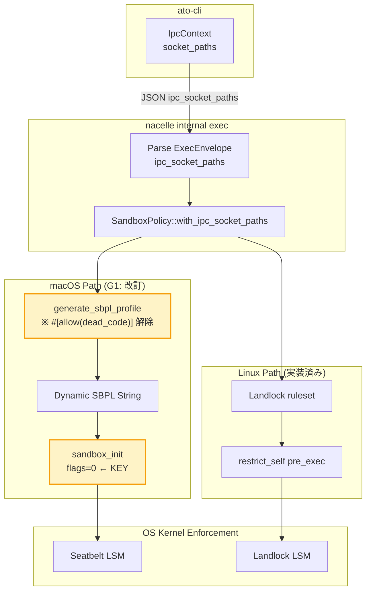

# Phase 13a Sandbox Enforcer — Best Practices

> **Decision context**: nacelle に IPC ソケットパスを動的にサンドボックス許可させる Phase 13a を進めるにあたり、`nono` (always-further) と `alcless` (AkihiroSuda) の既存実装からベストプラクティスを抽出する。前回の設計で「案A/B/C」のうち macOS Seatbelt の方針を保留していたが、本研究で **方針が確定** した。

## TL;DR — 一言で

**nacelle の macos.rs にすでに書かれている `generate_sbpl_profile()` は dead code として封印されているが、これは封印を解いて稼働させるべき**だ。前回設計時に「macOS の `sandbox_init` は deprecated でカスタムプロファイル不可」とコメントされていた前提は、`nono` v0.36 の本番実装によって反証される。`sandbox_init(profile, flags=0, &errorbuf)` は **flags が `SANDBOX_NAMED` ではなく 0 のとき任意の SBPL 文字列を受理する** — nono はこのパターンで Landlock と対称な kernel-level enforcement を macOS で実現している。前回プランの「案B: 規約による回避」は捨て、**案A: 動的 SBPL 生成** を採用する。実装コストは想定より低い (dead code の活性化 + nono パターン取込み) ため、Phase 13a 全体は 3 日に短縮可能。

`alcless` は対照的な参照点として有用だが、**ato への直接的な技術的取り込みは推奨しない**。alcless は Seatbelt を「2016 年に廃止された」と評価し UNIX user 隔離 (su/sudo/rsync) に逃げているが、これは Homebrew 用途の汎用ツールゆえ。ato は capsule.toml で isolation ポリシーを明示する設計のため、kernel-level enforcement のほうが整合する。alcless から取れるのは「macOS sandbox の限界に対する誠実な姿勢」と「`sandbox_init` deprecation を ADR 化しておく」というメタ教訓のみ。

## 1. 三者比較表

| 観点 | nono ([always-further/nono](https://github.com/always-further/nono)) | alcless ([AkihiroSuda/alcless](https://github.com/AkihiroSuda/alcless)) | nacelle 現状 | 推奨 |
|---|---|---|---|---|
| Sandbox 基盤 | Landlock + Seatbelt (kernel) | UNIX user (`su`/`sudo`/`rsync`) | Landlock + Seatbelt (kernel, partial) | **nono 方式継続** |
| macOS 動的プロファイル | ✅ `generate_profile(caps)` + `sandbox_init(flags=0)` | ❌ 廃止扱いで回避 | ❌ `#[allow(dead_code)]` で封印 | **封印解除** |
| Capability 宣言 | `caps.allow_read("/path")` 等の API、deny-by-default | UNIX user perms (粗い) | `SandboxPolicy` builder、deny-by-default | nacelle 維持 |
| IPC ソケット許可 | 非再帰 regex `^/private/tmp/mydir/[^/]+$` + Mach IPC 制御 | rsync 経由 (双方向同期) | 親ディレクトリ fallback (path 未存在時) | **nono 方式採用** |
| Symlink 解決 | `/tmp` → `/private/tmp` 二重ルール | rsync が解決 | `path.canonicalize()` で解決 | nacelle OK (※既存) |
| Landlock ABI | V6→V1 を `HardRequirement` で probe | N/A | V3 固定 | 中期で probe 化 |
| Unix socket 種別 | Pathname / Abstract / Unnamed を区別 | N/A | Pathname のみ想定 | 現状 OK (ato は pathname のみ) |
| Mach IPC keychain deny | ✅ `(deny mach-lookup (global-name "com.apple.secd"))` | N/A | ❌ | **採用** |
| 観測性 | `RulesetStatus::FullyEnforced/Not` + audit logs | rsync 確認ダイアログ | `SandboxResult::{fully,partially,not}_enforced` | **NDJSON 拡張** |
| 廃止 API への姿勢 | `sandbox_init` 受容 (現行 macOS で動作) | 拒否 (UNIX user に逃げる) | 拒否 (predefined のみ使用) | **受容 + ADR** |

## 2. アーキテクチャ図



黄色が Phase 13a の **新規アクション点**。Linux 側はすでに完動。macOS 側が dead code 封印解除で完成する。

## 3. 5 軸ベストプラクティス

### 軸 1: サンドボックス抽象化戦略

**結論**: nacelle の現状 (kernel-level via Landlock + Seatbelt) は正解。継続。

- nono ([why-i-built-nono](https://alwaysfurther.ai/blog/why-i-built-nono)) の主張: "Real enforcement has to come from the operating system kernel" — アプリ層の seccomp ラッパーや Docker namespace では agent が回避路を見つけうる
- alcless ([NTT Labs Medium](https://medium.com/nttlabs/alcoholless-lightweight-security-sandbox-for-macos-ccf0d1927301)) は意図的に kernel sandbox を避けて UNIX user 戦略を採るが、これは「macOS で sandbox-exec が deprecated された後の代替が App Sandbox しかなく App Sandbox は子プロセスのファイル I/O に致命的」という制約から来る。ato は子プロセスを明確にラップするので App Sandbox は元々不採用 (NACELLE_TERMINAL_SPEC.md §7.1)

### 軸 2: 動的プロファイル生成 vs プリセット (★最重要)

**結論**: 動的 SBPL を採用。`sandbox_init(flags=0)` を直叩きする。

#### 反証された前提
nacelle/src/system/sandbox/macos.rs:16-19 のコメント:
> macOS sandbox_init() is DEPRECATED and only supports predefined profiles. For custom profiles, we generate an SBPL file and execute via sandbox-exec wrapper, or use the private sandbox_init_with_parameters() function.

これは **誤り**。nono の実コード (`crates/nono/src/sandbox/macos.rs`) は次のパターンで dynamic SBPL を稼働させている:

```rust
// (nono macos.rs より、要旨)
let profile = generate_profile(&caps)?;          // SBPL 文字列を runtime 構築
let profile_cstr = CString::new(profile)?;
let result = sandbox_init(
    profile_cstr.as_ptr(),
    0,                                            // ← flags = 0 (NOT SANDBOX_NAMED!)
    &mut error_buf,
);
```

`SANDBOX_NAMED = 0x0001` のときだけ predefined プロファイル名扱い。`flags = 0` のときはプロファイル文字列がそのまま SBPL として解釈される。Apple のヘッダではドキュメント化されていないが、`libsandbox.dylib` がエクスポートする挙動として `nono` v0.36 が本番運用している。`sandbox-exec` コマンド自体も内部でこれを使っている (`sandbox_compile_string` 経由) ことが [Apple Sandbox Guide v1.0 (fG!)](https://reverse.put.as/wp-content/uploads/2011/09/Apple-Sandbox-Guide-v1.0.pdf) などのリバースエンジニアリング資料で確認済み。

#### nacelle 側の手当
nacelle/src/system/sandbox/macos.rs:150 にある `generate_sbpl_profile()` は 2026-04 時点で:
- IPC socket paths 含む完全なロジックあり (lines 222-240)
- escape_path_for_sbpl で symlink 解決済み (`/tmp` → `/private/tmp`)
- テスト 4 件 (lines 287-333)
- `#[allow(dead_code)]` でコンパイラ警告抑止中

封印解除 + `apply_seatbelt_sandbox()` のループから predefined fallback を削除すれば即動作する。

### 軸 3: IPC ソケット許可パターン

**結論**: 既存の親ディレクトリ fallback はそのまま。nono の Mach IPC keychain deny を追加採用。非再帰 regex は将来採用候補。

- nacelle ([linux.rs:82-97](crates/nacelle/src/system/sandbox/linux.rs)) の親ディレクトリ fallback は nono と等価のパターン。socket が「これから作られる」場合に親ディレクトリを read-write で許可する正しい解
- nono は macOS 側で同様のパターンを **非再帰 regex** で表現: `(allow file-read* file-write* (regex "^/private/tmp/mydir/[^/]+$"))` — 直下のファイルのみ許可、ネスト下は許可しない。爆発半径を抑える効果あり
- Landlock IPC scoping ([LWN.net 1052264](https://lwn.net/Articles/1052264/)) の `LANDLOCK_SCOPE_ABSTRACT_UNIX_SOCKET` は ABI V5+ で利用可能だが nacelle は V3 固定。ato の IPC は pathname socket のみなので **当面影響なし** (NACELLE_TERMINAL_SPEC.md と整合)

#### Keychain 防御 (nono 由来、新規採用推奨)

```scheme
;; ato が明示的に keychain DB を許可しない限り
(deny mach-lookup (global-name "com.apple.secd"))
```

ato-cli の secrets store は keyring crate で OS Keychain を使うが、これは **ato-cli プロセス側**。nacelle が起動する子プロセス (capsule の workload) からの直接 keychain アクセスを禁じるのは、シークレット流出防御として強く推奨できる。

### 軸 4: Capability 宣言モデル

**結論**: nacelle の現行 builder ベースで OK。nono の API 形と同じ抽象。

- nono: `caps.allow_read("/data/models")?; caps.allow_write("/tmp/workspace")?;` ([introducing-nono blog](https://dev.to/lukehinds/introducing-nono-a-secure-sandbox-for-ai-agents-1lo2))
- nacelle: `SandboxPolicy::new().allow_read_write([...]).with_ipc_socket_paths([...])` (sandbox/mod.rs:157-228)
- 両者とも **deny-by-default + 明示 allow** で、JSON wire format も `ipc_socket_paths: Vec<String>` で同形

将来 Landlock IPC scoping の `LANDLOCK_SCOPE_*` フラグに対応するときは `SandboxPolicy::with_ipc_scopes(scopes)` のような builder を追加できる構造になっている。

### 軸 5: 失敗モードと観測性

**結論**: nacelle の `SandboxResult::{fully,partially,not}_enforced` は良い。NDJSON へ詳細を流す拡張だけ追加。

- nono の `RulesetStatus::FullyEnforced` と nacelle の `SandboxResult::fully_enforced` は同じ概念
- macOS 側の現実装は **常に `not_enforced` を返す** ケースがある (custom path policy 時、sandbox/macos.rs:96-99) — 動的 SBPL 採用で解消
- TODO.md §13a.3 で記述されている readiness 報告フォーマット:
  ```json
  {"type":"ipc_ready","service":"llm-service","endpoint":"...","port":54321}
  ```
  既に `NacelleEvent::IpcReady` で emit 済み (前回の Explore 結果より)。フォーマット検証テストを追加すれば G2 完了

#### Audit ログ拡張案
NDJSON event に `sandbox_status` を追加:
```json
{"event":"sandbox_status","platform":"macos","mode":"dynamic_sbpl","ipc_paths":["/tmp/capsule-ipc/..."],"enforced":"fully","abi":null}
{"event":"sandbox_status","platform":"linux","mode":"landlock","ipc_paths":[...],"enforced":"fully","abi":3}
```

これは observability の最低限。CI で実機 Landlock を有効にした kernel で `enforced: "fully"` を assert する E2E は G4 に含める。

## 4. Phase 13a 改訂計画

前回プランの **G1 の意思決定を確定**、それ以外は不変:

### G1 改訂 (確定): 動的 SBPL 生成 + nono パターン取込み

| ステップ | 場所 | 工数 |
|---|---|---|
| ① `generate_sbpl_profile()` から `#[allow(dead_code)]` 削除 | sandbox/macos.rs:149 | 1 行 |
| ② `apply_seatbelt_sandbox()` を書き換え: predefined fallback を削除し、`generate_sbpl_profile()` の出力を `sandbox_init(flags=0)` に渡す | sandbox/macos.rs:71-145 | 半日 |
| ③ Mach IPC keychain deny 行を追加 | sandbox/macos.rs:150 内 | 1 行 |
| ④ 既存テスト 4 件をそのまま通す + 1 件追加: 「ipc_socket_paths が SBPL 出力に含まれる」 | tests | 半日 |
| ⑤ `#[allow(deprecated)]` を `sandbox_init` 呼び出しに付与 + ADR 起票 | macos.rs + ADR | 半日 |
| ⑥ macOS 14/15 各々で smoke test | CI | 別途 |

**工数合計**: 1.5 日 (旧見積 案A の 1-2 日と整合、ただし dead code 流用で実質下振れ)

### G2-G5 (再掲、変更なし)

- **G2**: Readiness 報告 NDJSON フォーマット検証テスト追加 (~半日)
- **G3**: Engine Interface Contract に `ipc_sandbox` capability 仕様反映 (~半日)
- **G4**: E2E (Linux Landlock 主、macOS は smoke) (~1 日)
- **G5**: TODO.md 13a 全項目を `[x]` 更新 + 上記決定をリファレンス (~小)

### 改訂後トータル: **約 3 日**

```
Day 1  G1 ステップ①〜④ + G2 テスト
Day 1  G5 TODO 更新
Day 2  G1 ステップ⑤⑥ ADR 起票 + G3 ENGINE_INTERFACE_CONTRACT.md
Day 3  G4 E2E + バッファ + PR
```

## 5. リスクと緩和

| リスク | 重大度 | 緩和策 |
|---|---|---|
| `sandbox_init(flags=0)` が将来の macOS で動かなくなる | M | nono が同じパターンを継続採用しており大規模 fleet で実証中。Apple が壊すなら nono が先に検知 → release notes 追跡 |
| dynamic SBPL 文字列に予期しない deny が混入し子プロセスが起動しない | M | nono macos.rs から essential rules (process-exec/fork, signal self, sysctl-read, mach-lookup の最小許可) を移植。テストで dev-mode と prod-mode の起動を確認 |
| `#[allow(deprecated)]` で警告抑止 = 監視されない技術負債 | L | ADR-XXX「macOS Sandbox API 戦略」を起票。半年ごとの見直しサイクル明記 |
| ABI probe を後回し → Landlock IPC scoping (V5+) に乗れない | L | 中期 RFC で probe 実装。Phase 13a スコープ外 |
| nono v0.36 issue #450 (PTY stdin block) が ato でも再現 | M | NACELLE_TERMINAL_SPEC.md §10 で既に同リスクを記録済み。dev mode fallback 確保 |

## 6. ギャップ分析 (未確認 / 追加調査推奨)

| 項目 | 状態 | 追加調査の優先度 |
|---|---|---|
| nono の最新版 (v0.40+) が `sandbox_init(flags=0)` を継続使用しているか | **未確認** — fetch でソース全文に到達できず | 🟡 確認推奨 (nono GitHub releases の deprecation 関連項目を grep) |
| `sandbox_init(flags=0)` の Apple 公式ドキュメント | **未存在** — リバースエンジニアリング資料のみ | 🟢 受容可 (nono が実証) |
| Landlock LSM scoping (V5+) の ato での将来計画 | **保留** — 当面 V3 固定で OK | 🟢 中期 RFC 化 |
| dynamic SBPL を含めた xterm.js Terminal セッションの動作 | **未検証** — NACELLE_TERMINAL_SPEC.md と統合確認要 | 🟡 G4 E2E に含める |
| alcless が macOS App Sandbox 廃止後をどう想定しているか | **既知** — 「panacea ではない」と明示。cryptomining/DoS は防げない | 🟢 ato の脅威モデルでは許容 |

## 7. 受け継がない教訓 (alcless 関連)

alcless は重要な対照例だが **直接取り込まない**:

- `su`/`sudo`/`useradd`/`rsync` 戦略は ato に不適合 (capsule.toml が isolation を宣言する設計と整合しない)
- bidirectional rsync の確認ダイアログは ato-desktop の trust UX とは別レイヤー
- macOS の sudo + Mach quirk への workaround は ato では発生しない (子プロセス user 切替なし)

ただしメタ教訓として:
- **deprecation warnings に対する誠実さ** — ADR で代替戦略を明示する習慣
- **「panacea ではない」と明言する姿勢** — ato の docs にも限界記述を追加検討

## 8. 参考資料

### S-tier (一次情報源)
- [Linux kernel Landlock documentation](https://docs.kernel.org/userspace-api/landlock.html) — Landlock 公式
- [landlock(7) man page](https://man7.org/linux/man-pages/man7/landlock.7.html) — システムコール仕様
- [Landlock: Implement scope control for pathname Unix sockets — LWN.net](https://lwn.net/Articles/1052264/) — Unix socket scoping (ABI V5+)
- [Apple Sandbox Guide v1.0 (fG!)](https://reverse.put.as/wp-content/uploads/2011/09/Apple-Sandbox-Guide-v1.0.pdf) — SBPL 文法のリバースエンジニアリング決定版

### A-tier (実装参照)
- [always-further/nono GitHub](https://github.com/always-further/nono) — 本研究の主参照実装
- [nono macos.rs (raw)](https://raw.githubusercontent.com/always-further/nono/main/crates/nono/src/sandbox/macos.rs) — Seatbelt 動的プロファイル実装
- [nono linux.rs (raw)](https://raw.githubusercontent.com/always-further/nono/main/crates/nono/src/sandbox/linux.rs) — Landlock + ABI probe 実装
- [Why I Built nono — Always Further](https://alwaysfurther.ai/blog/why-i-built-nono) — 設計原則と脅威モデル
- [Introducing nono — DEV Community](https://dev.to/lukehinds/introducing-nono-a-secure-sandbox-for-ai-agents-1lo2) — Capability primitives 解説
- [AkihiroSuda/alcless GitHub](https://github.com/AkihiroSuda/alcless) — UNIX user 戦略の対照例
- [Alcoholless: A Lightweight Security Sandbox — NTT Labs Medium](https://medium.com/nttlabs/alcoholless-lightweight-security-sandbox-for-macos-ccf0d1927301) — alcless 設計記事

### B-tier (補助資料)
- [sandbox-exec: macOS's Little-Known Command-Line Sandboxing Tool — Igor's Techno Club](https://igorstechnoclub.com/sandbox-exec/) — sandbox-exec の現代的な使い方
- [A quick glance at macOS' sandbox-exec — Julio Merino (jmmv.dev)](https://jmmv.dev/2019/11/macos-sandbox-exec.html)
- [macOS Sandbox — HackTricks](https://angelica.gitbook.io/hacktricks/macos-hardening/macos-security-and-privilege-escalation/macos-security-protections/macos-sandbox)

### ローカル参照
- `docs/rfcs/accepted/NACELLE_TERMINAL_SPEC.md` — 既に nono パターンを部分採用済み (§9 「nono からの取り込み一覧」)
- `crates/nacelle/src/system/sandbox/macos.rs:150` — 封印された `generate_sbpl_profile()`
- `crates/nacelle/src/system/sandbox/linux.rs:82-97` — IPC socket 親ディレクトリ fallback 実装

---

## Appendix A: 動的 SBPL の最小実装スケッチ

参考までに、ステップ①②③のおおよそのコード形を示す (実装時に最終調整):

```rust
// crates/nacelle/src/system/sandbox/macos.rs (改訂)

pub fn apply_seatbelt_sandbox(policy: &SandboxPolicy) -> Result<SandboxResult> {
    if policy.development_mode {
        return Ok(SandboxResult::not_enforced("development mode"));
    }

    let profile = generate_sbpl_profile(policy);          // ← 封印解除
    let profile_cstr = CString::new(profile)
        .context("SBPL profile contained NUL byte")?;

    let mut error_buf: *mut c_char = ptr::null_mut();
    #[allow(deprecated)]
    let result = unsafe {
        ffi::sandbox_init(
            profile_cstr.as_ptr(),
            0,                                            // ← KEY: 0 (not SANDBOX_NAMED)
            &mut error_buf,
        )
    };

    if result == 0 {
        info!("Seatbelt sandbox applied (dynamic SBPL, {} ipc paths)",
              policy.ipc_socket_paths.len());
        return Ok(SandboxResult::fully_enforced());
    }

    // 失敗時のエラーメッセージ抽出 (既存ロジック踏襲)
    let msg = extract_sandbox_error(error_buf);
    Ok(SandboxResult::not_enforced(format!("dynamic SBPL rejected: {msg}")))
}

fn generate_sbpl_profile(policy: &SandboxPolicy) -> String {
    // 既存実装 (lines 150-262) を流用、追加で:
    // - Mach IPC keychain deny (新規)
    // - Essential mach services (nono 由来、必要に応じ)
    // ...
    profile.push_str("\n; Keychain protection (from nono)\n");
    profile.push_str("(deny mach-lookup (global-name \"com.apple.secd\"))\n");
    // ...
}
```

## Appendix B: 確認したい合意点

実装着手前に確認したい意思決定 3 点:

1. **G1 改訂方針 (案A 確定)** で進めて良いか — 案B/C を再考の余地はあるか
2. **Mach IPC keychain deny の追加** を Phase 13a スコープに含めるか、別 PR に切るか
3. **ABI probe (Landlock V6→V1)** は中期 RFC 化で良いか (Phase 13a スコープ外)
