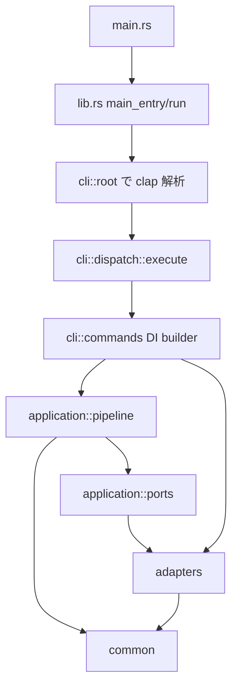

# ato-cli Source Architecture Overview

このドキュメントは、ato-cli の src 配下にある主要レイヤーの責務と依存関係を把握しやすくするための概要です。
実装の正確な仕様は docs/current-spec.md と各モジュール実装が正であり、この文書はそれらを読むための地図として使うことを想定しています。

## 1. 全体像

ato-cli の src 配下は、現在おおむね次の役割分担で整理されています。

- cli: CLI 定義、コマンド分配、adapter と reporter の組み立て
- application: ユースケース、phase 制御、アプリケーション固有の意味論
- adapters: registry、runtime、output、IPC など外部境界の実装
- common: 複数レイヤーから共有される小さな共通機能
- utils: 既存 call site 互換のための再公開用ユーティリティ

起動から実行までの大きな流れは次のとおりです。

ポイントは、cli が入口と依存性注入を担当し、application が phase の意味論とユースケースを持ち、adapters が外部 I/O と実行基盤を引き受けることです。

## 2. エントリポイントと統合ポイント

### 2.1 main.rs

main.rs は極薄いエントリポイントです。実体は lib.rs の main_entry に委譲されます。

### 2.2 lib.rs

lib.rs はこの crate の統合ポイントです。主な責務は次のとおりです。

- モジュールツリーの宣言
- main_entry と run による起動制御
- JSON エラー出力と通常エラー出力の切り替え
- CliReporter の生成
- SidecarCleanup による sidecar の後始末
- 既存 call site から使いやすいように各レイヤーの再公開

つまり lib.rs は、ビジネスロジックを抱える場所ではなく、「起動」「終了」「再公開」のハブです。設計上は CLI を薄い DI コンテナとして扱い、ロジックの主戦場は application と adapters に寄せる前提です。

## 3. 各レイヤーの責務

### 3.1 cli レイヤー

cli はユーザー入力をプログラム内部の処理へ変換する層です。設計上は次の 3 つの役割に分かれます。

- root: clap によるコマンド・引数定義
- dispatch: Commands を受けて適切な処理へ振り分けるルータ
- commands: 引数を正規化し、adapter と reporter を生成して application のユースケースへ依存注入するビルダー

#### root

src/cli/root.rs では Cli と Commands を定義し、現在の公開 CLI サーフェスを集約しています。主なコマンド群は次のとおりです。

- Primary: run、build、publish、install、search、init
- Management: ps、stop、logs、state、binding
- Auth: login、logout、whoami
- Advanced: inspect、fetch、finalize、project、unproject、key、config、gen-ci、registry、engine、setup、validate、source、profile、package、ipc など

ここで定義されるのは「何を受け付けるか」であり、「どう実行するか」は dispatch と commands に分離されています。

補足として、stop は公開 subcommand 名であり、内部実装は commands::close.rs に残っています。つまり公開面は stop に統一しつつ、内部モジュール名には旧称が一部残っている状態です。

#### dispatch

src/cli/dispatch/mod.rs の execute が主要ルータです。
Clap が解釈した Commands を match し、適切な dispatch ハンドラまたは commands 実装へ渡します。

現在の dispatch 配下には、たとえば次のような CLI 入口が置かれています。

- run
- install
- publish
- registry
- engine
- binding
- state

この構成により、CLI の公開面と実行ロジックの接続点が一箇所に保たれています。dispatch 自体は薄いルータでありつつ、旧来 orchestration にあった「CLI 入口としての接着コード」はここへ集約されつつあります。

現時点では src/cli/orchestration 配下の旧モジュールはすでに主要ルートから外れており、architecture の主語は dispatch と application に置くのが正確です。とくに publish / run / support 系の入口は dispatch 側へ移動済みです。

#### commands

src/cli/commands は CLI 層の実行ビルダー群です。現在の主要モジュールは次のとおりです。

- build
- close
- gen_ci
- inspect
- ipc
- keygen
- logs
- profile
- ps
- run
- search
- sign
- source
- update
- validate
- verify

各 command モジュールの責務は、CLI 引数を内部 request に正規化し、必要な adapter・reporter・runtime 設定を組み立てて application の pipeline やユースケースへ渡すことです。つまり commands は単なる薄いハンドラではなく、CLI 側の DI Builder として振る舞います。

設計意図としては、CLI 層に phase 意味論を持たせず、処理順序や stop point の解決は application に寄せることです。commands はそのための入口と配線に徹します。

### 3.2 application レイヤー

application は ato-cli のユースケースと内部ルールを表す層です。CLI 表現には依存せず、何を実現するかを中心に整理されています。

主なモジュールは次のとおりです。

- agent: エージェント関連のアプリケーションロジック
- auth: 認証情報の管理と Store / GitHub 連携
- engine: build / install / manager / data_injection などの中核フロー
- pipeline: hourglass phase order、consumer / producer pipeline、phase selection 検証
- preview: プレビュー用途のアプリケーション処理
- search: レジストリ検索のユースケース
- workspace: init / new / scaffold などプロジェクト生成系
- ports: adapter へ要求する境界インターフェース
- types: 共有型

#### ports

src/application/ports.rs は、Ports and Adapters パターン上の境界です。現状の代表ポートは次のとおりです。

- OutputPort: 進捗、警告、利用情報などの出力契約
- InteractionPort: confirm、manifest preview、editor 起動など対話契約
- ports/install.rs: SourcePort と TargetPort により Artifact -> Directory の install を抽象化
- ports/publish.rs: DestinationPort により Artifact -> Destination の publish を抽象化

application はこれらの trait に依存し、具体的な端末出力や UI 実装には直接依存しません。

#### pipeline

src/application/pipeline は、双方向 hourglass の制御フローを持つユースケース層です。現状の主要モジュールは次のとおりです。

- hourglass: ConsumerRun / ProducerPublish の canonical phase vocabulary と phase selection 型
- executor: phase runner を順番に駆動する共通エンジン
- consumer: ConsumerRunPipeline
- producer: PublishPipelineRequest、PublishPhaseOptions、PublishPipelinePlan、ProducerPipeline
- phases/run: run 各 phase の実処理
- phases/install: Artifact -> Directory の install ユースケース
- phases/publish: Artifact -> Destination の publish ユースケース

重要なのは、phase の順序や stop point の意味論が CLI ではなく application に属している点です。

一方で、実装上の run には少し注意点があります。hourglass vocabulary としては Install -> Prepare -> Build -> Verify -> DryRun -> Execute を持っていますが、ConsumerRunPipeline 自体は Prepare 以降を駆動し、Install 境界の解決は commands 側の入口ビルダーと install::support が先に処理します。アーキテクチャ上の見方としては、CLI が Install を含む consumer request を整えて application pipeline へ渡す構図です。

publish 側はより application 主導で、producer が次の責務を持ちます。

- source input / artifact input の違いを吸収した start phase 解決
- official / private / local registry の違いを踏まえた stop point 解決
- --prepare / --build / --deploy / --artifact / --legacy-full-publish の検証
- ProducerPipeline による phase 実行

また、src/application/pipeline/phases/publish.rs は現時点で 2 つの役割を持ちます。

- PublishPhase により DestinationPort を通す Artifact -> Destination 境界を定義する
- private publish と official publish の既存実装を application 側から呼び出す wrapper API を提供する

具体的には summarize_private_publish、run_private_publish_phase、run_official_publish_phase が追加され、CLI 側の publish 入口はこれらを呼ぶ薄い配線として機能します。private upload は DestinationPort 経由で application 側の publish phase に乗っており、build-backed private publish でも入力解決と upload handoff の両方が application 側の request 解決へ寄っています。

#### engine

src/application/engine は ato-cli の build / install / run 周辺の中核処理を担います。

- build: パッケージングや build 系処理
- install: install 系処理と support
- data_injection: 外部入力注入
- manager: engine 管理や制御補助

とくに install::support は、run 系フローで重要な橋渡しを担います。ここでは次のような責務があります。

- run 対象の解決
- install 済み artifact の探索
- GitHub repository install / build の補助
- local manifest の存在確認
- invalid manifest のバックアップと再生成
- execute_run_command への受け渡し

つまり、run/build/publish/install の表面 API は cli にありますが、処理の意味論と再利用ロジックは application::engine に集約されています。

#### auth

src/application/auth は認証と資格情報の管理を担当します。

- credentials.toml を中心とした認証情報の永続化
- GitHub token や Store session token の取り扱い
- device flow や publisher 情報の管理
- consent store と対話補助

外部サービス連携の細部は含みつつも、役割としては「認証ユースケースの一元管理」です。

#### workspace

src/application/workspace はプロジェクト開始時の体験を担当します。

- init: 現在のプロジェクト検出、prompt、recipe
- new: 新規プロジェクト作成
- scaffold: テンプレートや雛形生成

CLI の init / new / scaffold 系はこの層に寄せて実装されます。

### 3.3 adapters レイヤー

adapters は外部システムとの接続面です。I/O、ネットワーク、プロセス実行、ターミナル表示など、変化しやすい境界がここに集まります。

現在のトップレベルサブモジュールは次のとおりです。

- inference_feedback
- install
- ipc
- output
- preview
- publish
- registry
- runtime

#### output

src/adapters/output はユーザーへの見せ方をまとめた層です。

- reporters: CliReporter などの出力実装
- diagnostics: エラー分類、コマンド文脈検出、終了コード対応
- progressive: ロゴや段階的表示
- terminal: TUI / ターミナル向け表現

application::ports::OutputPort を実装する具体物はこの周辺に置かれます。

#### runtime

src/adapters/runtime はプロセス実行とランタイム依存部分を吸収します。

- executors: deno、node_compat、oci、shell、source、wasm など
- external_capsule: 外部 capsule 実行との接続
- manager: ランタイム管理
- overrides: 実行上書き
- process: プロセス制御
- provisioning: 実行前準備
- tree: 実行ツリー管理

ato-cli が複数ランタイムを扱えるのは、この層で driver ごとの差異を閉じ込めているためです。

#### registry

src/adapters/registry は公開レジストリおよびローカルレジストリとの接点です。

- binding: ホスト側 binding 管理
- http: レジストリ API クライアント
- publish: artifact、ci、official、preflight、prepare、private
- serve: ローカルサーブ
- state: 状態バインディング管理
- store: ストア連携
- url: レジストリ URL 解決補助

また、RegistryResolver は DNS TXT や well-known endpoint を使った discovery をサポートしており、単なる HTTP 呼び出し以上の責務を持ちます。

#### install / publish

src/adapters/install と src/adapters/publish は、application 側の port を具体化する adapter 群です。

- install: Artifact をどこから取得し、どの Directory に展開するかを具体化する
- publish: Artifact をどの Destination に配備するかを具体化する

docs/current-spec.md で整理されている Artifact -> Directory と Artifact -> Destination の境界は、この層で実装されます。

publish adapter については、LocalCasDestination と RemoteRegistryDestination の両方が DestinationPort 実装として動作しています。RemoteRegistryDestination は bytes-based upload adapter を使って private upload を受け持ち、build-backed private publish も application::pipeline::phases::publish 側で入力解決を済ませたうえで同じ publish 境界へ渡します。

#### ipc

src/adapters/ipc は capsule 間またはホスト間通信の境界です。

- broker
- dag
- guest_protocol
- inject
- jsonrpc
- refcount
- registry
- schema
- token
- types
- validate

設計上、IPC は付属機能ではなく、独立した adapter 群として扱われています。

#### preview / inference_feedback

preview と inference_feedback は、GitHub 推論や draft preview、manual fix 補助など、補助的だが外部対話を伴う機能をまとめた adapter 群です。とくに GitHub 推論フローでは、生成 manifest の preview 表示、手修正、再試行、共有確認といった周辺体験を吸収します。

### 3.4 common レイヤー

common は小さいが複数箇所から必要とされる共通部品を置く場所です。

- proxy: HTTP proxy 周辺の共通処理
- sidecar: sidecar プロセスの起動と停止

lib.rs にある SidecarCleanup も、この common::sidecar のハンドルを使って後始末を統一しています。

### 3.5 utils レイヤー

utils は archive、env、error、fs、hash、local_input、payload_guard を含むユーティリティ群です。

現状の utils は、新規ロジックの主戦場ではなく、既存 call site 互換のための薄い再公開レイヤーです。新しい共有ロジックを追加する際は、まず common・application・adapters のどこに属する責務かを判定し、互換要件がある場合だけ utils から再公開するのが安全です。

## 4. 依存方向

設計の基本方針は次の方向です。

- cli は application のユースケースに対して adapter と reporter を注入する
- application はユースケースとポート定義を持つ
- adapters は application が要求するポートを具体化する
- install / publish adapter は Artifact の取得・展開先・配備先という外部境界を受け持つ
- common は複数レイヤーから利用される
- utils は主に互換のための薄い再公開に留める

簡略化すると次のように読めます。

- 入力の入口: cli
- 処理の意味: application
- 外部接続の実体: adapters
- 横断補助: common
- 互換の受け口: utils

このため、新規実装時の判断基準は比較的明快です。

- CLI 引数や公開サブコマンド追加なら cli
- ユースケースや phase の意味論なら application
- ファイル I/O、HTTP、プロセス、表示、IPC なら adapters
- 小さい横断機能なら common
- 既存互換の都合だけで再公開したい小物なら utils

## 5. 代表的なフロー

### 5.1 run

run の典型フローは次の順です。

1. cli::root が引数を解釈する
2. cli::dispatch::execute が Commands::Run を受ける
3. cli::commands::run が入力を正規化し、必要な adapter・reporter・runtime 設定を組み立てる
4. CLI 側で install 境界の解決、local manifest 準備、実行対象の確定を行う
5. application::pipeline の consumer 側 phase 語彙に沿って Prepare -> Build -> Verify -> DryRun -> Execute を進める
6. adapters::runtime が実ランタイム差分を吸収し、adapters::output::reporters が結果を出力する

ここで重要なのは、CLI が単に実行を呼ぶのではなく、Install を含む consumer flow の入口として必要な依存性を組み立ててから application に渡す点です。

### 5.2 build / validate

build と validate は、CLI 側で入力と adapter を整えたうえで、build 系ユースケースと diagnostics / output adapter を接続するフローです。

build は公開 CLI としては単一コマンドですが、内部では build 実行、manifest 注入、pack 処理、出力整形などの複数責務をまたぐため、commands はこれらを application / adapters へ橋渡しするビルダーとして振る舞います。

### 5.3 publish

publish は phase selection と順序制御を application::pipeline::producer が主導し、CLI 入口は src/cli/dispatch/publish.rs にあります。ここで ProducerPipeline と phase runner が配線され、責務分担は次のとおりです。

- CLI 側: publish target の解決、reporter の注入、artifact/source 入力の整理、phase runner への接着
- application 側: start / stop phase の解決、option 検証、ProducerPipeline 実行、publish/install/dry-run helper の提供
- adapter 側: registry / destination との具体的なやりとり

dispatch::publish では Prepare, Build, Verify, Install, DryRun, Publish の各 phase を走らせますが、phase 選択そのものは ProducerPipeline が持ち、official/private publish の実行判断は application::pipeline::phases::publish の wrapper を通します。

このため、publish の意味論は application::pipeline::producer にあり、dispatch 側は CLI 入口としての配線と phase 実行の接着に集中しています。以前の orchestration 前提で読むよりも、現在は「dispatch が入口、producer が意味論、phases/publish が publish ユースケース境界」と捉えるのが実装に合っています。

### 5.4 install / search / registry

install、search、registry 系も同様に、CLI 側は request と依存性を組み立て、registry adapter と output adapter を application ユースケースへ接続します。GitHub repository install は install::support と preview / inference_feedback も併用し、推論・preview・manual fix の補助が入ります。

## 6. 新しい機能を足すときの目安

### 6.1 新しい CLI コマンドを追加する場合

通常は次の順で触ります。

1. src/cli/root.rs に引数定義を追加する
2. 必要に応じて src/cli/mod.rs からモジュールを公開する
3. src/cli/dispatch 配下にハンドラを追加する
4. 複数段階フローなら、まず src/application/pipeline か application の既存ユースケースへ置けるかを判定する
5. CLI 側で必要なのは adapter / reporter / request の組み立てだけに留める
6. 外部 I/O は adapters に実装する

### 6.2 既存構造を保つための判断

- 単一コマンドで閉じる処理は cli::commands 寄り
- 複数フェーズをまたぐ順序や stop point は application::pipeline 寄り
- phase 順序、stop point、ユースケース意味論は application
- 実行環境差分や出力差分は adapters
- 小さい横断機能は common
- 互換再公開は utils

## 7. まとめ

ato-cli の src 構成は、単純な層分けというより、CLI を入口にした Ports and Adapters 寄りの構成として読むと理解しやすいです。

- cli が公開インターフェースと依存関係注入を担う
- application がユースケースと hourglass の順序制御を表現する
- adapters が外部世界への接続を担う
- common が横断機能を支える
- utils は互換のための受け口に留める

この整理を前提にコードを追うと、コマンド追加、registry 拡張、runtime 追加、出力改善のそれぞれで、どこに変更を入れるべきか判断しやすくなります。
