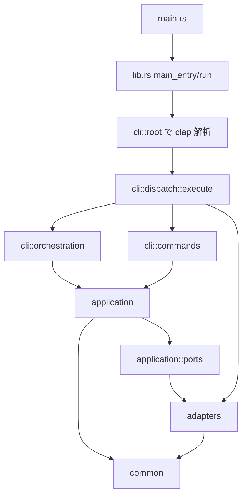

# ato-cli Source Architecture Overview

このドキュメントは、ato-cli の src 配下にある主要レイヤーの責務と依存関係を把握しやすくするための概要です。
実装の正確な仕様は docs/current-spec.md と各モジュール実装が正であり、この文書はそれらを読むための地図として使うことを想定しています。

## 1. 全体像

ato-cli の src 配下は、概ね次の役割分担で整理されています。

- cli: CLI 定義、コマンドルーティング、依存関係注入
- application: ユースケース、パイプライン制御、アプリケーション固有の振る舞い
- adapters: レジストリ、ランタイム、出力、IPC など外部境界の実装
- common: 複数レイヤーから使われる小さな共通機能
- utils: 横断ユーティリティの受け口

起動から実行までの大きな流れは次のとおりです。

ポイントは、cli が入口として要求を受け、application がユースケースを持ち、adapters が外部 I/O や実行基盤を引き受けることです。

## 2. エントリポイントと統合ポイント

### 2.1 main.rs

main.rs は極薄いエントリポイントです。実体は lib.rs の main_entry に委譲されます。

### 2.2 lib.rs

lib.rs はこの crate の統合ポイントです。主な責務は次のとおりです。

- モジュールツリーの宣言
- main_entry と run による起動制御
- JSON エラー出力と通常エラー出力の切り替え
- CliReporter の生成
- sidecar の後始末
- 既存 call site から使いやすいように各レイヤーの再公開

つまり lib.rs は、アプリケーションの実装詳細を全部持つ場所ではなく、「起動」「終了」「再公開」のハブとして機能しています。

## 3. 各レイヤーの責務

### 3.1 cli レイヤー

cli はユーザー入力をプログラム内部の処理へ変換する層です。主に次の 3 つの役割に分かれます。

- root: clap によるコマンド・引数定義
- dispatch: Commands を受けて適切な処理へ振り分けるルータ
- orchestration: 移行中の薄いビルダー層。CLI 引数から依存関係を組み立てて application::pipeline へ委譲する

#### root

src/cli/root.rs では Cli と Commands を定義し、run、build、publish、install、search、init などの公開 CLI サーフェスを集約しています。
ここで定義されるのは「何を受け付けるか」であり、「どう実行するか」は別モジュールに分離されています。

#### dispatch

src/cli/dispatch/mod.rs の execute が主要ルータです。
Clap が解釈した Commands を match し、以下のどちらかへ渡します。

- orchestration 配下の高レベルフロー
- commands 配下の個別コマンド実装

この構成により、CLI の公開面と実行ロジックの接続点が一箇所に保たれています。

#### orchestration

src/cli/orchestration は、単一モジュールに閉じない処理の並びを扱います。代表例は次のとおりです。

- build_validate: build と validate 系の流れ
- install_command: install のフロー
- publish_command: publish のフロー
- run_install: run 系のフロー
- catalog_registry: registry/search の高レベル操作
- support_command: engine/setup 系の補助操作

この層は現在 migration 中であり、最終的な責務は「phase の順序を持つこと」ではなく「CLI 引数から adapter / reporter を組み立てて application::pipeline を起動すること」です。

#### commands

src/cli/commands は比較的単機能なコマンド実装を持ちます。例えば次のようなものがあります。

- keygen
- sign
- verify
- search
- inspect
- logs
- ps
- run
- update
- validate

設計意図としては、単発で完結する処理は commands に置き、複数段階のフローは orchestration に寄せる形です。

### 3.2 application レイヤー

application は ato-cli のユースケースと内部ルールを表す層です。CLI 表現には依存せず、何を実現するかを中心に整理されています。

主なモジュールは次のとおりです。

- agent: エージェント関連のアプリケーションロジック
- auth: 認証情報の管理と Store/GitHub 連携
- engine: build/install/manager/data_injection などの中核フロー
- pipeline: hourglass phase order、ConsumerRun/ProducerPublish のユースケース、phase selection 検証を持つパイプライン層
- preview: プレビュー用途のアプリケーション処理
- search: レジストリ検索のユースケース
- workspace: init/new/scaffold などプロジェクト生成系
- ports: adapter へ要求する境界インターフェース
- types: 共有型

#### ports

src/application/ports.rs は、Ports and Adapters パターン上の境界です。現状の代表ポートは次のとおりです。

- OutputPort: 進捗、警告、利用情報などの出力契約
- InteractionPort: confirm、manifest preview、editor 起動など対話契約
- ports/install.rs: SourcePort と TargetPort により Artifact -> Directory の install を抽象化
- ports/publish.rs: DestinationPort により Artifact -> Destination の publish を抽象化

application はこれらの trait に依存し、具体的な端末出力や UI 実装には直接依存しません。

#### pipeline

src/application/pipeline は、双方向 hourglass の制御フローを持つユースケース層です。
現在の主な責務は次のとおりです。

- hourglass: ConsumerRun / ProducerPublish の canonical phase vocabulary と選択範囲
- executor: phase runner を順番に駆動する共通エンジン
- consumer: run の標準 phase 範囲を表す ConsumerRunPipeline
- producer: publish の stop point 解決、phase option 検証、ProducerPipeline
- phases/install, phases/publish: Artifact -> Directory、Artifact -> Destination の個別ユースケース

重要なのは、phase の順序や stop point の意味論が CLI ではなく application に属している点です。
CLI 側は、どの adapter を使うかと、どの pipeline を起動するかだけを決める方向へ寄せています。

#### engine

src/application/engine は ato-cli の実行・構築パイプラインの中核です。

- build: パッケージングや build 系処理
- install: install 系処理と support
- data_injection: 外部入力注入
- manager: engine 管理や制御補助

run/build/publish/install の表面 API は cli にありますが、処理の意味論はこの層に集約されます。

#### auth

src/application/auth は認証と資格情報の管理を担当します。

- credentials.toml を中心とした認証情報の永続化
- GitHub トークンや Store session token の取り扱い
- device flow や publisher 情報の管理
- consent store と対話補助

外部サービス連携の細部は含みつつも、役割としては「認証ユースケースの一元管理」です。

#### workspace

src/application/workspace はプロジェクト開始時の体験を担当します。

- init: 現在のプロジェクト検出、prompt、recipe
- new: 新規プロジェクト作成
- scaffold: テンプレートや雛形生成

CLI の init/new/scaffold 系はこの層に寄せて実装されます。

### 3.3 adapters レイヤー

adapters は外部システムとの接続面です。I/O、ネットワーク、プロセス実行、ターミナル表示など、変化しやすい境界がここに集まります。

主なサブモジュールは次のとおりです。

- output: 人間向け/JSON 向け出力
- runtime: 実行ランタイムと executor 群
- install: install source / target adapter 群
- publish: publish destination adapter 群
- registry: レジストリ解決、HTTP、publish、state、serve
- ipc: IPC broker と JSON-RPC 系
- preview: GitHub preview や下書き管理
- inference_feedback: 推論中フィードバック

#### output

src/adapters/output はユーザーへの見せ方をまとめた層です。

- reporters: CliReporter などの出力実装
- diagnostics: エラー分類、コマンド文脈検出、終了コード対応
- progressive: ロゴや段階的表示
- terminal: TUI/ターミナル向け表現

application::ports::OutputPort を実装する具体物はこの周辺に置かれます。

#### runtime

src/adapters/runtime はプロセス実行とランタイム依存部分を吸収します。

- executors: deno、node_compat、oci、shell、source、wasm など
- external_capsule: 外部 capsule 実行との接続
- manager: ランタイム管理
- overrides: 実行上書き
- process: プロセス制御
- provisioning: 実行前準備
- tree: 実行ツリー管理

ato-cli が複数ランタイムを扱えるのは、この層で driver ごとの差異を閉じ込めているためです。

#### registry

src/adapters/registry は公開レジストリおよびローカルレジストリとの接点です。

- binding: ホスト側 binding 管理
- http: レジストリ API クライアント
- publish: artifact、ci、official、preflight、prepare、private
- serve: ローカルサーブ
- state: 状態バインディング管理
- store: ストア連携
- url: レジストリ URL 解決補助

また、RegistryResolver は DNS TXT や well-known endpoint を使った discovery をサポートしており、単なる HTTP 呼び出し以上の責務を持ちます。

#### ipc

src/adapters/ipc は capsule 間またはホスト間通信の境界です。

- broker
- dag
- guest_protocol
- inject
- jsonrpc
- refcount
- registry
- schema
- token
- types
- validate

設計上、IPC は付属機能ではなく、独立した adapter 群として扱われています。

### 3.4 common レイヤー

common は小さいが複数箇所から必要とされる共通部品を置く場所です。

- proxy: HTTP proxy 周辺の共通処理
- sidecar: sidecar プロセスの起動と停止

lib.rs にある SidecarCleanup も、この common::sidecar のハンドルを使って後始末を統一しています。

### 3.5 utils レイヤー

lib.rs では utils を archive、env、error、fs、hash、local_input、payload_guard などのユーティリティ群として再公開しています。

現状の utils は、既存 call site 互換のための薄い互換レイヤーです。archive、env、error、fs、hash、local_input、payload_guard のような小さな横断機能を再公開しますが、新しいロジックの主戦場としては扱わない前提です。

新しい共有ロジックを追加する際は、utils に安易に積まず、まず common・application・adapters のどこに属する責務かを判定したうえで配置し、既存互換の都合がある場合だけ utils から再公開するのが安全です。

## 4. 依存方向

設計の基本方針は次の方向です。

- cli は application のユースケースに対して adapter と reporter を注入する
- application はユースケースとポート定義を持つ
- adapters は application が要求するポートを具体化する
- install / publish adapter は Artifact の取得・展開先・配備先という外部境界を受け持つ
- 新設中の install / publish adapters は、Install を Artifact -> Directory、Publish を Artifact -> Destination として分離する方向へ寄せる
- common は複数レイヤーから利用される

簡略化すると次のように読めます。

- 入力の入口: cli
- 処理の意味: application
- 外部接続の実体: adapters
- 横断補助: common

このため、新規実装時の判断基準は比較的明快です。

- CLI 引数やコマンド追加なら cli
- ユースケースや内部ルールなら application
- ファイル I/O、HTTP、プロセス、表示、IPC なら adapters
- 小さい横断機能なら common

## 5. 代表的なフロー

### 5.1 run

run の典型フローは次の順です。

1. cli::root が引数を解釈する
2. cli::dispatch::execute が Commands::Run を受ける
3. cli::orchestration::run_install が install 準備と依存関係の組み立てを行う
4. application::pipeline::consumer::ConsumerRunPipeline が Prepare -> Build -> Verify -> DryRun -> Execute を駆動する
5. 各 phase の具体処理は application / adapters / executors を通じて実行される
6. adapters::output::reporters が結果を出力する

### 5.2 build / validate

build と validate は cli::orchestration::build_validate に集約され、内部で build 系 application ロジックと diagnostics/出力 adapter を組み合わせます。

### 5.3 publish

publish は cli::orchestration::publish_command が入口ですが、phase selection と順序制御は application::pipeline::producer::ProducerPipeline へ委譲されます。CLI 側は publish target の解決、reporter の注入、phase runner の組み立てを担い、phase の順番自体は application が保持します。

### 5.4 install / search / registry

install は install_command、search や registry 系は catalog_registry を経由し、registry adapter と output adapter を使いながらフローを完結させます。

## 6. 新しい機能を足すときの目安

### 6.1 新しい CLI コマンドを追加する場合

通常は次の順で触ります。

1. src/cli/root.rs に引数定義を追加する
2. 必要に応じて src/cli/mod.rs からモジュールを公開する
3. src/cli/dispatch 配下にハンドラを追加する
4. 複数段階フローなら、まず src/application/pipeline か application の既存ユースケースへ置けるかを判定する
5. CLI 側で必要なのが配線だけなら src/cli/orchestration か src/cli/dispatch の薄いビルダーに留める
6. 外部 I/O は adapters に実装する

### 6.2 既存構造を保つための判断

- 単一コマンドで閉じる処理は cli::commands 寄り
- 複数フェーズをまたぐ処理は cli::orchestration 寄り
- 再利用される業務ルールは application
- 実行環境差分や出力差分は adapters

## 7. まとめ

ato-cli の src 構成は、単純な層分けというより、CLI を入口にした Ports and Adapters 寄りの構成として読むと理解しやすいです。

- cli が公開インターフェースと依存関係注入を担う
- application がユースケースと hourglass の順序制御を表現する
- adapters が外部世界への接続を担う
- common と utils が横断機能と互換受け口を支える

この整理を前提にコードを追うと、コマンド追加、レジストリ拡張、ランタイム追加、出力改善のそれぞれで、どこに変更を入れるべきか判断しやすくなります。