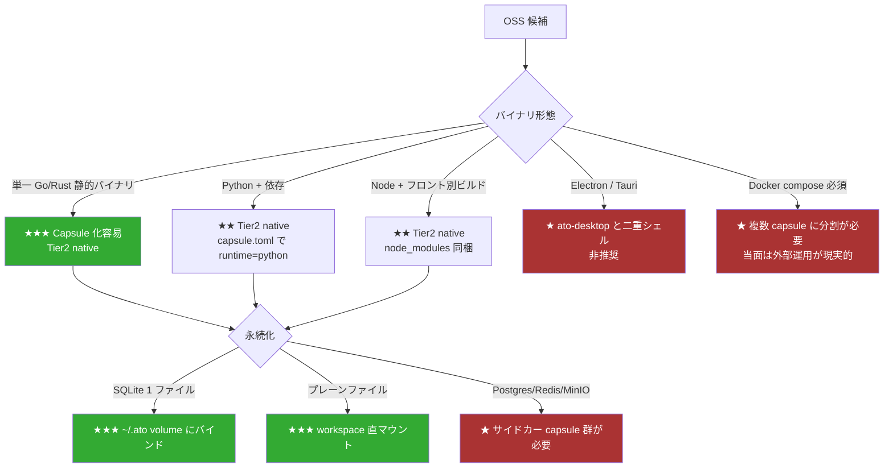
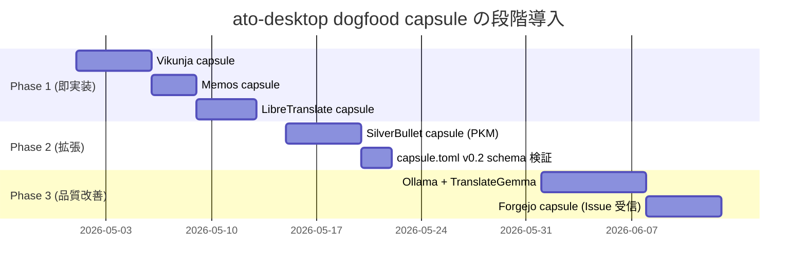

# ato-desktop ドッグフーディング: 普段使いツールの Capsule 候補リサーチ

> 作成: 2026-04-29
> 対象: ato-desktop での日常使用ツール (TODO / メモ / 日↔英翻訳)
> ゴール: capsule 化の実装コスト・利便性・OSS 健全性を踏まえた現実的な推奨

---

## 1. エグゼクティブサマリー

ato-desktop は GPUI シェルの中で **Wry WebView をパネル化して capsule をホストする**アーキテクチャなので、capsule 候補の評価軸は通常の "self-hosted ランキング" と少しズレる。具体的には次の 3 点が決め手になる:

1. **シングルバイナリで HTTP サーバを立てる Web アプリが最も capsule 化しやすい** — `ato run` から子プロセスとして起動し、`localhost:PORT` を Wry に流し込むだけで完結する。Electron デスクトップアプリ (Joplin / Logseq / AppFlowy) は既に "WebView シェル + ロジック" を内包しているので、ato-desktop と二重シェルになり Tier2 native でも嬉しさが薄い。
2. **永続化が単一 SQLite ファイル or プレーンファイルに収まるもの**は `~/.ato/` 配下にマウントする capsule volume と相性が良く、バックアップ・移行が `cp` で済む。Postgres / Redis / MinIO を要求する分散構成 (AppFlowy Cloud / Plane) は capsule 1 個で完結せず、`ato compose` 的な複数 capsule オーケストレーションが必要になる。
3. **JP↔EN 翻訳は明確な OSS の谷間** — ピュア OSS で品質が安定するのは LibreTranslate (Argos Translate) だが [JP-EN の BLEU スコアは 11.36 と低め](https://community.libretranslate.com/t/bleu-scores-with-argos-translate/340)。実用品質を取るなら Ollama + TranslateGemma などの **LLM 経由** が現実解で、これは容量 4–8GB のモデル配布をどう capsule 内に閉じるかが設計ポイント。

結論として、推奨スタックは下記の 3 capsule 構成:

| 用途 | 推奨 | 理由 |
|---|---|---|
| **TODO / Issue** | **Vikunja** | Go シングルバイナリ + 埋込 Vue フロント + SQLite。capsule 化が一番素直 |
| **メモ** | **Memos**（速記用）+ **SilverBullet**（長文・PKM 用）の 2 段構え | Memos は MIT・20MB バイナリで起動瞬時。SilverBullet は markdown ファイル直格納で Logseq 的な PKM 用途に耐える |
| **翻訳** | **LibreTranslate**（API + Web UI）を最初に capsule 化、不満なら **Ollama + TranslateGemma** capsule に置換 | LibreTranslate は Tier2 でも数 100MB で完結。品質を取りたい段階で LLM スタックに移行 |

以降、各カテゴリの選択理由を実データで詰める。

---

## 2. 評価フレームワーク: ato-desktop における "Capsule 適合度"



**重み付け:**

| 軸 | 重み | 評価値の意味 |
|---|---|---|
| バイナリ形態 | 35% | Go 静的 > Python > Node > Electron > 多重サービス |
| 永続化 | 25% | SQLite 1 ファイル > プレーンファイル > 専用 DB |
| ato-desktop との UX 整合 | 20% | ブラウザ完結 UI > Native ウィンドウ |
| ライセンス | 10% | MIT/Apache > AGPL（個人ドッグフード前提なら問題なし） |
| アクティビティ | 10% | 直近 30 日コミット & v2026 系リリース |

---

## 3. カテゴリ A: TODO / Issue 管理

### 3.1 候補比較

| 候補 | License | スタック | 永続化 | バイナリ形態 | ★ Capsule 適合 | 備考 |
|---|---|---|---|---|---|---|
| **Vikunja** | AGPL-3.0 | Go + Vue (埋込) | SQLite / MySQL / Postgres | **単一バイナリ** | **★★★ 5/5** | v2.3.0 (2026-04-09)、4.1k★、リスト/Kanban/Gantt/CalDAV/REST API ([source](https://vikunja.io/)) |
| **Plane** | AGPL-3.0 | TS (Vite) + Django + Postgres + Redis | Postgres 必須 | Docker compose | ★★ 2/5 | v1.3.0、48.5k★、Jira 級だが [複数サービス必須](https://developers.plane.so/self-hosting/overview) |
| **WeKan** | MIT | Meteor (Node) + MongoDB | MongoDB 必須 | Docker | ★ 2/5 | Trello 風だが MongoDB が重い |
| **Focalboard** | (実質 EOL) | Go + React | SQLite | バイナリ | — | [Mattermost が 2024-08 に unmaintained 宣言](https://selfhosting.sh/compare/wekan-vs-focalboard/) |
| **OpenProject** | GPL-3.0 | Rails + Postgres | Postgres 必須 | Docker | ★ 1/5 | 過剰機能 |
| **Tasks.org** | GPL-3.0 | Android | — | — | — | モバイル中心 |
| **Taskwarrior** | MIT | C++ CLI | flat file | バイナリ | ★★ 3/5 | UI 無し、TUI ラッパー必要 |
| **tududi** | (要確認) | Ruby/Sinatra | SQLite | gem | ★★ 3/5 | [新興だが採用例少](https://github.com/chrisvel/tududi) |

### 3.2 推奨: Vikunja

**根拠:**
- **Go の単一バイナリにフロント (Vue) が埋め込まれて配布される** — `vikunja --config /path` を `ato run` の executor に渡すだけ。Wry に `localhost:3456` を流せば完成
- SQLite ファイルが `~/.ato/capsules/vikunja/data.db` に落ちる構成にできる → workspace policy で読み書きを許可するだけ
- v2.x で Gantt / Table / CalDAV / REST API まで揃い、Todoist + Linear + Trello を 1 つで代替できる
- AGPL は個人 dogfood なら問題なし（再配布する瞬間に注意）

**capsule.toml ドラフト:**

```toml
schema = "capsule/v0.2"
name = "vikunja"
version = "2.3.0"

[runtime]
kind = "native"          # Tier2: nacelle で sandbox 化
binary = "vikunja"

[network]
listen = ["127.0.0.1:3456"]
egress = []              # 完全オフライン (sync 不要なら)

[filesystem]
read_write = ["~/.ato/capsules/vikunja"]

[surface]
url = "http://127.0.0.1:3456"
title = "Vikunja"
```

### 3.3 セカンドオピニオン

GitHub Issues 連携が必須 (実 Issue を ato で扱いたい) なら、**Forgejo / Gitea を別 capsule** として並列展開し、Vikunja を「個人 TODO」、Forgejo を「OSS Issue 受信箱」として **2 capsule 構成**にするのが筋が良い。Vikunja には GitHub Issue インポート機能はない。

---

## 4. カテゴリ B: メモパッド

### 4.1 候補比較

| 候補 | License | スタック | 永続化 | バイナリ形態 | ★ Capsule 適合 | 備考 |
|---|---|---|---|---|---|---|
| **Memos** | MIT | Go + React (埋込) | SQLite / MySQL / Postgres | **単一バイナリ 20MB** | **★★★ 5/5** | v0.28.0 (2026-04-27)、59.3k★、port 5230 ([source](https://github.com/usememos/memos)) |
| **SilverBullet** | MIT | Go + Node ビルド | プレーン .md ファイル | バイナリ + Docker | **★★★ 5/5** | v2.6.1 (2026-04-11)、5.1k★、port 3000、SQL 風クエリ + Lua スクリプト ([source](https://lwn.net/Articles/1030941/)) |
| **Trilium / TriliumNext** | AGPL-3.0 | Node | SQLite | Docker / バイナリ | ★★★ 4/5 | 階層 PKM、属性 DB、Mermaid/Excalidraw 内蔵 |
| **Joplin Server** | AGPL-3.0 | Node (server) + Electron (client) | Postgres / SQLite | Docker | ★★ 3/5 | E2EE が強み、Electron client は非推奨 |
| **Logseq** | AGPL-3.0 | Electron (ClojureScript) | プレーン .md | Electron | ★ 2/5 | デスクトップアプリ、ato-desktop と二重シェル |
| **AppFlowy** | AGPL-3.0 | Flutter + Rust + (Cloud: Postgres/Redis/MinIO/GoTrue) | local mode or 4 サービス | Tauri-like or Docker compose | ★ 2/5 | フル機能には [2-4GB RAM の compose](https://docs.appflowy.io/docs/guides/appflowy) |
| **Standard Notes** | AGPL-3.0 | Node + 複数サービス | 専用 DB | Docker | ★★ 2/5 | E2EE 特化、構成重め |
| **flatnotes** | MIT | Python (FastAPI) | プレーン .md | Docker | ★★ 4/5 | シンプル、軽量、検索のみに割り切り |
| **QOwnNotes** | GPL-2.0 | Qt | プレーン .md | Native デスクトップ | ★ 2/5 | デスクトップアプリ |

### 4.2 推奨: Memos + SilverBullet の 2 段構え

メモ用途は **「速記 (fleeting)」と「PKM (永続)」で別 capsule** にするのが体感的に最良。

#### 4.2.1 Memos (速記)

- 1 投稿 = 1 markdown スニペット、Twitter 的タイムラインで流れる
- **20MB の Go バイナリ + SQLite** で完結 — Vikunja と同じ要領で capsule 化可能
- 「思いついたら即書く」用途で、ato-desktop の常駐パネル候補

#### 4.2.2 SilverBullet (PKM)

- データが **プレーン .md ファイル**そのもの → ato workspace に直マウント、git で履歴管理可
- **service worker でオフライン動作 → ato-desktop の Wry でも快適**
- SQL 風クエリ + Lua プラグインで「TODO 一覧を Memos と Vikunja から集約する」など後で拡張できる
- 注意点: [SilverBullet 2.0 で offline+sync モードに移行](https://vpntierlists.com/blog/markdown-notes-war-silverbullet-alternatives-spark-self) — capsule 内では同期不要なので関係ないが、外部端末と共有する設計の場合は確認

**capsule.toml ドラフト (Memos):**

```toml
schema = "capsule/v0.2"
name = "memos"
version = "0.28.0"

[runtime]
kind = "native"
binary = "memos"
args = ["--mode", "prod", "--port", "5230"]

[network]
listen = ["127.0.0.1:5230"]

[filesystem]
read_write = ["~/.ato/capsules/memos"]

[surface]
url = "http://127.0.0.1:5230"
title = "Memos"
```

### 4.3 不採用理由メモ

- **Logseq / Joplin / AppFlowy デスクトップ版** は **Electron / Tauri / Flutter で既に "シェル + WebView" を持っている**ため、ato-desktop でホストする意味が薄い (二重シェルでメモリも倍)。AppFlowy は Cloud server 側を capsule 化する手はあるが、4 サービス必須で 1 capsule に収まらない
- **Trilium** は強力だが Memos + SilverBullet で機能が重複 + 学習コスト高

---

## 5. カテゴリ C: 日↔英 翻訳

### 5.1 候補比較

| 候補 | License | 方式 | 品質 (JP-EN) | リソース | ★ Capsule 適合 | 備考 |
|---|---|---|---|---|---|---|
| **LibreTranslate** | AGPL-3.0 | Argos NMT (OpenNMT) | **BLEU 11.36** ([source](https://community.libretranslate.com/t/bleu-scores-with-argos-translate/340)) | CPU 数 100MB | **★★★ 4/5** | v1.9.5、Web UI 同梱、API も同居 |
| **Argos Translate** | MIT | NMT ライブラリ | LibreTranslate と同 | CPU 軽量 | ★★ 3/5 | UI なし、CLI/GUI 別途 |
| **Ollama + TranslateGemma** | Apache 2.0 (Gemma) | LLM (Gemma 3 派生) | DeepL に近い体感品質 ([demo report](https://medium.com/free-or-open-source-software/demo-translategemma-ollama-obsidian-55-languages-offline-ai-powered-translation-global-indian-14ae927d8aa3)) | **4-8GB モデル + 8GB+ RAM** | ★★ 3/5 | モデル配布が capsule の重荷、GPU 推奨 |
| **Ollama + Aya / Qwen 系** | Apache 2.0 | 多言語 LLM | 体感良 | 同上 | ★★ 3/5 | 23+ 言語サポート ([Aya 23](https://medium.com/free-or-open-source-software/offline-ai-ollama-aya-llm-chat-with-ollama-documents-devices-in-hindi-english-french-german-7afc9441b0e6)) |
| **Sugoi Translator** | (Patreon 経由) | CNN (visual novel 特化) | JP-EN 高品質 | **8GB RAM、CPU heavy** | ★ 2/5 | OSS distribution が弱い、配布が Patreon |
| **Translate Shell** | GPL-3.0 | Google/Yandex/Bing API | 高品質 | 軽量 | ★ 1/5 | **オフラインでない** (外部 API) |
| **Bergamot / Firefox Translate** | MPL-2.0 | Marian NMT (WASM!) | 中 (英↔欧州語中心、JP は限定) | ブラウザ内完結 | ★★ 3/5 | Tier1 (browser_static) で動く可能性あり、JP モデルの成熟度要確認 |

### 5.2 推奨: 2 段階アプローチ

**段階 1 (今すぐ着手): LibreTranslate を capsule 化**

- Python ランタイムは ato が `python_runtime` モジュールでサポート済 → capsule.toml で `runtime = "python"` を指定して `pip install libretranslate` を `ato build` 時に行えば良い
- Argos モデル (`translate-en_ja-1_X.argosmodel` / `translate-ja_en-1_X.argosmodel`) は数 100MB なので capsule 内に同梱可
- Web UI が同梱されているので Wry に流すだけで OK
- BLEU 11 は「定型文や技術ドキュメントの大意把握」には十分。**ニュアンスや会話翻訳には不足する**

**段階 2 (品質が不足したら): Ollama + TranslateGemma capsule に置換**

- Ollama 自体を別 capsule として常駐させ、翻訳 UI capsule から `localhost:11434` に投げる構成
- モデルは初回 `ato run` 時に lazy ダウンロード (capsule artifact CAS にキャッシュ → 2 回目以降高速)
- 8GB+ RAM が前提 — `capsule.toml` の `[resource]` で min RAM を宣言してドキュメント化

**capsule.toml ドラフト (LibreTranslate):**

```toml
schema = "capsule/v0.2"
name = "libretranslate"
version = "1.9.5"

[runtime]
kind = "python"
version = "3.11"
entrypoint = "libretranslate --host 127.0.0.1 --port 5000 --load-only ja,en"

[network]
listen = ["127.0.0.1:5000"]
egress = []              # オフラインモードで完結

[filesystem]
read_write = ["~/.ato/capsules/libretranslate/models"]

[surface]
url = "http://127.0.0.1:5000"
title = "Translate (JA↔EN)"
```

### 5.3 探索済みだが不採用

- **Sugoi Translator** は JP-EN 品質では魅力的だが、**配布が Patreon DL ベースで checksumed なソース URL がない** → ato の reproducible capsule pack に乗せにくい
- **Translate Shell** は外部 API 依存でオフライン要件と矛盾
- **Bergamot WASM** は Tier1 で動かせば理想形だが、**JP↔EN 公式モデルがまだ実用域に達していない** (主に欧州言語ペア中心)

---

## 6. ロードマップ提案



**順序の理由:**

1. Vikunja → Memos → LibreTranslate の順は **capsule 化難度が低い順** (全て Go/Python シングルプロセス、SQLite or Argos モデルファイル)
2. SilverBullet を後にしたのは markdown ファイルの workspace mount + service worker の挙動を Wry で先に検証したいため (Memos で Tier2 native + WebView の素直な事例を作ってから)
3. Phase 3 の Ollama は **モデル配布 (~5GB)** を capsule artifact / CAS に乗せる検証が必要で、ato 側の改善 (lazy fetch + checksum) と並行して進めるのが妥当

---

## 7. 未解決事項 / 要追加調査

| 項目 | 内容 | 解消方法 |
|---|---|---|
| Vikunja のシングル binary 内 Web フロント挙動 | 公式ページに "single binary" の明記はあるが、フロント assets が embedded か static dir か未確認 | リリース zip を実際に展開して `file` で確認 |
| LibreTranslate JP-EN モデルの実体験品質 | BLEU 11 が "実用上どの程度か" は技術文書 vs 会話文で大きく違う | 段階 1 capsule 完成後、実テキスト 30 文程度で官能評価 |
| Bergamot Translation の最新 JP モデル状況 | Mozilla 側で 2025-2026 に追加された可能性あり | `firefox-translations-models` リポジトリの最新 release を直接確認 |
| ato Tier2 native capsule の SQLite 書き込み挙動 | nacelle の Landlock / Seatbelt 配下で WAL ファイルが正しく作れるか | nacelle samples で SQLite テスト capsule を 1 個作って検証 |
| Forgejo を Issue 受信箱として使う構成 | Vikunja で全部済むなら不要 | Phase 1 完了後の使用感次第 |

---

## 8. Sources

- [Vikunja: The task manager you actually own](https://vikunja.io/)
- [Vikunja vs WeKan comparison](https://vikunja.io/compare/wekan/)
- [Planka vs Vikunja](https://openalternative.co/compare/planka/vs/vikunja)
- [WeKan vs Focalboard](https://selfhosting.sh/compare/wekan-vs-focalboard/)
- [Memos GitHub](https://github.com/usememos/memos)
- [Memos features](https://usememos.com/features)
- [SilverBullet (LWN)](https://lwn.net/Articles/1030941/)
- [SilverBullet community key selling points](https://community.silverbullet.md/t/key-selling-points/47)
- [Markdown notes war: SilverBullet alternatives](https://vpntierlists.com/blog/markdown-notes-war-silverbullet-alternatives-spark-self)
- [Plane self-hosting docs](https://developers.plane.so/self-hosting/overview)
- [LibreTranslate GitHub](https://github.com/LibreTranslate/LibreTranslate)
- [LibreTranslate vs Google Translate](https://www.machinetranslation.com/blog/libretranslate-vs-google-translate)
- [BLEU scores with Argos Translate](https://community.libretranslate.com/t/bleu-scores-with-argos-translate/340)
- [Argos Translate GitHub](https://github.com/argosopentech/argos-translate)
- [Ollama + Aya offline LLM](https://medium.com/free-or-open-source-software/offline-ai-ollama-aya-llm-chat-with-ollama-documents-devices-in-hindi-english-french-german-7afc9441b0e6)
- [TranslateGemma + Ollama demo](https://medium.com/free-or-open-source-software/demo-translategemma-ollama-obsidian-55-languages-offline-ai-powered-translation-global-indian-14ae927d8aa3)
- [Best LLM for Translation 2026](https://www.noviai.ai/models-prompts/best-llm-for-translation/)
- [Sugoi Japanese Translator GitHub](https://github.com/leminhyen2/Sugoi-Japanese-Translator)
- [AppFlowy self-hosting docs](https://docs.appflowy.io/docs/guides/appflowy)
- [10 Best Open-Source Task Management Apps (2026)](https://super-productivity.com/blog/open-source-productivity-apps-comparison/)
- [tududi GitHub](https://github.com/chrisvel/tududi)
- [4 best self-hosted note-taking apps](https://www.xda-developers.com/best-self-hosted-note-taking-apps/)
