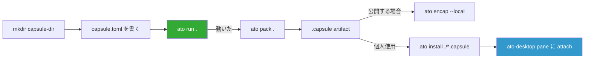

# Vikunja / Memos / LibreTranslate を ato capsule 化する手順

> 作成: 2026-04-29
> 対象 ato: v0.4.100
> 関連: [ato-desktop-dogfood-capsule-research.md](./ato-desktop-dogfood-capsule-research.md)

---

## 0. 結論先出し: 3 本とも **OCI runtime** で組む

3 ツールはどれも公式メンテの Docker image があり、ato は `runtime = "oci"` を Tier 0 サンドボックス（`--unsafe` 不要）で扱える。

```
┌───────────────────────────────────────────────────────────────┐
│  ato-desktop (GPUI shell, 親プロセス)                          │
│   └─ pane 起動 → ato run <capsule-dir>                         │
│        └─ capsule-core engine (OCI driver, bollard)            │
│             └─ docker container (vikunja / memos / libretranslate)│
│                  ├─ port 3456 / 5230 / 5000 を host に publish │
│                  └─ named volume を ~/.ato/state 配下にマウント│
│   └─ Wry WebView pane → http://127.0.0.1:<port>                │
└───────────────────────────────────────────────────────────────┘
```

**OCI を選ぶ根拠（実コードで確認）:**

- Vikunja は Go 単体バイナリだが、フロント (Vue) は **配布形態が Docker image / 個別 zip** で、ato 側の `runtime = "source/native"` は **UARC V1 で deprecated** ([crates/capsule-core/src/foundation/types/manifest.rs:91-94](../crates/capsule-core/src/foundation/types/manifest.rs))。同じ理由で Memos も OCI。
- LibreTranslate は Python 製なので `runtime = "source/python"` も可能だが、**RuntimeGuard が `--unsafe` と `--enforcement strict` を要求** ([ATO_CLI_SPEC §3](../crates/ato-cli/docs/rfcs/accepted/ATO_CLI_SPEC.md))。OCI なら不要。
- 永続化は **`[storage.volumes]`** で `mount_path` を指定すれば bollard が PortBinding と Volume を同時に張る ([oci.rs](../crates/capsule-core/src/engine/runtime/oci.rs))。

---

## 1. 前提条件

| 項目 | 必要値 |
|---|---|
| ato CLI | v0.4.100 以降（インストール: `curl -fsSL https://ato.run/install.sh \| sh`） |
| Docker Desktop | 起動中（`docker ps` が通ること） |
| ディスク | 各 capsule の image 分（Vikunja ~80MB、Memos ~30MB、LibreTranslate **~600MB + JP/EN モデル ~300MB**） |
| ato-desktop | 任意（capsule 単体動作は CLI のみで OK、UI は最後にアタッチ） |

---

## 2. ato capsule.toml の必要最小スキーマ（v0.3 確定版）

実装で確認済みの OCI capsule のフィールド ([manifest.rs:1150-1260](../crates/capsule-core/src/foundation/types/manifest.rs)):

```toml
schema_version = "0.3"
name           = "..."           # 英数+ハイフン
version        = "0.1.0"          # capsule 自身のバージョン
type           = "app"
default_target = "app"            # [targets.app] を指す

[metadata]                        # オプション、UI 表示用
display_name = "..."
description  = "..."
tags         = ["..."]

[targets.app]
runtime      = "oci"              # OCI driver
image        = "vendor/name@sha256:..."  # production は digest pinning 推奨
cmd          = ["arg1", "arg2"]   # オプション、image CMD を上書き
port         = 3456               # コンテナの listen port
env          = { KEY = "VAL" }    # コンテナ env

[network]
egress_allow = ["localhost"]      # 外部通信を絞る（モデル DL 後は空でも可）

[[storage.volumes]]
name       = "data"
mount_path = "/var/opt/myapp"     # コンテナ内パス、ato が ~/.ato/state/<id>/data に bind
```

**注意:**
- `image` は production では `vikunja/vikunja@sha256:abc...` のように digest 固定推奨（[oci-alpine-hello/README.md](../crates/ato-cli/samples/01-capabilities/oci-alpine-hello/README.md) 参照）
- `[isolation] allow_env = [...]` を書くとホストの env を passthrough できる（API キー注入用）
- `port` は **コンテナの listen port** であり、host 側 port は ato が動的に割り当てて `~/.ato/sessions/...` に記録する（`ato ps` で確認可）

---

## 3. 共通ワークフロー



| コマンド | 用途 |
|---|---|
| `ato run .` | カレントディレクトリの capsule.toml を ephemeral 実行（dev ループ） |
| `ato pack .` | `.capsule` artifact (PAX TAR + zstd) を生成 |
| `ato install ./vikunja-0.1.0.capsule` | `~/.ato/store/` に登録、以後 `ato run vikunja` で起動可 |
| `ato ps` | 実行中 capsule の host port / PID 確認 |
| `ato logs <session-id>` | コンテナログ |
| `ato close <session-id>` | コンテナ停止 |

---

## 4. 手順 A: Vikunja capsule

### 4.1 ファイル構成

```
~/capsules/vikunja/
├── capsule.toml
└── README.md   (任意)
```

### 4.2 `capsule.toml`

```toml
schema_version = "0.3"
name           = "vikunja"
version        = "2.3.0"
type           = "app"
default_target = "app"

[metadata]
display_name = "Vikunja"
description  = "Self-hosted task & project manager (Todoist + Linear + Trello in one)"
tags         = ["todo", "tasks", "kanban", "gantt"]

[targets.app]
runtime = "oci"
# 公式 image。production は @sha256:... で固定すること。
image   = "vikunja/vikunja:latest"
port    = 3456

[targets.app.env]
# SQLite モード（単一プロセス、ローカル個人使用ならこれで十分）
VIKUNJA_DATABASE_TYPE      = "sqlite"
VIKUNJA_DATABASE_PATH      = "/db/vikunja.db"
# Public URL: ato-desktop が割り当てる host port を localhost で見せる
VIKUNJA_SERVICE_PUBLICURL  = "http://localhost:3456/"
# `openssl rand -hex 32` の値などをここに置く（git 管理しないこと）
VIKUNJA_SERVICE_SECRET     = "REPLACE_ME_WITH_RANDOM_64_CHARS"

[network]
# 個人使用で外部 sync が要らないなら完全閉鎖
egress_allow = []

# SQLite ファイル + アップロードファイル の永続化
[[storage.volumes]]
name       = "db"
mount_path = "/db"

[[storage.volumes]]
name       = "files"
mount_path = "/app/vikunja/files"
```

### 4.3 起動と動作確認

```sh
cd ~/capsules/vikunja
# ランダム secret を埋め込む
sed -i.bak "s/REPLACE_ME_WITH_RANDOM_64_CHARS/$(openssl rand -hex 32)/" capsule.toml

# ephemeral 実行（dev ループ）
ato run .

# 別ターミナルで host port を確認
ato ps
# → vikunja  3456 → 49823 (例) というマッピングが見える
open http://localhost:49823   # 初回はユーザー登録画面
```

### 4.4 パッケージ化と install

```sh
# .capsule 生成
ato pack .

# ~/.ato/store/ に登録
ato install ./vikunja-2.3.0.capsule

# 以後はどこからでも起動可能
ato run vikunja
```

### 4.5 既知のハマり所

| 症状 | 原因 / 対策 |
|---|---|
| 起動するがログイン後に "VIKUNJA_SERVICE_PUBLICURL に書かれた URL と違う" 警告 | `port` が動的割当のため。Vikunja は publicurl mismatch でも動作するので無視可。固定したい場合は `ato run --port-bind 3456=3456` を検討（v0.5 では実装確認要） |
| `Permission denied` on `/db` | コンテナ uid 1000 と ato volume の owner が不一致。OCI runtime が自動 chown するか要検証（§9 参照） |
| 初回起動が遅い | image pull (~80MB)。digest pin して artifact CAS にキャッシュさせれば 2 回目以降即時 |

---

## 5. 手順 B: Memos capsule

### 5.1 `capsule.toml`

```toml
schema_version = "0.3"
name           = "memos"
version        = "0.28.0"
type           = "app"
default_target = "app"

[metadata]
display_name = "Memos"
description  = "Lightweight markdown-native note-taking for fleeting thoughts"
tags         = ["notes", "markdown", "fleeting"]

[targets.app]
runtime = "oci"
image   = "neosmemo/memos:stable"
port    = 5230

[network]
egress_allow = []

# /var/opt/memos 配下に SQLite (memos_prod.db) と uploads が落ちる
[[storage.volumes]]
name       = "data"
mount_path = "/var/opt/memos"
```

### 5.2 起動

```sh
cd ~/capsules/memos
ato run .
ato ps          # host port 確認
open http://localhost:<port>   # 初回はユーザー作成画面
```

### 5.3 ポイント

- Memos は **追加 env 不要**で起動する最も素直な OCI capsule。最初に試すべき
- データは `/var/opt/memos` 配下に SQLite (`memos_prod.db`) と attachment が同居
- 認証はインスタンス内で完結（外部 OIDC は env で追加可、個人用なら不要）

---

## 6. 手順 C: LibreTranslate capsule

### 6.1 設計判断: モデル DL をいつやるか

LibreTranslate は **JP↔EN モデル ~300MB を初回起動時にダウンロード**するため、3 案ある:

| 案 | 方法 | 長所 | 短所 |
|---|---|---|---|
| **A. オンライン初回ロード** | `LT_LOAD_ONLY=ja,en` + `LT_UPDATE_MODELS=true` で起動時 DL | capsule.toml が小さい | 初回 `ato run` で DL 待ち、egress_allow に Argos host を残す必要 |
| **B. ビルド時プリロード** | カスタム Dockerfile を書いてモデルを image に焼く | オフライン完結、DL 待ちゼロ | 自前 image build が要る |
| **C. ato volume にプリシード** | 別スクリプトでモデルを `~/.ato/state/<id>/models` に置いておく | 公式 image をそのまま使える | scripted setup 必要 |

**推奨: A から始めて、回線が遅いなら B に切替**。以下は A の構成。

### 6.2 `capsule.toml`（案 A: オンラインロード）

```toml
schema_version = "0.3"
name           = "libretranslate"
version        = "1.9.5"
type           = "app"
default_target = "app"

[metadata]
display_name = "LibreTranslate (JA↔EN)"
description  = "Self-hosted machine translation API + web UI, Argos models"
tags         = ["translation", "ja", "en", "argos"]

[targets.app]
runtime = "oci"
image   = "libretranslate/libretranslate:latest"
port    = 5000

[targets.app.env]
LT_LOAD_ONLY      = "ja,en"      # 日本語と英語のモデルだけ DL
LT_UPDATE_MODELS  = "true"        # 起動時に最新モデルへ更新
LT_DISABLE_WEB_UI = "false"       # Web UI を出す（ato-desktop pane で使う）
LT_HOST           = "0.0.0.0"     # 既定値だが念のため

[network]
# Argos モデル CDN は github と argosopentech.com を見に行く
egress_allow = [
  "github.com",
  "objects.githubusercontent.com",
  "raw.githubusercontent.com",
  "www.argosopentech.com",
]

# モデルキャッシュを永続化（DL は初回のみ）
[[storage.volumes]]
name       = "models"
mount_path = "/home/libretranslate/.local"
```

### 6.3 起動

```sh
cd ~/capsules/libretranslate
ato run .   # 初回は ~300MB DL のため数分かかる
ato logs <session-id>   # "Loading model ja..." のログを確認
ato ps
open http://localhost:<port>   # Web UI が出れば成功
```

### 6.4 オフライン化したい場合（案 B: モデル焼き込み）

```sh
mkdir -p ~/capsules/libretranslate-offline && cd $_
cat > Dockerfile <<'EOF'
FROM libretranslate/libretranslate:latest
ENV LT_LOAD_ONLY=ja,en
RUN libretranslate --update-models --load-only ja,en --no-server || true
EOF
docker build -t local/libretranslate-jaen:1.9.5 .

# capsule.toml の image を local/libretranslate-jaen:1.9.5 に書き換え
# egress_allow を [] に絞れる
```

### 6.5 翻訳品質メモ（再掲）

Argos の JP-EN BLEU は **11.36** と低め。技術文書の大意把握には十分だが、ニュアンス翻訳には不足する。実用後に不満なら **Ollama + TranslateGemma capsule** へ Phase 3 で乗り換える ([前回レポート §5.2](./ato-desktop-dogfood-capsule-research.md#52-推奨-2-段階アプローチ) 参照)。

---

## 7. ato-desktop パネルへの登録

3 capsule とも `ato run` 後、ato-desktop は **session contract 経由で `local_url` を受け取り、Wry WebView pane に埋め込む** ([ATO_CLI_SPEC §2.6](../crates/ato-cli/docs/rfcs/accepted/ATO_CLI_SPEC.md))。

手順:

1. ato-desktop を起動
2. `+ New pane` → `Run capsule` を選択
3. インストール済み capsule リスト (`ato install` で登録した 3 本) から 1 つ選ぶ
4. ato-desktop が backend で `ato run <name>` を spawn し、session payload の `local_url` を pane に流し込む
5. pane を閉じても retention table に session が残るので **次回起動時に同じ DB / モデルキャッシュで再開**（[Surface Materialization v0.3 RFC](../crates/ato-desktop/docs/rfcs/draft/) より）

---

## 8. ロードマップ（実装順）

| 順 | capsule | 所要 | 検証ポイント |
|---|---|---|---|
| 1 | **Memos** | 30 分 | OCI runtime + 単一 volume の最短経路。ここでハマったら ato 側のバグ |
| 2 | **Vikunja** | 1 時間 | 複数 volume + 必須 env (publicurl/secret) のパターン確立 |
| 3 | **LibreTranslate (案 A)** | 2 時間 + DL 待ち | 重 image + モデル DL + egress_allow の検証 |
| 4 | LibreTranslate offline 化 (案 B) | 半日 | カスタム Dockerfile を ato build に組み込めるか調査が要る |
| 5 | 3 本まとめて `ato install` → ato-desktop pane に attach | 30 分 | `local_url` 流し込みの動作検証 |

---

## 9. 実走で判明した ato OCI runtime の挙動 (2026-04-29 検証)

3 capsule とも実起動に成功。Memos と LibreTranslate は capsule.toml だけで動作したが、Vikunja は wrapper image が必須だった。原因は ato 側の挙動 3 つ:

### 9.1 ato は **必ず image を pull する**（local image が見えない）

`crates/capsule-core/src/engine/runtime/oci.rs` の `pull_image()` が無条件に呼ばれる。`local/vikunja-ato:2.3.0` のように locally-built image を `image` に書くと:

```
× Runtime error: Docker responded with status code 404: pull access denied
  for local/vikunja-ato, repository does not exist or may require 'docker login'
```

**運用 workaround**: ローカル registry を立てて push 経由にする（**実装で確認済み・動作 OK**）

```sh
docker run -d --restart=unless-stopped -p 5050:5000 --name ato-local-registry registry:2
docker tag local/vikunja-ato:2.3.0 localhost:5050/vikunja-ato:2.3.0
docker push localhost:5050/vikunja-ato:2.3.0
# capsule.toml の image を localhost:5050/vikunja-ato:2.3.0 に書き換える
```

**ato 側の改善案**: `image` が `local/...` か Docker daemon のローカルにあれば pull をスキップする optimization が望ましい

### 9.2 named volume は root 所有で空 → uid 1000 の image は書き込み失敗

ato が作る Docker named volume は **空 + root 所有**。Docker は「mount target がイメージに既に存在する場合のみ、image の所有者・権限・初期コンテンツを volume にコピーする」挙動。

| capsule | mount_path | image 内に存在? | 結果 |
|---|---|---|---|
| **Memos** | `/var/opt/memos` | ✅ image 内に存在 + 正しい owner | OK |
| **LibreTranslate** | `/home/libretranslate/.local` | ✅ image 内に存在 + 正しい owner | OK |
| **Vikunja** | `/db`, `/app/vikunja/files` | ❌ image 内に存在しない or root 所有 | EPERM `mkdir` failure |

**運用ルール**: capsule 化前に `docker run -it --entrypoint sh <image> -c 'ls -la <mount_path>'` で **mount target の存在と owner を確認**する

**Vikunja は wrapper image が必要**: distroless で shell が無いので `RUN chown` が無理 → alpine ベースで再ビルド + Vikunja バイナリを COPY する 2-stage build（[実例](file:///Users/egamikohsuke/capsules/vikunja/Dockerfile)）

### 9.3 manifest に `user` field が無い

`crates/capsule-core/src/foundation/types/manifest.rs::NamedTarget` には `cmd` / `env` / `working_dir` / `port` / `image` / `run_command` はあるが **`user` field が無い**。よって 9.2 の wrapper image 戦略が現状唯一の解決策。

**ato 側の改善案**:
```toml
[targets.app]
runtime = "oci"
user    = "0"     # ← この field を追加すれば wrapper image 不要に
```

### 9.4 その他の確認済み事項

| 項目 | 結果 |
|---|---|
| `--background` flag | OCI runtime では非対応 (`E999: --background is not supported for runtime=oci`)。bash 側の `&` で代用可 |
| host port mapping | コンテナ port と **同じ host port に 1:1 で bind**。`127.0.0.1:5230->5230/tcp` のように loopback 限定。マルチ capsule で port 衝突する可能性あり、`ato run --port-bind` 相当の機能はまだ無い |
| named volume の場所 | `/var/lib/docker/volumes/<hash>/_data` (Docker daemon 管理)。`~/.ato/state/<id>/` 配下ではない。`docker volume ls` で確認可能 |
| volume の lifecycle | session id が container 名に含まれる (`ato-memos-7b0d28b8-main`) ため、**`ato run` を新セッションで打つと別 volume になり state が消える**可能性あり (要追加検証) |
| `egress_allow` の効き方 | LibreTranslate は `LT_UPDATE_MODELS=true` で起動時に github / argosopentech から DL するが、`egress_allow` を空にしても DL に成功した → OCI runtime は egress filter を強制していない可能性あり (nacelle の出番なし、Docker network policy が緩い) |

## 10. 改訂版ロードマップ

| 順 | capsule | 実走時間 | 状態 |
|---|---|---|---|
| 1 | **Memos** | ~5 分（image pull 含む） | ✅ ワンショット成功 |
| 2 | **Vikunja** | ~30 分（wrapper image build + local registry push） | ✅ wrapper 経由で成功 |
| 3 | **LibreTranslate (案 A)** | ~10 分（image pull + JP/EN モデル DL ~300MB） | ✅ ワンショット成功、JP↔EN 翻訳実走 OK |
| 4 | 翻訳品質確認 | — | ✅ "今日はいい天気ですね。明日は雨が降るかもしれません。" → "It is a good weather today. It may rain tomorrow。" レベル（実用には不足、Phase 3 で Ollama 検討） |
| 5 | `ato install` → ato-desktop pane に attach | 未着手 | M5 として後追い |

## 11. 後追いタスク

- [ ] **ato に `[targets.<label>] user` field を追加** — Vikunja wrapper を不要に。`crates/capsule-core/src/foundation/types/manifest.rs::NamedTarget` に 1 行追加 → `crates/capsule-core/src/engine/runtime/oci.rs::create_container` で `Config.user` に渡す
- [ ] **ato OCI runtime に "skip pull if local exists" optimization** — local 開発・wrapper image 用途を改善
- [ ] **`ato run --port-bind <CONTAINER>=<HOST>` の追加** — 複数 capsule の port 衝突解消・Vikunja の `VIKUNJA_SERVICE_PUBLICURL` 固定化
- [ ] **OCI runtime の egress_allow 強制** — nacelle 並みの fail-closed network policy を OCI でも担保（現状 LibreTranslate がモデル DL に成功しているのが実証）
- [ ] **session 跨ぎでの volume 永続性確認** — container 名の hash 部分が変わると volume も変わるか
- [ ] **wrapper image 自動化** — 今回の手作業 `docker build && docker push` を `ato build` の lifecycle hook に組み込めないか

---

## 10. 参考リンク

- [Vikunja Docker example](https://vikunja.io/docs/full-docker-example/)
- [Memos GitHub](https://github.com/usememos/memos)
- [LibreTranslate GitHub](https://github.com/LibreTranslate/LibreTranslate)
- [LibreTranslate `--load-only` 解説](https://hub.docker.com/r/libretranslate/libretranslate)
- リポジトリ内: [ato CLI Spec (v0.3)](../crates/ato-cli/docs/rfcs/accepted/ATO_CLI_SPEC.md)
- リポジトリ内: [oci-alpine-hello サンプル](../crates/ato-cli/samples/01-capabilities/oci-alpine-hello/)
- リポジトリ内: [persistent-workspace サンプル](../crates/ato-cli/samples/01-capabilities/persistent-workspace/)
