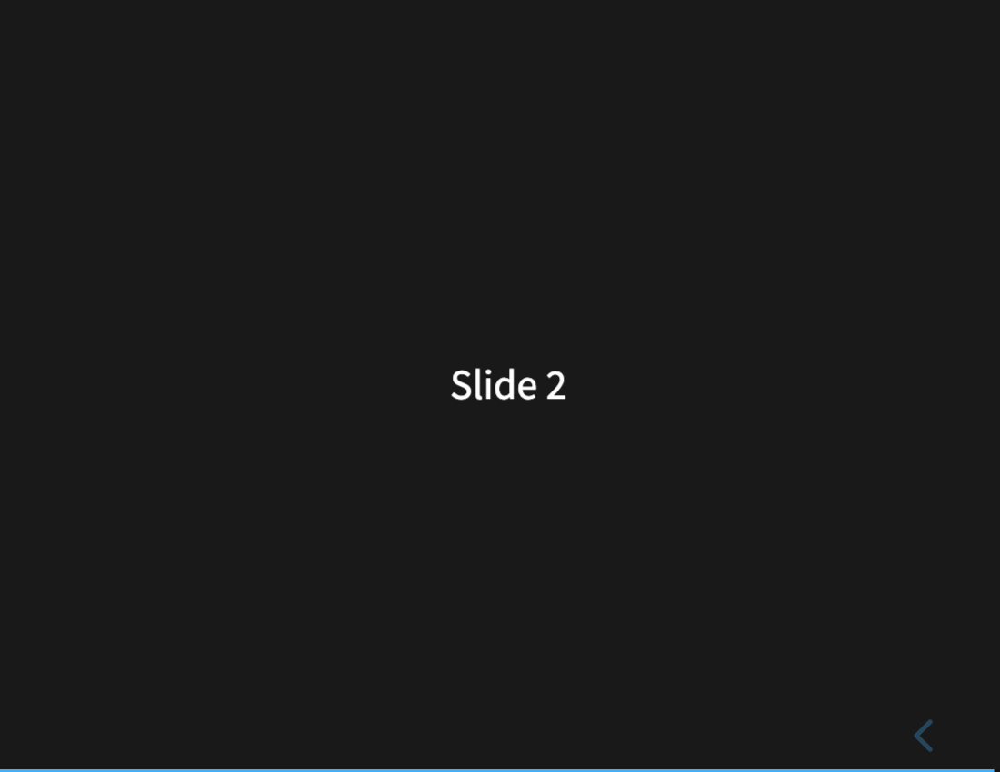
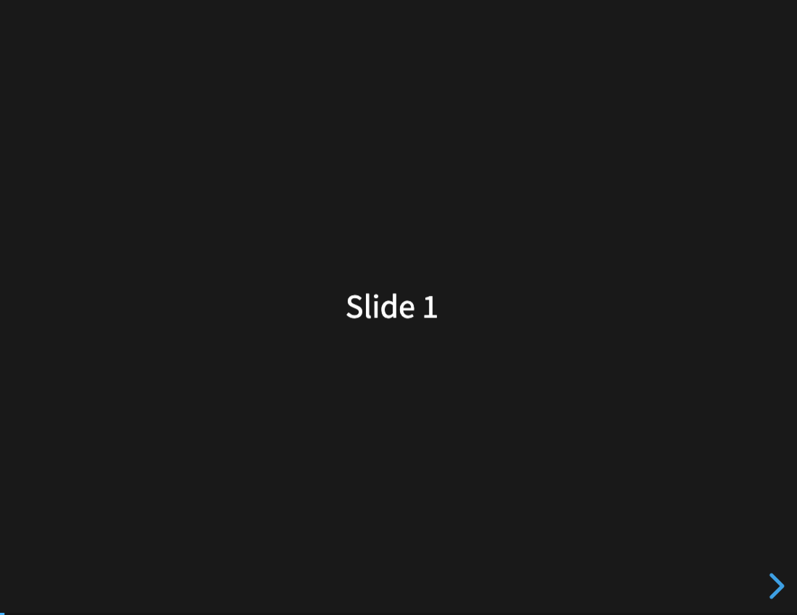

# Static functional acceptance append — 2048 and reveal.js

**Result: two fresh typed-K receipts PASS; both fixed browser operations PASS.**
Persistence was not measured. This is later evidence, not a replacement for
[coverage-50](formation-coverage-50.json) or a new 50-app success rate.

The [plan](formation-static-functional-plan-2026-09-30.json) was committed
before Formation/browser execution at
`896c3cc0e441e770c697a6ac5421b067be7d7203`, SHA256
`1fe46dcc666385c2cc8a5ab36ba89b7e6deadf28da943beb2b0385709c3d0de7`.
The original baseline scratch, including retained static bundles, was absent.
`coverage-50.py` removes it after each app; the historical retained reference
proves that publication happened, not that the artifact is still available.

Both existing archives were verified and formed exactly once with the frozen
baseline binaries on oci-linux-test (Linux/aarch64):

- Measurement code `c4c285f3e9a751975286ccd78ba49e76e483fa83`.
- `coverage_baseline` SHA256 `cabca856fe6f2c6a1bc8b28e2867c1482a6144155d467a6f38a813558e216428`.
- `ato-formation-worker` SHA256 `ee2c1e402e6111fac9e7d8e002d29b76eb70769d46e41b5d36b4925ea3e89092`.
- Network denied, producer/provider OFF, max four candidate attempts, zero model
  calls. No dependency acquisition. reveal.js's Node build candidate was refused
  at admission; its static-files candidate used shipped `dist` assets.

| App / source pin | Fresh Rust receipt | Browser acceptance | Ato persistence |
|---|---|---|---|
| 2048 `478b6ec346e3787f589e4af751378d06ded4cbbc` | `local-2234819-3`, fully_satisfied; baseline K/D/source observations unchanged | Left/Up/Right/Down repeated twice: rendered board changes, score 0 → 20; power-of-two tiles in 4×4 bounds | Unmeasured |
| reveal.js `f8c9ec3bb3b288e061b166fba5e4975920dd5cd4` | `local-2234825-4`, fully_satisfied; baseline K/D/source observations unchanged | Actual Right/Left keys: `.present` Slide 1 → Slide 2 → Slide 1 | Unmeasured |

Fresh materialization references differ from the old retained refs; they are
recorded separately. This was fresh same-source Formation, not retained replay.
K includes only GET `/` = 200 and source identity. The existing Verifier did
**not** judge game keys or slide navigation; those are independent functional
acceptance. Neither browser localStorage nor an HTTP 200 demonstrates Ato state
persistence.

The produced bundles were copied without rewriting source or HTML. A local
manifest/blob HTTP reader checked all 29 / 130 blobs, the manifest reference,
and root-body digest against the receipt before serving them. Chrome
`154.0.8037.58` on local macOS/arm64 used a fresh context per app: all requests
outside its exact loopback origin were refused before sending; service workers
and WebSockets were blocked. Each app had zero external requests and zero page
errors; all 17 / 11 observed HTTP requests returned 200. This verifies local
artifact UI operation, not ato.run production/hosted integration.

Two browser rounds were recorded. Round 1 passed the same DOM expectations but
the next-slide screenshot captured the outgoing transition. Round 2 added only
RAF / visual-transition waiting to the harness; source, Formation result and
acceptance conditions were unchanged. Both rounds are retained; no further
Formation invocation or online retry.

Evidence: [append JSON](formation-static-functional-append-2026-09-30.json),
[raw browser trace](evidence/formation-static-functional-20260930/run-2/browser-results.json),
[2048 Formation observation](evidence/formation-static-functional-20260930/21-formation.json),
[reveal Formation observation](evidence/formation-static-functional-20260930/22-formation.json).
The JSON ledger hashes all screenshots and both browser rounds.





Reproduction consumes the saved fresh bundle roots, using an already provisioned
Playwright module and Chrome executable; it installs no dependency:

```sh
node scripts/acceptance/coverage/static-functional.mjs \
  <fresh-root-with-21.json-22.json-and-out/bundles> \
  <absolute-playwright-module> <chrome-executable> <new-output-directory>
```

The fresh roots are preserved on oci-linux-test under
`~/formation-foundation/.tmp/static-functional-20260930`; local copied bundles
are in workspace `.tmp/formation-6b-functional/served`. The Node/browser process
and loopback servers were closed after the checks. Evidence is committed on the
docs branch; no deploy, remote migration or model call.
