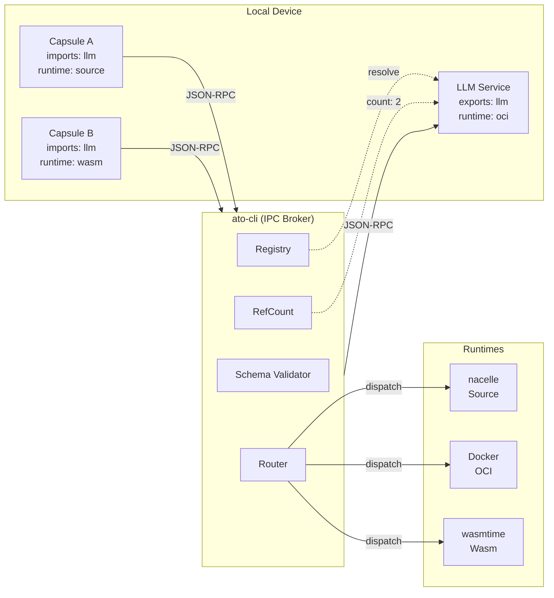
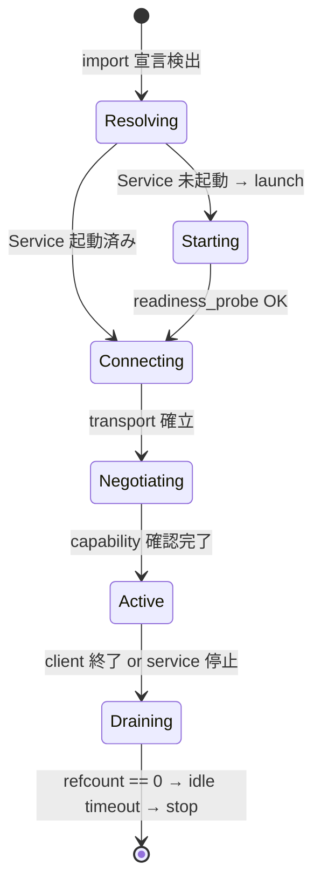
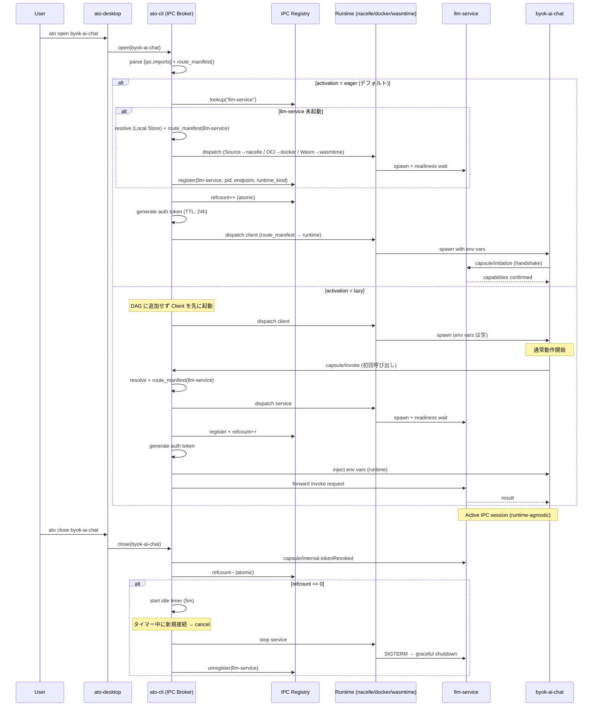

# 📄 Capsule IPC Specification

**Document ID:** `CAPSULE_IPC_SPEC`
**Status:** Accepted v1.1
**Target:** ato-cli v0.3+, ato-desktop v0.9+
**Last Updated:** 2026-02-06
**Supersedes:** `APP_IN_APP.md` (v0.3), `CAPSULE_IPC_SPEC v1.0`

> **v1.1 Breaking Change:** IPC Broker の責務を nacelle から **ato-cli** に移行。
> 理由: ato-cli が OCI/Wasm/Source の全ランタイムをディスパッチするため、
> nacelle にのみ Broker を置くと OCI/Wasm ランタイムの Capsule が IPC に参加できない。
> 「Smart Build, Dumb Runtime」原則に従い、IPC オーケストレーション（Smart）は ato-cli に、
> プロセス隔離（Dumb）は各 Engine に委譲する。

---

## 1. 概要 (Overview)

本仕様は、Capsule 同士が安全かつ効率的に通信するための **IPC（Inter-Process Communication）** プロトコルを定義する。

### 1.1 設計原則

- **プロトコル統一:** Host-Guest (stdio) も Client-Service (network) も同一の JSON-RPC 2.0 メッセージフォーマットを使用する
- **MCP 互換:** Capsule の Capability は MCP (Model Context Protocol) の Tool/Resource 概念と相互運用できる
- **Transport 非依存:** プロトコル層はトランスポート（stdio / HTTP / WebSocket / Unix Socket / tsnet）に依存しない
- **ato-cli 仲介:** 全ての接続は ato-cli (IPC Broker) が仲介する。Capsule 同士が直接 listen/connect することはない。これにより Source/OCI/Wasm の全ランタイムが IPC に参加できる
- **Least Privilege:** 通信チャネルは `capsule.toml` の宣言に基づいて ato-cli が生成・注入する
- **Runtime Agnostic:** IPC Broker はランタイムに依存しない。nacelle (Source), Docker (OCI), wasmtime (Wasm) のいずれで動作する Capsule も同一の IPC プロトコルで通信する

### 1.2 関連仕様

| 仕様                         | 関連                                                                  |
| ---------------------------- | --------------------------------------------------------------------- |
| `LIFECYCLE_SPEC` (v1.2)      | `[tasks]` / `[services]` の DAG 管理。Shared Service のライフサイクル |
| `APP_IN_APP.md` (v0.3)       | 本仕様に統合。Host-Guest プロトコルはここで再定義                     |
| `NETWORKING_TAILNET_SIDECAR` | Remote Capsule の Transport 層                                        |
| `SCHEMA_REGISTRY`            | Capability の型定義の共有・解決                                       |
| `SYNC_SPEC`                  | `.sync` ファイルの Guest 実行契約                                     |

### 1.3 Quick Start — 5分で始める Capsule IPC

最小構成で IPC 通信を体験するためのステップ。

#### Step 1: Service を作る

```bash
mkdir greeter-service && cd greeter-service
ato init --name greeter-service
```

```toml
# greeter-service/capsule.toml
schema_version = "1.1"
name = "greeter-service"
version = "0.1.0"
type = "app"

[ipc.exports]
capabilities = [
    { name = "greet", description = "Return a greeting", schema = "schemas/greet.json" },
]

[ipc.exports.sharing]
mode = "singleton"
idle_timeout = "5m"

[services.server]
cmd = "node server.js --port {{PORT}}"
expose = ["PORT"]
readiness_probe = { http_get = "/health", port = "PORT" }

[lifecycle]
run = "server"
```

```json
// greeter-service/schemas/greet.json
{
  "$id": "capsule://greeter-service/greet",
  "type": "object",
  "properties": {
    "input": {
      "type": "object",
      "properties": { "name": { "type": "string" } },
      "required": ["name"]
    },
    "output": {
      "type": "object",
      "properties": { "message": { "type": "string" } }
    }
  }
}
```

#### Step 2: Client から利用する

```toml
# my-app/capsule.toml
schema_version = "1.1"
name = "my-app"
version = "0.1.0"
type = "app"

[ipc.imports]
dependencies = [
    { capability = "greet", from = "greeter-service" },
]

[lifecycle]
run = "node app.js"
port = 3000
```

```javascript
// my-app/app.js — 環境変数から接続情報を取得するだけ
const url = process.env.CAPSULE_IPC_GREETER_SERVICE_URL;
const token = process.env.CAPSULE_IPC_GREETER_SERVICE_TOKEN;

const res = await fetch(url, {
  method: "POST",
  headers: {
    "Content-Type": "application/json",
    Authorization: `Bearer ${token}`,
  },
  body: JSON.stringify({
    jsonrpc: "2.0",
    id: 1,
    method: "capsule/invoke",
    params: { capability: "greet", input: { name: "World" } },
  }),
});
const { result } = await res.json();
console.log(result.message); // "Hello, World!"
```

#### Step 3: 実行

```bash
ato install ./greeter-service   # ローカルストアに登録
ato open my-app                 # ato-cli が greeter-service を自動起動（ランタイム自動選択）
```

#### Step 4: 確認

```bash
ato ipc status
# SERVICE          MODE       REFCOUNT  TRANSPORT     ENDPOINT
# greeter-service  singleton  1         unix_socket   /tmp/capsule-ipc/greeter-service.sock
```

---

## 2. アーキテクチャ (Architecture)

### 2.1 コンポーネント責務 (IPC における役割分担)

| コンポーネント  | IPC における役割                                                                                      | 根拠                                                                                                     |
| --------------- | ----------------------------------------------------------------------------------------------------- | -------------------------------------------------------------------------------------------------------- |
| **ato-cli** | **IPC Broker** — Service 解決、RefCount、Token 管理、Schema 検証、DAG 統合                            | 全ランタイム (Source/OCI/Wasm) のディスパッチャーであり、ランタイム横断で IPC を統括できる唯一のレイヤー |
| **nacelle**     | **Sandbox Enforcer** — OS 隔離ポリシー適用、プロセス監視、IPC 用 Transport の許可 (Seatbelt/Landlock) | Smart Build, Dumb Runtime。IPC の _内容_ には関与せず、_隔離_ のみ担当                                   |
| **ato-desktop** | **UI Host** — Guest Mode の iframe ホスティング、User Consent ダイアログ、IPC ダッシュボード          | ユーザーとの対話が必要な部分のみ担当                                                                     |

### 2.2 なぜ ato-cli が IPC Broker なのか

ato-cli の `router.rs` は以下の3ランタイムにディスパッチする:

```
ato open <target>
  └── router::route_manifest() → RuntimeDecision
      ├── Source → nacelle (engine)
      ├── OCI    → docker/podman
      └── Wasm   → wasmtime
```

IPC Broker を nacelle に置くと、**OCI/Wasm ランタイムの Capsule は IPC に参加できない**。
ato-cli は全ランタイムの上位に位置するため、ランタイムに依存しない IPC Broker として最適。

既存の `guest.rs` (762行) も同じパターンで、nacelle を経由せず ato-cli 内で完結している。

### 2.3 レイヤー構成

| Layer           | Technology               | Role                                        |
| --------------- | ------------------------ | ------------------------------------------- |
| **Application** | `capsule.toml`           | 依存定義 (`imports`) と機能公開 (`exports`) |
| **Capability**  | JSON-RPC 2.0 + Schema    | 関数インターフェース (MCP 互換)             |
| **Session**     | Token Auth + Negotiation | 接続確立、認証、機能ネゴシエーション        |
| **Transport**   | stdio / Socket / HTTP    | 物理的な通信路                              |
| **Isolation**   | nacelle / Docker / Wasm  | OS レベルの隔離 (Runtime 固有)              |



---

## 3. Transport Layer

### 3.1 Transport Types

ato-cli (IPC Broker) は以下の優先順で transport を選択する:

| Priority | Context                     | Transport Type                   |
| -------- | --------------------------- | -------------------------------- |
| 1        | **Host-Guest** (App-in-App) | `stdio` (Parent-Child Process)   |
| 2        | **Local Service** (Unix)    | `Unix Domain Socket`             |
| 3        | **Local Service** (Windows) | `Named Pipe`                     |
| 4        | **Remote** (Tailnet)        | `tsnet` (P2P Encrypted Tunnel)   |
| 5        | **Fallback**                | `HTTP` / `WebSocket` (localhost) |

Transport は `capsule.toml` で明示的にオーバーライドできる（デバッグ・パフォーマンスチューニング用途）:

```toml
[ipc.imports]
dependencies = [
    { capability = "llm", from = "llm-service", transport = "unix_socket" },
]
```

### 3.2 stdio Transport (App-in-App)

Host が Guest を子プロセスとして spawn し、stdin/stdout で JSON-RPC メッセージを交換する。

```
Host Process                    Guest Process
    │                               │
    │──── stdin ──────────────────►  │  (JSON-RPC Request)
    │                               │
    │  ◄──── stdout ────────────── │  (JSON-RPC Response)
    │                               │
    │  ◄──── stderr ─────────────  │  (Logs, 非プロトコル)
```

- **Framing:** NDJSON (Newline Delimited JSON) — 1行1メッセージ
- **Orphan Protection:** Guest プロセスは Host によって `kill_on_drop(true)` で管理され、Host クラッシュ時に道連れ終了する。orphan process は発生しない

### 3.3 Network Transport (Shared Service)

ato-cli が動的にポート/ソケットパスを生成し、環境変数で各ランタイムに注入する。

- **Payload Limit:** デフォルト `max_message_size = "1MB"`。Transport 層で強制
- **認証:** ato-cli が接続ごとに Bearer Token を生成し、双方に注入
- **ランタイム非依存:** OCI コンテナには `--env` で、Wasm には WASI env で、Source には nacelle 経由で注入

### 3.4 tsnet Transport (Remote Capsule)

リモートデバイスの Capsule との通信は `ato-tsnetd` の Tailnet 経由で行う。

```
Local Device                                    Remote Device
┌───────────────┐                           ┌───────────────┐
│ Capsule A     │                           │ Capsule B     │
│ imports: ocr  │                           │ exports: ocr  │
└───────┬───────┘                           └───────┬───────┘
        │                                           │
   ato-cli (local)                         ato-cli (remote)
        │                                           │
   ato-tsnetd ◄──────── Tailnet P2P ──────► ato-tsnetd
```

**アドレッシング:** `capsule://<device-id>/<capsule-name>/<capability>`

---

## 4. Capability Layer (MCP-Compatible)

### 4.1 Capability 定義 (`capsule.toml`)

```toml
# サービス側: 機能をエクスポート
[ipc.exports]
capabilities = [
    { name = "summarize", description = "テキストを要約", schema = "schemas/summarize.json" },
    { name = "translate", description = "テキストを翻訳", schema = "schemas/translate.json" },
]

# Shared Service 設定
# 注意: [ipc.exports.sharing] を定義する場合、LIFECYCLE_SPEC の Level 2 ([services.*]) を必須とする。
# [lifecycle] ショートカット (Level 1) との併用はパースエラーとなる。
[ipc.exports.sharing]
mode = "singleton"               # singleton | exclusive | daemon (下記参照)
idle_timeout = "5m"              # 全 client 切断後の停止猶予 (daemon では無視)
connection_idle_timeout = "60s"  # 個別接続のアイドル切断
max_clients = 10                 # 同時接続上限 (exclusive では常に 1)
requests_per_minute = 600        # service 全体の rate limit
allow_clients = "*"              # 許可する Capsule 名のリスト or "*"

# クライアント側: 機能をインポート
[ipc.imports]
dependencies = [
    # name 自動解決 (Local Registry → Local Store → Error)
    # activation = "eager" (デフォルト): Client 起動前に Service を起動し Ready を待つ
    { capability = "summarize", from = "llm-service" },
    # activation = "lazy": Client は先に起動し、初回 invoke 時に Service をオンデマンド起動
    # 大容量モデルのロード等、起動コストが高い Service に推奨
    { capability = "translate", from = "llm-service", activation = "lazy", optional = true },
    # Package ID + SemVer range 指定
    { capability = "ocr", from = "@ato/ocr-service:^1.0", optional = true },
    # ローカルパス (開発用)
    # { capability = "ocr", from = "./local/ocr-service" },
    # Remote 許可
    { capability = "ocr", from = "ocr-service", device = "any", optional = true },
]
```

### 4.2 Sharing Mode セマンティクス

| Mode            | 共有                                | 終了条件                                              | ユースケース                         |
| --------------- | ----------------------------------- | ----------------------------------------------------- | ------------------------------------ |
| **`singleton`** | 複数 Client で 1 インスタンスを共有 | `refcount == 0` → `idle_timeout` 後に停止             | ローカル LLM、ベクター DB            |
| **`exclusive`** | Client ごとに専用インスタンスを起動 | Client 終了時に即停止 (SIGTERM)                       | 専用 Headless AI、一時的な変換ツール |
| **`daemon`**    | 複数 Client で共有                  | **明示的な停止操作のみ**。`idle_timeout` は無視される | 通知センター、ファイル同期デーモン   |

> **Note:** `exclusive` は初期草案の `Ephemeral` に相当する。Client のライフサイクルに完全に連動し、
> Client が終了すれば Service も即座に終了する（`idle_timeout` なし）。

### 4.3 Activation Strategy

Client が Service をいつ起動するかを制御する。`[ipc.imports]` の各依存に `activation` フィールドで指定する。

| Strategy                 | 挙動                                                                           | DAG 影響                           | ユースケース                        |
| ------------------------ | ------------------------------------------------------------------------------ | ---------------------------------- | ----------------------------------- |
| **`eager`** (デフォルト) | Client 起動前に Service を起動し、`readiness_probe` を待つ                     | `_ipc_*` ノードが DAG に追加される | DB、認証サービスなど起動必須の依存  |
| **`lazy`**               | Client は先に起動する。初回 `capsule/invoke` 時にオンデマンドで Service を起動 | DAG に追加されない                 | LLM (4GB+) など起動コストが高い依存 |

**`lazy` の動作詳細:**

1. Client が `capsule/invoke` を呼ぶ
2. nacelle が Service 未起動を検知
3. nacelle が Service を起動し、`readiness_probe` を待つ
4. 起動完了後、元の `invoke` リクエストを転送する
5. Client には起動待ち時間分のレイテンシが発生する（nacelle は `-32002 Service unavailable` を返さず、起動を待つ）

### 4.4 `from` の解決ルール

| 記法                         | 意味                                            | 例                        |
| ---------------------------- | ----------------------------------------------- | ------------------------- |
| `"<name>"`                   | 自動解決 (Local Registry → Local Store → Error) | `"llm-service"`           |
| `"@<scope>/<name>:<semver>"` | Store の Package ID + SemVer range              | `"@ato/ocr-service:^1.0"` |
| `"./<path>"`                 | 相対パス（開発用）                              | `"./local/ocr-service"`   |

**自動ダウンロードは行わない。** 未インストールの場合はエラーとし、`ato install <name>` を促す（サプライチェーン攻撃の防止）。

### 4.5 Schema Validation

- **責任:** ato-cli (IPC Broker) が Service への転送前に JSON Schema 検証を行う。不正入力は Service に到達しない
- **違反時:** ato-cli がエラーレスポンス (`-32003 Schema validation failed`) を返す
- **サイズ制限:** `max_message_size` (Transport 層) で巨大ペイロードを事前拒否

### 4.6 MCP との互換性

Capsule の Capability は MCP の Tool として直接マッピングできる:

| Capsule IPC                | MCP                | 説明                   |
| -------------------------- | ------------------ | ---------------------- |
| `ipc.exports.capabilities` | `tools/list`       | 利用可能な機能の一覧   |
| `capsule/invoke`           | `tools/call`       | 機能の実行             |
| Capability Schema          | Tool `inputSchema` | 入力パラメータの型定義 |

ato-cli は MCP ↔ Capsule IPC のブリッジとして機能し、外部 AI エージェント (Claude, GPT 等) が Capsule の Capability を MCP Tool として直接呼び出せるようにする。

```
AI Agent (MCP Client)
    │
    │── tools/call("summarize", {...}) ──► ato-cli (MCP Server / IPC Broker)
    │                                         │
    │                                         │── capsule/invoke ──► LLM Service Capsule
    │                                         │                      (any runtime)
    │  ◄── result ───────────────────────────  │
```

---

## 5. Session Layer

### 5.1 接続ライフサイクル



### 5.2 Capability Negotiation (Handshake)

接続確立時に `capsule/initialize` で双方が Capability とプロトコルバージョンを確認する。
バージョン不一致や必須 Capability 欠落時は接続を拒否する。

```json
// Client → Service
{
    "jsonrpc": "2.0",
    "id": 1,
    "method": "capsule/initialize",
    "params": {
        "protocol_version": "capsule-ipc/1.0",
        "client_info": { "name": "byok-ai-chat", "version": "0.1.0" },
        "required_capabilities": ["summarize", "translate"]
    }
}

// Service → Client
{
    "jsonrpc": "2.0",
    "id": 1,
    "result": {
        "protocol_version": "capsule-ipc/1.0",
        "server_info": { "name": "llm-service", "version": "1.0.0" },
        "capabilities": {
            "summarize": { "schema": "capsule://llm-service/summarize" },
            "translate": { "schema": "capsule://llm-service/translate" }
        }
    }
}
```

### 5.3 認証 (Token Lifecycle)

| 属性       | 値                                                                           |
| ---------- | ---------------------------------------------------------------------------- |
| 発行者     | ato-cli (IPC Broker)                                                     |
| 方式       | Bearer Token (per-session)                                                   |
| TTL        | デフォルト 24 時間。`[ipc.exports.sharing]` で上書き可能                     |
| ストレージ | ato-cli のプロセスメモリのみ。ディスク永続化禁止                         |
| 失効       | Client 切断時、ato-cli が即座にトークンを無効化                          |
| 失効通知   | ato-cli → Service に `capsule/internal.tokenRevoked` Notification を送信 |
| 検証方式   | constant-time comparison 必須（タイミング攻撃防止）                          |

**環境変数注入:**

```bash
# 命名規則: CAPSULE_IPC_<SERVICE_NAME>_<PROPERTY>
CAPSULE_IPC_LLM_SERVICE_URL="http://localhost:54321"
CAPSULE_IPC_LLM_SERVICE_TOKEN="eyJ..."

# Unix Socket の場合
CAPSULE_IPC_LLM_SERVICE_SOCKET="/tmp/capsule-ipc/llm-service.sock"
```

> **Known Risk (Phase 1):** 環境変数はプロセス隔離 (Sandbox) により他プロセスから読み取り不可だが、
> Phase 2 で Unix Socket ハンドシェイクによるトークン交換方式をオプション提供する。

---

## 6. Shared Service Lifecycle

### 6.1 依存解決と DAG 統合

`[ipc.imports]` の依存のうち、`activation = "eager"` (デフォルト) のものは、ato-cli が構築する DAG に **`_ipc_<service_name>` ノード** として暗黙的に追加される。`activation = "lazy"` の依存は DAG に追加されず、初回 invoke 時にオンデマンド起動される。

```
Effective DAG (eager のみ):
    [_ipc_llm_service] (shared, readiness wait)
         ↓
    [_setup] (lifecycle.setup)
         ↓
    [_main] (lifecycle.run)

※ lazy 依存は DAG 外。初回 capsule/invoke 時に ato-cli が起動を仲介する。
```

**予約プレフィックス:** 以下のプレフィックスは ato-cli が内部使用するため、ユーザー定義のタスク/サービス名には使用できない。使用した場合はパースエラーとなる。

| プレフィックス | 用途                                     |
| -------------- | ---------------------------------------- |
| `_ipc_`        | IPC 依存の暗黙ノード                     |
| `_setup`       | `[lifecycle] setup` のショートカット展開 |
| `_main`        | `[lifecycle] run` のショートカット展開   |

**循環依存の検出:**

- **同一デバイス内:** ato-cli の DAG ソルバーが IPC 依存グラフを含めて循環検出を行い、起動エラーとする
- **Remote (cross-device):** 検出不可能（分散デッドロック問題）。`ato validate` で警告を出すが、開発者の責任で回避すること

**解決順序:**

1. **Local Registry:** 既に起動中のサービス
2. **Local Store:** `~/.capsule/store/` にインストール済みのカプセル
3. **Error:** 自動ダウンロードは行わず、ユーザーに `ato install <name>` を促す

### 6.2 参照カウント (Reference Counting)

ato-cli (IPC Broker) が参照カウントを **atomic に** 管理する。タイマー発火前に新規接続があった場合、タイマーはキャンセルされる。

```
Client A: ato open → imports llm-service → refcount = 1
Client B: ato open → imports llm-service → refcount = 2
Client A: ato close                      → refcount = 1 → token revoke
Client B: ato close                      → refcount = 0 → idle timer start
                                               (idle_timeout 後に service 停止)
```

### 6.3 Manifest 例 (Service 側)

`[ipc.exports.sharing]` を持つ Capsule は LIFECYCLE_SPEC の Level 2 (`[services.*]`) を必須とする:

```toml
schema_version = "1.1"
name = "llm-service"
version = "1.0.0"
type = "app"

[ipc.exports]
capabilities = [
    { name = "summarize", description = "Summarize text", schema = "schemas/summarize.json" },
    { name = "translate", description = "Translate text", schema = "schemas/translate.json" },
]

[ipc.exports.sharing]
mode = "singleton"              # singleton | exclusive | daemon
idle_timeout = "5m"
connection_idle_timeout = "60s"
max_clients = 10
requests_per_minute = 600

# Level 2: [services.*] で定義（[lifecycle] ショートカットは不可）
[services.server]
cmd = "llama-server --model ./model.gguf --port {{PORT}}"
expose = ["PORT"]
readiness_probe = { http_get = "/health", port = "PORT" }

[lifecycle]
run = "server"
```

### 6.4 Manifest 例 (Client 側)

```toml
schema_version = "1.1"
name = "byok-ai-chat"
version = "0.1.0"
type = "app"

[ipc.imports]
dependencies = [
    # DB は起動必須 → eager (デフォルト)
    { capability = "summarize", from = "llm-service" },
    # AI翻訳は必要になるまで起動しない → lazy
    { capability = "translate", from = "llm-service", activation = "lazy", optional = true },
    # Remote OCR → lazy + optional
    { capability = "ocr", from = "ocr-service", device = "any", activation = "lazy", optional = true },
]

[lifecycle]
setup = "npm install"
run = "npm start"
port = 3000
```

### 6.5 起動シーケンス



---

## 7. App-in-App (Guest Mode)

`APP_IN_APP.md` (v0.3) で定義されていた Guest Protocol を、本 IPC 仕様に統合する。

### 7.1 プロトコル統一

| APP_IN_APP v0.3                       | → CAPSULE_IPC v1.0                                           |
| ------------------------------------- | ------------------------------------------------------------ |
| 独自プロトコル (`guest.v2`)           | JSON-RPC 2.0 (IPC 統一フォーマット)                          |
| `action: InvokeCapability`            | `method: "capsule/invoke"`                                   |
| `ReadPayload` / `WritePayload`        | `method: "capsule/payload.read"` / `"capsule/payload.write"` |
| `RequestResize` / `RequestModeChange` | `method: "capsule/ui.resize"` / `"capsule/ui.modeChange"`    |
| 独自環境変数                          | IPC 標準環境変数に統一                                       |

### 7.2 Host-Guest 環境変数

```bash
CAPSULE_IPC_PROTOCOL="jsonrpc-2.0"      # "jsonrpc-2.0" | "guest.v1" (compat lane)
CAPSULE_IPC_TRANSPORT="stdio"           # 現状 stdio のみ
CAPSULE_IPC_ROLE="consumer"             # consumer | owner — GuestContextRole と一致
CAPSULE_IPC_MODE="widget"               # headless | widget | app
CAPSULE_IPC_SYNC_PATH="/path/to/.sync"
CAPSULE_IPC_WIDGET_BOUNDS="0,0,300,400" # widget mode のみ必須 (x,y,w,h)
CAPSULE_IPC_TOKEN="eyJ..."              # 任意 — 認可トークン (将来用)
```

各 env の値は **request の `params.context` フィールドと一致しなければならない**。
不一致の場合 `-32602 Invalid Params` (旧プロトコルでは `InvalidRequest`) を返す。
env が設定されていない場合は対応する validation を skip (opt-in)。

#### 旧 env (削除済み、Phase 13b.9 v2.1)

| 旧 | 新 | 廃止 |
|---|---|---|
| `CAPSULE_GUEST_PROTOCOL` | `CAPSULE_IPC_PROTOCOL` | ✅ |
| `GUEST_MODE` | `CAPSULE_IPC_MODE` | ✅ |
| `GUEST_ROLE` | `CAPSULE_IPC_ROLE` | ✅ |
| `SYNC_PATH` | `CAPSULE_IPC_SYNC_PATH` | ✅ (※ WASI mount path `SYNC_PATH=/sync` は別レイヤーで継続) |
| `GUEST_WIDGET_BOUNDS` | `CAPSULE_IPC_WIDGET_BOUNDS` | ✅ |

### 7.3 Display Modes

| モード       | UIメタファー   | 振る舞い                                                    |
| ------------ | -------------- | ----------------------------------------------------------- |
| **Headless** | Status Icon    | 不可視 / 常駐アイコン。Capability の実行のみ受け付ける      |
| **Widget**   | PiP (Floating) | HTML Overlay / Picture-in-Picture。ホスト画面の最前面に浮遊 |
| **App**      | Tab / Window   | メインビューを占有、または新規タブとして展開                |

### 7.4 モード遷移セキュリティ

Guest が UI モードを変更する場合、以下の制約を適用する:

1. **Allowlist:** `capsule.toml` の `[ui]` で許可された遷移のみ可能

```toml
[ui]
allow_mode_transitions = ["widget", "app"]  # headless → widget, widget → app

[ui.widget]
default_width = 300
default_height = 400
min_width = 200
resizable = true
default_placement = "top-right"
```

2. **User Consent:** `app` モード（メインビュー占有）への昇格要求は、ato-desktop が **ユーザー確認ダイアログ** を表示し、承認された場合のみ許可する
3. **Headless → App 直接昇格:** 禁止。Headless → Widget → App の段階的遷移を必須とする

### 7.5 Guest Protocol Methods

#### Capability 呼び出し

```json
// Host → Guest
{ "jsonrpc": "2.0", "id": "req_001", "method": "capsule/invoke",
  "params": { "capability": "calculate_tax", "input": { "price": 1000, "rate": 0.1 } } }

// Guest → Host
{ "jsonrpc": "2.0", "id": "req_001", "result": { "tax": 100, "total": 1100 } }
```

#### .sync Payload / Context アクセス

ato-cli `ato guest` の stdio 経路で実装される 5 メソッド (Phase 13b.9):

| Method | params | result | GuestAction |
|---|---|---|---|
| `capsule/payload.read` | `{ context }` | `{ payload_b64: string }` | ReadPayload |
| `capsule/payload.write` | `{ context, payload_b64 }` | `null` | WritePayload |
| `capsule/payload.update` | `{ context, payload_b64 }` | `null` | UpdatePayload |
| `capsule/context.read` | `{ context }` | `{ value: any }` | ReadContext |
| `capsule/context.write` | `{ context, value }` | `null` | WriteContext |

`context` は `GuestContext` schema (`mode`, `role`, `permissions`, `sync_path`, `host_app`)
を必ず含む。Host が起動時に渡す `CAPSULE_IPC_*` env と整合する必要がある (§7.2)。

```json
// Guest → Host: payload の読み取り
{ "jsonrpc": "2.0", "id": "req_002",
  "method": "capsule/payload.read",
  "params": { "context": { "mode": "Headless", "role": "Owner", "permissions": {...},
                            "sync_path": "/path/to/.sync", "host_app": null } } }

// Host → Guest: payload データ
{ "jsonrpc": "2.0", "id": "req_002", "result": { "payload_b64": "base64..." } }

// 書き込み (success time は result: null)
{ "jsonrpc": "2.0", "id": "req_003",
  "method": "capsule/payload.write",
  "params": { "context": {...}, "payload_b64": "base64..." } }

// → { "jsonrpc": "2.0", "id": "req_003", "result": null }
```

##### 互換性レーン (guest.v1 — 旧プロトコル)

JSON-RPC 2.0 envelope (`jsonrpc: "2.0"`) 以外を stdin で受け取った場合、
`version: "guest.v1"` envelope を旧来通り処理する。新規実装は JSON-RPC 経路を
推奨。両方のフィールドが同時に存在する場合は **JSON-RPC を優先** する。

##### 予約 / 未公開 method

- `capsule/invoke` は Service-to-Service 用に予約 (params shape: `{ service, method, token, args }`)
  で、Host-to-Guest stdio では使用しない (CAPSULE_IPC ipc/jsonrpc.rs::InvokeParams)
- `capsule/wasm.execute` は WASM/OCI ランタイム整備後に確定予定
  (Phase 13b.9 v2.1 では未公開、`-32601 Method not found` を返す)。
  ExecuteWasm は当面 guest.v1 envelope のみで利用可能

#### UI ネゴシエーション

```json
// Guest → Host: リサイズ要求
{ "jsonrpc": "2.0", "id": "req_003", "method": "capsule/ui.resize",
  "params": { "width": 400, "height": 600 } }

// Guest → Host: モード遷移要求 (User Consent が必要な場合あり)
{ "jsonrpc": "2.0", "id": "req_004", "method": "capsule/ui.modeChange",
  "params": { "target_mode": "app" } }
```

#### ライフサイクル

```json
// Host → Guest: 終了通知 (Notification, id なし)
{ "jsonrpc": "2.0", "method": "capsule/lifecycle.shutdown",
  "params": { "reason": "user_close", "grace_period_ms": 5000 } }

// Guest → Host: 終了準備完了
{ "jsonrpc": "2.0", "id": "req_005", "method": "capsule/lifecycle.ready_to_shutdown",
  "params": {} }
```

---

## 8. Wire Protocol (JSON-RPC 2.0)

### 8.1 Standard Methods

| Method                                | Direction                            | 説明                             |
| ------------------------------------- | ------------------------------------ | -------------------------------- |
| `capsule/initialize`                  | Client → Service                     | セッション開始・ネゴシエーション |
| `capsule/invoke`                      | Client → Service / Host → Guest      | Capability 実行                  |
| `capsule/payload.read` / `.write`     | Guest → Host                         | .sync payload アクセス           |
| `capsule/context.read` / `.write`     | Guest → Host                         | .sync context アクセス           |
| `capsule/ui.resize` / `.modeChange`   | Guest → Host                         | UI ネゴシエーション              |
| `capsule/lifecycle.shutdown`          | Host → Guest                         | 終了通知                         |
| `capsule/lifecycle.ready_to_shutdown` | Guest → Host                         | 終了準備完了                     |
| `capsule/ping`                        | 双方向                               | 生存確認                         |
| `capsule/event`                       | 双方向 (Notification)                | 状態変更通知                     |
| `capsule/internal.tokenRevoked`       | ato-cli → Service (Notification) | トークン失効通知                 |

### 8.2 Error Codes

JSON-RPC 2.0 標準エラーコード + Capsule IPC 拡張:

| Code   | Message                  | 説明                                   |
| ------ | ------------------------ | -------------------------------------- |
| -32700 | Parse error              | JSON パースエラー                      |
| -32600 | Invalid request          | 不正なリクエスト                       |
| -32601 | Method not found         | 未定義の method                        |
| -32602 | Invalid params           | パラメータ不正                         |
| -32603 | Internal error           | 内部エラー                             |
| -32000 | Capability not found     | 要求された Capability が未エクスポート |
| -32001 | Permission denied        | 権限不足 (Guest Context)               |
| -32002 | Service unavailable      | Shared Service が停止中                |
| -32003 | Schema validation failed | 入力が Capability Schema に違反        |
| -32004 | Rate limited             | 呼び出し頻度制限                       |

### 8.3 Error Hint

全てのエラーレスポンスには `data.hint` フィールドを含め、開発者が原因を特定しやすくする:

```json
{
  "code": -32000,
  "message": "Capability not found",
  "data": {
    "requested": "summarize",
    "available": ["translate", "ocr"],
    "hint": "Check [ipc.exports] in 'llm-service' capsule.toml"
  }
}
```

### 8.4 Notifications (Fire-and-Forget)

`id` フィールドを省略した JSON-RPC メッセージは Notification として扱われ、応答を期待しない:

```json
{
  "jsonrpc": "2.0",
  "method": "capsule/event",
  "params": {
    "event": "model_loaded",
    "data": { "model": "llama-3.3-70b", "ready": true }
  }
}
```

---

## 9. Security

### 9.1 権限モデル

```
Guest の有効権限 = Host 委譲権限 ∩ Guest Manifest (allowlist)
```

- **Sandbox:** 全モードで OS レベルの隔離（Landlock / Seatbelt）を適用
- **Egress Control:** `capsule.toml` の `[network]` に基づく厳格なフィルタリング
- **トークンスコープ:** 一時トークンは特定の Capability セットにスコープされる
- **Process Isolation:** OS の Sandbox ポリシーにより、他プロセスの環境変数 (`/proc/*/environ` 等) は読み取り不可

### 9.2 Shared Service のアクセス制御

```toml
[ipc.exports.sharing]
mode = "singleton"
allow_clients = ["byok-ai-chat", "note-app"]   # 許可する Capsule 名
# allow_clients = "*"                           # 全公開
```

### 9.3 Remote IPC のセキュリティ

- **Transport 暗号化:** tsnet（WireGuard ベース）により全通信が暗号化
- **相互認証:** 双方の ato-cli が Tailnet 上の Identity で認証
- **Capability 制限:** Remote からアクセス可能な Capability は `remote = true` で明示的に公開されたもののみ

```toml
[ipc.exports]
capabilities = [
    { name = "ocr", description = "OCR processing", schema = "schemas/ocr.json", remote = true },
    { name = "admin", description = "Admin API", schema = "schemas/admin.json" },
    # ↑ remote = false (デフォルト): ローカルのみ
]
```

> **Validation:** `ato validate` 実行時、`remote = true` の Capability は警告表示される。

---

## 10. 実装フェーズ (Phasing)

| Phase       | 内容                                                                                                                                          | ターゲット |
| ----------- | --------------------------------------------------------------------------------------------------------------------------------------------- | ---------- |
| **Phase 1** | **Core IPC:** JSON-RPC 2.0, stdio/HTTP Transport, RefCount, Token Auth (env var), Basic Schema Validation, DAG 統合, `ato ipc status` CLI | v0.3       |
| **Phase 2** | **Enhanced Security & DX:** Unix Socket Handshake (token 交換), Inline Capability Schema (TOML), `ato ipc` CLI 拡張                       | v0.4       |
| **Phase 3** | **Ecosystem:** MCP ブリッジ, TypeScript/Python SDK, Capability Schema バージョニング (SCHEMA_REGISTRY 連携)                                   | v0.5       |
| **Phase 4** | **Remote IPC:** tsnet Transport, Remote Discovery, `device = "any"` 選択アルゴリズム                                                          | v0.6+      |

### Phase 1: `ato ipc status` CLI（診断コマンド）

Phase 1 から最低限の診断コマンドを提供する:

```bash
ato ipc status              # 起動中の Service と接続一覧
# SERVICE          MODE       REFCOUNT  TRANSPORT     ENDPOINT                                     UPTIME
# llm-service      singleton  2         unix_socket   /tmp/capsule-ipc/llm-service.sock             12m
# ocr-service      exclusive  1         http          http://localhost:54321                        3m
```

### Phase 2: `ato ipc` CLI 拡張（予定）

```bash
ato ipc services            # 起動中の Shared Service 一覧（status の詳細版）
ato ipc call <svc> <cap>    # Capability テスト呼び出し
ato ipc logs <svc>          # IPC 通信ログ
ato ipc inspect <svc>       # Service の Capability Schema 表示
```

### Phase 2: インライン Capability Schema (予定)

```toml
# Phase 1: 外部ファイル参照
[ipc.exports]
capabilities = [
    { name = "add", schema = "schemas/add.json" },
]

# Phase 2: インライン記法も許可
[ipc.exports.capabilities.add]
description = "Add two numbers"
input = { a = "number", b = "number" }
output = "number"
```

---

## 11. Remote Discovery 選択アルゴリズム

`device = "any"` で複数のリモートデバイスが同一 Capability を公開している場合、ato-cli は以下のアルゴリズムで選択する。

### 11.1 デフォルト: `first-available`

ato-cli が Tailnet 上のピアに並列で問い合わせ、**最初に応答した**デバイスを選択する。

### 11.2 明示的な選択ヒント

Client が `[ipc.imports]` で選択戦略を指定できる:

```toml
[ipc.imports]
dependencies = [
    { capability = "ocr", from = "ocr-service", device = "any",
      selection = "first_available" },  # first_available (default) | prefer_local | specific
    # 特定デバイス指定:
    # { capability = "ocr", from = "ocr-service", device = "macbook-pro" },
]
```

| Strategy          | 挙動                                             |
| ----------------- | ------------------------------------------------ |
| `first_available` | 最初に応答したピアを選択（デフォルト）           |
| `prefer_local`    | ローカルを優先、なければリモートにフォールバック |
| `specific` (暗黙) | `device = "<device-id>"` で特定デバイスを指定    |

> **Note:** ロードバランスやレイテンシベースの選択は Phase 4+ で検討する。
> まずはシンプルな `first_available` で十分な実用性を確保する。

---

## 12. マルチ Workspace ポリシー

Ato Desktop が複数の Workspace を管理する場合の Shared Service 共有ポリシー:

| ルール                | 挙動                                                                 |
| --------------------- | -------------------------------------------------------------------- |
| **Singleton Service** | **システム全体で 1 インスタンス**。Workspace をまたいで共有される    |
| **Exclusive Service** | **Client (= Workspace) ごとに独立**。同一 Service でも別インスタンス |
| **Daemon Service**    | **システム全体で 1 インスタンス**。Singleton と同様                  |
| **IPC Registry**      | **システム全体で 1 つ**。`~/.capsule/ipc-registry.json`              |
| **Token スコープ**    | トークンは Client 単位で発行。Workspace 情報は含まない               |

**Workspace 分離が必要な場合:**

```toml
# capsule.toml で明示的に Workspace スコープを要求
[ipc.imports]
dependencies = [
    { capability = "db", from = "local-db", scope = "workspace" },
    # → nacelle が Workspace ごとに別インスタンスを起動
]
```

`scope = "workspace"` が指定された場合、ato-cli は Service 名に Workspace ID を付加して IPC Registry に登録する（例: `local-db@ws_abc123`）。

---

## 13. 参照実装ガイド (Implementors' Guide)

### 13.1 Transport 抽象化 (Rust)

```rust
use tokio::io::{AsyncRead, AsyncWrite};

/// 全 Transport に共通のインターフェース
#[async_trait]
pub trait IpcTransport: Send + Sync {
    type Stream: AsyncRead + AsyncWrite + Unpin + Send;

    /// Client 側: Service に接続する
    async fn connect(&self, endpoint: &Endpoint) -> Result<Self::Stream, TransportError>;

    /// Service 側: Client からの接続を受け付ける
    async fn accept(&mut self) -> Result<Self::Stream, TransportError>;
}

pub enum Endpoint {
    Stdio,
    UnixSocket(PathBuf),
    Tcp { host: String, port: u16 },
    WebSocket { url: String },
    Tsnet { device_id: String, capsule_name: String },
}
```

### 13.2 参照カウント管理のロック戦略

参照カウント操作と Service 状態の一貫性を保つため、以下のロック順序を **常に** 遵守する:

```
1. idle_timer (Mutex)     — 先にロック
2. service_state (Mutex)  — 後にロック
```

逆順でのロック取得は **禁止** (デッドロック防止)。

```rust
struct SharedService {
    ref_count: AtomicU32,
    idle_timer: Mutex<Option<JoinHandle<()>>>,
    state: Mutex<ServiceState>,
}

impl SharedService {
    async fn acquire(&self) -> Result<Endpoint> {
        // 1. idle_timer を先にロック
        let mut timer = self.idle_timer.lock().await;
        if let Some(handle) = timer.take() {
            handle.abort(); // タイマーキャンセル
        }
        // 2. state を後にロック
        let state = self.state.lock().await;
        self.ref_count.fetch_add(1, Ordering::SeqCst);
        // ...
    }
}
```

### 13.3 Platform 差分

| 機能       | Unix                          | Windows                           |
| ---------- | ----------------------------- | --------------------------------- |
| Transport  | `tokio::net::UnixStream`      | `tokio::net::windows::named_pipe` |
| Path       | `/tmp/capsule-ipc/*.sock`     | `\\.\pipe\capsule-ipc-*`          |
| Permission | `chmod 600`                   | ACL / Security Descriptor         |
| Cleanup    | 手動 (`std::fs::remove_file`) | 自動（最後のハンドル close 時）   |

---

## 14. FAQ / Troubleshooting

### よくある質問

**Q: IPC を使わない普通のアプリには影響がある？**
A: ない。`[ipc.exports]` / `[ipc.imports]` を書かなければ、従来通り `[lifecycle]` だけで動作する。

**Q: Service が起動しない。**
A: `ato ipc status` で状態を確認。Service が Local Store にインストールされているか `ato list` で確認し、なければ `ato install <name>` を実行する。

**Q: `activation = "lazy"` にしたのに、アプリ起動が遅い。**
A: 他に `eager` (デフォルト) の依存がないか確認。`eager` 依存があれば DAG ブロッキングが発生する。

**Q: Token が無効と言われる。**
A: Token TTL (デフォルト 24h) を超えていないか確認。長時間稼働する Service は `[ipc.exports.sharing]` で TTL を延長するか、Client を再接続する。

### よくあるエラーと解決策

| エラーコード | メッセージ               | 原因                                 | 解決策                                                                |
| ------------ | ------------------------ | ------------------------------------ | --------------------------------------------------------------------- |
| -32000       | Capability not found     | `[ipc.exports]` に定義がない         | Service の `capsule.toml` を確認                                      |
| -32002       | Service unavailable      | Service が停止中 or 未インストール   | `ato install <name>` → `ato open`                             |
| -32003       | Schema validation failed | 入力が JSON Schema に違反            | `data.hint` のフィールド名を確認                                      |
| -32004       | Rate limited             | `requests_per_minute` 超過           | Service 側の rate limit を引き上げるか、Client の呼び出し頻度を下げる |
| -32001       | Permission denied        | Guest Context で許可されていない操作 | `CAPSULE_IPC_GUEST_CONTEXT` と Service の `allow_clients` を確認      |

### デバッグの手順

```bash
# 1. Service の状態確認
ato ipc status

# 2. nacelle のログ確認 (RUST_LOG=debug)
RUST_LOG=debug ato open my-app 2>&1 | grep ipc

# 3. 手動で Capability を呼び出してテスト (Phase 2)
ato ipc call greeter-service greet --input '{"name": "test"}'

# 4. マニフェストの検証
ato validate
```

---

## 15. 未決事項

1. **Streaming:** 大容量データ（LLM ストリーミング応答等）の扱い。Phase 1 では HTTP only、Streaming が必要な場合は最初から WebSocket Transport を選択（動的昇格はしない）
2. **Capability バージョニング:** Phase 1 では schema ファイルのハッシュで一致判定。不一致はハンドシェイク時エラー。Phase 3 で SCHEMA_REGISTRY と連携した正式なバージョニングを導入
3. **課金:** Protocol Economy における Capability 呼び出しの計量（PoU: Proof of Usage との統合）
4. **マルチテナント:** 1つの Shared Service が複数ユーザーに対応するケースの認証モデル
5. **Hot Reload:** Service の Capability 変更時の Client への通知・再ネゴシエーション
