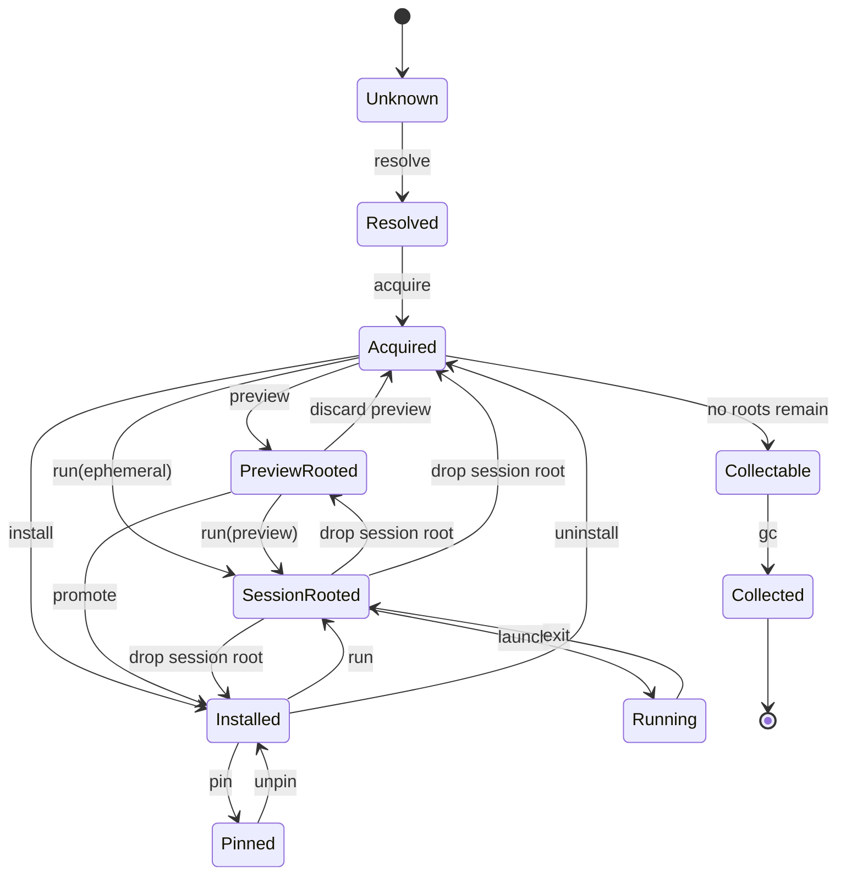

# Ato CAS State Model

**ステータス:** Draft  
**目的:** Ato の理想的な local storage / lifecycle / state transition model を、単一 CAS と root-based retention に基づいて定義する。  
**対象:** `ato install`, `ato run`, `preview`, `promote`, `pin`, `uninstall`, `gc`。  
**非対象:** 既存実装との互換レイヤ、段階移行手順、UI 詳細、ネットワーク API 詳細。

## 1. 要約

Ato の理想モデルでは、ランタイム、カプセル payload、署名、provenance、配布物はすべて単一の Content-Addressed Storage (CAS) に保存される。

ユーザーや CLI が直接扱うのは CAS 本体ではなく、次の 4 つのレイヤである。

- `refs/`: 人間と CLI のための名前解決レイヤ
- `gcroots/`: 保持契約を表す root レイヤ
- `materialized/`: 実行のための再生成可能な展開キャッシュ
- `state/`: 非CASの実機状態

このモデルにおける中核命題は次の通り。

- `install` は「ファイルを置く操作」ではなく「installed root を張る操作」である。
- `run` は「起動する操作」ではなく「session root を張って materialize して起動する操作」である。
- `preview` は「仮 install root を持つ検証フロー」である。
- `gc` は「cache 削除」ではなく「root 到達不能 object の回収」である。

## 2. 設計原則

### 2.1 Single Physical CAS

物理実体はすべて 1 つの CAS に格納する。runtime と capsule payload を物理ディレクトリで分けない。

### 2.2 Logical Views over Immutable Objects

人間可読な名前、保持契約、実行用展開は、immutable object そのものではなく別レイヤで表現する。

### 2.3 Root-Based Retention

ローカルに object を残す理由は root で表現する。`installed`, `pinned`, `preview`, `session`, `system` などの root が 1 つもない graph は GC 対象である。

### 2.4 Materialization Is Disposable

実行用展開は正本ではない。`materialized/` は常に `objects/` から再生成できる disposable cache である。

### 2.5 Trust Is Evaluated, Not Implied by Path

信頼境界はディレクトリ配置ではなく、署名、attestation、provenance、local policy によって評価する。

### 2.6 File-First Canonical API

重要な入力・出力・判断結果は canonical file tree として表現する。DB を使ってよいが、正本 API は file projection でなければならない。

### 2.7 Snapshot Before Resolution

live state の観測は impure でよいが、resolve / placement / compatibility 判断の前に snapshot file に落とさなければならない。

## 3. 状態レイヤ

Ato が扱う状態は次の 5 層に分かれる。

1. 宣言された入力
   `publisher/slug`, `github.com/owner/repo`, local path, preview id など
2. 解決結果
   graph identity, manifest digest, payload tree digest, foundation requirement, resource requirement, resolved foundation lock
3. object graph
   `objects/` に格納された immutable DAG
4. retention root
   `gcroots/` に記録された保持契約
5. derived locks
   graph lock, placement lock, execution plan
6. materialized / running state
   実行用展開、sandbox、session、ログ

## 4. 理想ディレクトリ構成

```text
~/.ato/
├── objects/                         # 物理実体の唯一の正本
│   ├── blobs/
│   │   └── sha256/...
│   ├── trees/
│   │   └── sha256/...
│   ├── manifests/
│   │   └── sha256/...
│   ├── packages/
│   │   └── sha256/...
│   └── metadata/
│       └── sha256/...
│
├── refs/                            # 論理参照。保持保証は持たない
│   ├── capsules/
│   │   └── <publisher>/<slug>/
│   │       ├── versions/<version>.json
│   │       ├── channels/latest
│   │       ├── channels/stable
│   │       └── default
│   ├── foundation/
│   │   ├── profiles/<profile>.json
│   │   └── artifacts/<name>/<version>.json
│   └── resources/
│       └── <kind>/<name>/<version>.json
│
├── gcroots/                         # 保持契約の正本
│   ├── installed/
│   ├── pinned/
│   ├── previews/
│   ├── sessions/
│   └── system/
│
├── materialized/                    # 再生成可能な展開キャッシュ
│   ├── trees/
│   │   └── <tree-digest>/root
│   ├── sandboxes/
│   │   └── <session-id>/
│   │       ├── upper/
│   │       ├── work/
│   │       └── merged/
│   └── leases/
│       └── <session-id>.json
│
├── trust/                           # local policy と trust decision
│   ├── roots/
│   ├── policies/
│   ├── transparency/
│   └── decisions.db
│
├── state/                           # 非CAS実機状態
│   ├── sessions.db
│   ├── placements.db
│   ├── foundation-inventory.db
│   ├── sessions/
│   │   └── <session-id>.json
│   ├── placements/
│   │   └── current.json
│   ├── foundation-inventory/
│   │   └── current.json
│   ├── grants.db
│   ├── bindings.db
│   ├── registry-cache.db
│   └── locks/
│
├── cache/                           # 消去可能な高速化キャッシュ
├── logs/
└── tmp/
```

## 5. Object Model

### 5.1 Canonical Digest

- canonical object identity は `sha256:<hex>` を用いる
- `blake3` は高速化のための副次 index としては許容するが、正本 identity には使わない

### 5.2 Object Kinds

- `blob`
  ファイル内容そのもの
- `tree`
  ディレクトリ構造。entry の並び、mode、target digest を持つ
- `manifest`
  capsule manifest, foundation profile manifest, resource manifest
- `package`
  `.capsule`, tarball, wheel, npm tarball などの配布単位
- `metadata`
  signatures, provenance, attestation, SBOM, fetch receipt

### 5.3 Tree Object

`tree` object は canonical JSON または canonical CBOR とし、少なくとも次を持つ。

- `version`
- `entries[]`
  - `name`
  - `kind`: `file | dir | symlink`
  - `mode`
  - `size`
  - `digest` or `target`

非本質的属性は hash 対象に含めない。

- `mtime`
- `uid`
- `gid`
- quarantine 属性
- ホスト依存 xattr

## 6. refs, gcroots, materialized の役割分離

### 6.1 refs

`refs/` は名前解決のための mutable alias であり、保持保証を持たない。

例:

- `refs/capsules/acme/chat/versions/1.2.0.json`
- `refs/foundation/profiles/linux-x86_64-cuda12.json`
- `refs/resources/models/whisper-large-v3/2025-04-01.json`

### 6.2 gcroots

`gcroots/` のみが retention policy を決める。root が指す object graph は GC で残される。

例:

- `gcroots/installed/default/acme/chat`
- `gcroots/pinned/foundation/profiles/linux-x86_64-cuda12`
- `gcroots/pinned/resources/models/whisper-large-v3/2025-04-01`
- `gcroots/previews/<preview-id>`
- `gcroots/sessions/<session-id>`

### 6.3 materialized

`materialized/` は object graph の read-only cache view であり、正本ではない。

- 可能な限り hardlink を使う
- 不可なら reflink を使う
- それも不可なら copy を使う
- 書き込みは `sandboxes/<session-id>/upper` など overlay の上層に限定する

## 7. Trust Model

foundation, resource, capsule payload は同一 CAS に存在してよい。信頼の差は path ではなく policy evaluation で扱う。

評価入力は少なくとも次を含む。

- object digest
- signature object
- provenance object
- attestation object
- registry/source identity
- local trust policy

`trust/` は immutable object を持たず、「何を信頼するか」という local decision のみを持つ。

## 8. 統一ライフサイクル

すべてのコマンドは次の一般形に還元される。

```text
resolve
  -> acquire objects into CAS
  -> optionally resolve placement
  -> optionally resolve foundation lock
  -> derive graph lock
  -> derive placement lock
  -> derive execution plan
  -> attach one or more roots
  -> optionally materialize
  -> optionally launch
  -> detach ephemeral roots
  -> later gc unreachable objects
```

### 8.1 `ato resolve`

- 入力を graph identity に解決する
- live state を直接評価せず、必要な観測対象を snapshot 化する前段を担う
- root は張らない
- object acquire は強制しない
- materialize しない
- launch しない

### 8.2 `ato install`

- resolve
- 不足 object を `objects/` へ取得
- 必要なら foundation requirement を exact version に resolve して lock する
- foundation profile の compatibility policy は install 時にも評価対象になる
- `graph lock` を pure に生成する
- `gcroots/installed/...` を作る
- install 完了は「installed root が張られた状態」

### 8.3 `ato run`

- resolve
- 不足 object を取得
- 必要なら foundation requirement を exact version に resolve して lock する
- 必要なら `foundation profile` を満たす `placement` を解決する
- 必要なら foundation inventory refresh と compatibility check を行う
- `graph lock -> placement lock -> execution plan` の順で derived file を作る
- `gcroots/sessions/<session-id>` を張る
- 必要なら `materialized/trees/...` を生成
- sandbox overlay を準備
- launch
- 終了時に session root を落とす

未 install の run は ephemeral install であり、installed root を張らない。placement の live decision は `state/placements.db` などの非CAS state で扱う。複数 foundation version が候補にある場合は inventory と requirement の交差から 1 つを選び、session/install ごとに exact version へ lock する。OS update や device/driver 追加があった場合は、inventory refresh と foundation compatibility policy に従って revalidate / relock / fail-close を決める。

### 8.4 `preview`

- source ref を resolve
- generated manifest / snapshot を object 化
- `gcroots/previews/<preview-id>` を張る
- 必要なら run する
- promote されるまでは installed root を張らない

### 8.5 `ato promote`

- preview-rooted graph に installed root を追加する
- object copy は行わない
- 必要なら preview root を除去して installed のみ残す

### 8.6 `ato pin`

- `gcroots/pinned/...` を追加する
- install の有無とは独立
- pin は retention policy の追加であり object copy ではない

### 8.7 `ato uninstall`

- `gcroots/installed/...` を削除する
- object を即削除しない
- 他 root が残っていれば graph は引き続き保持される

### 8.8 `ato gc`

- すべての root を列挙する
- root から object graph を辿る
- 到達不能 object を回収する
- stale materialization と orphan sandbox も削除する

## 9. 状態空間

単一 enum より、複数の直交 state を持つ方が堅牢である。

### 9.1 State Axes

- `resolution`
  入力が graph identity に解決済みか
- `acquisition`
  graph object が local CAS に揃っているか
- `placement`
  要求された foundation profile をどの実体が今提供できるか
- `foundation_lock`
  実行/install に使う exact foundation version が何か
- `retention`
  どの root が張られているか
- `derived_lock`
  graph lock / placement lock / execution plan が確定しているか
- `materialization`
  実行用展開が存在するか
- `execution`
  session が動作中か

### 9.2 Suggested Rust Shape

```rust
enum ResolutionState {
    Unknown,
    Resolved {
        graph_id: GraphId,
        source: ResolvedSource,
    },
}

enum AcquisitionState {
    Missing,
    Partial,
    Complete,
}

enum PlacementState {
    Unresolved,
    Local,
    Remote { placement_id: PlacementId },
}

enum FoundationLockState {
    Unresolved,
    Locked {
        profile: FoundationProfileId,
        engines: std::collections::BTreeMap<String, String>,
        runtimes: std::collections::BTreeMap<String, String>,
        tools: std::collections::BTreeMap<String, String>,
    },
}

enum PlacementLockState {
    Unresolved,
    Locked { placement_id: PlacementId },
}

bitflags! {
    struct RootKinds: u8 {
        const PREVIEW   = 0b0001;
        const INSTALLED = 0b0010;
        const PINNED    = 0b0100;
        const SESSION   = 0b1000;
    }
}

enum MaterializationState {
    None,
    TreeCached,
    SandboxPrepared,
}

enum ExecutionState {
    Idle,
    Running { session_id: SessionId },
}

struct GraphState {
    graph_id: GraphId,
    resolution: ResolutionState,
    acquisition: AcquisitionState,
    placement: PlacementState,
    foundation_lock: FoundationLockState,
    placement_lock: PlacementLockState,
    roots: RootKinds,
    materialization: MaterializationState,
    execution: ExecutionState,
}
```

## 10. State Transition Map



## 11. コマンドごとの厳密な意味

### 11.1 `resolve`

- pure に近い metadata transition
- retention に影響しない

### 11.2 `install`

- `installed root` の追加
- object graph は immutable のまま
- placement は決めなくてよい
- foundation version は exact に lock する

### 11.3 `run`

- `session root` の追加
- foundation version は exact に lock する
- 必要なら placement を解決する
- materialization と sandbox 準備
- launch
- exit 後に session root を削除

### 11.4 `preview`

- `preview root` の追加
- promote 可能な仮 install

### 11.5 `promote`

- preview graph に installed root を追加
- graph identity を変えない

### 11.6 `pin`

- `pinned root` の追加
- keep policy の明示化

### 11.7 `uninstall`

- installed root の削除
- graph を collectable に近づける

### 11.8 `gc`

- root 到達不能 object の回収
- object delete は GC にのみ許可される

## 12. Invariants

この model を壊さないため、以下を invariant とする。

- `objects/` だけが正本である
- `materialized/` は常に再生成可能である
- `refs/` は保持保証を持たない
- `gcroots/` のみが retention policy を決める
- `install` は object copy を意味しない
- `promote` は object copy を意味しない
- `uninstall` は object deletion を意味しない
- `run` は常に session root を伴う
- `gc` は session-rooted graph を回収してはならない
- trust decision は path ではなく signature / provenance / local policy に基づく

## 13. 実装ガイド

### 13.1 実装順の推奨

1. `GraphId`, `RootKinds`, `GraphState`, `Transition` を `capsule-core` に導入する
2. `resolve` を pure API として固定する
3. `attach_root` / `detach_root` を filesystem backend 付きで実装する
4. `gc` を graph traversal として実装する
5. `materialize` と `launch` を state machine に接続する

### 13.2 推奨 Transition API

```rust
enum Transition {
    Resolve(InputRef),
    Acquire(GraphId),
    AttachPreviewRoot(GraphId, PreviewId),
    AttachInstalledRoot(GraphId, InstallId),
    AttachPinnedRoot(GraphId, PinId),
    AttachSessionRoot(GraphId, SessionId),
    Materialize(GraphId),
    Launch(SessionId),
    Exit(SessionId),
    DetachPreviewRoot(PreviewId),
    DetachInstalledRoot(InstallId),
    DetachPinnedRoot(PinId),
    DetachSessionRoot(SessionId),
    Collect(GraphId),
}
```

## 14. この仕様が置き換える思考モデル

この仕様では、次のような従来型の理解を採らない。

- install は「ファイルを store にコピーすること」
- uninstall は「ファイルを削除すること」
- runtime は「capsule payload と別ディレクトリに置かれるべきもの」
- preview は「雑な一時実行」
- gc は「cache を消すこと」

代わりに、次の理解を採る。

- install は installed root の追加
- uninstall は installed root の削除
- runtime も capsule payload も同じ immutable object graph の一部
- preview は preview root を持つ仮 install
- gc は root 到達不能 graph の回収

## 15. まとめ

Ato の理想的な local system は、単一 CAS を物理層とし、その上に `refs`, `gcroots`, `materialized`, `trust`, `state` の論理レイヤを重ねる構成である。

この構成では、`install`, `run`, `preview`, `promote`, `pin`, `uninstall`, `gc` は別々の機能群ではなく、同一 object graph に対する root attach/detach と placement/materialization/launch の差分として表現される。

この model を `capsule-core` の state machine として固定することにより、Ato は package manager と runtime orchestrator を同一の数学的枠組みで実装できる。
