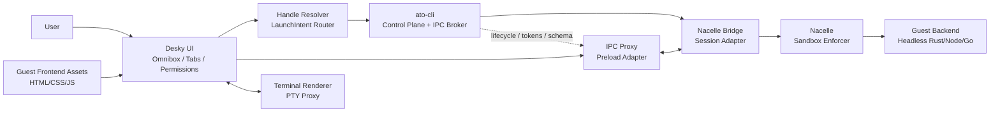
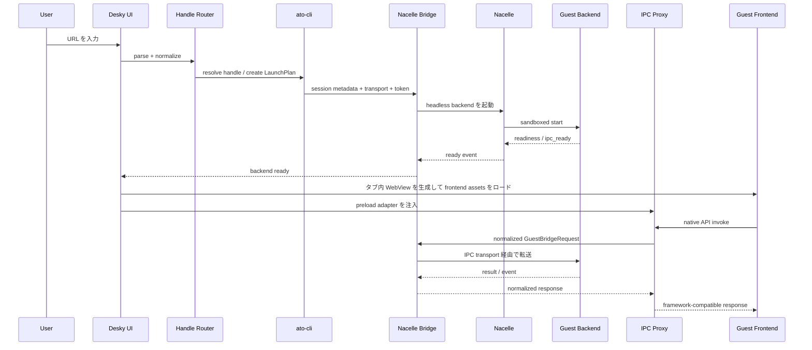

# Desky Product & Architecture Spec

**Status:** Draft v0.1  
**Last Updated:** 2026-04-05  
**Target:** Desky Phase 1 (Electron MVP), Phase 2 (Pure Rust + Wry)  
**Related:** [DESKY_INSTALL_SPEC.md](DESKY_INSTALL_SPEC.md), [DESKTOP_SPEC.md](DESKTOP_SPEC.md), [NACELLE_SPEC.md](NACELLE_SPEC.md), [DRAFT_CAPSULE_IPC.md](DRAFT_CAPSULE_IPC.md), [DESKTOP_TAB_SPEC.md](DESKTOP_TAB_SPEC.md), [MULTI_WEBVIEW_SPEC.md](MULTI_WEBVIEW_SPEC.md)

---

## 1. Product Vision and Purpose

Desky は Ato エコシステムの **User Plane** である。

Ato CLI が宣言を解決し、Nacelle が安全に実行し、Desky がそれらを **ひとつの URL バー** と **ブラウザのタブ** に統合する。

Desky の最終目標は次の 3 点にある。

1. **Everything runs through the same handle**
   - Web アプリ、CLI ツール、WebView ベースのデスクトップアプリを、`https://...`、`capsule://...`、`npm:...` のような同じ操作面で起動する。
2. **Browser-grade multi-tenancy for local software**
   - 各アプリを独立したタブとして扱い、UI・プロセス・権限・状態を分離する。
3. **A safe face for the Ato runtime**
   - ユーザーは個別のランタイム、パッケージマネージャー、OS ごとの起動方法を意識せず、Ato の宣言モデルを安全に利用できる。

### 1.1 Problem Statement

従来のデスクトップ環境では、Web アプリ、CLI、ネイティブアプリはそれぞれ別の mental model を要求する。

- Web はブラウザで開く
- CLI はターミナルで実行する
- デスクトップアプリは Finder / Dock / 専用ランチャーから起動する
- 各アプリは独自のアップデータ、権限モデル、状態管理を持つ

Desky はこの分断をやめる。Ato の capsule モデルの上で、あらゆるソフトウェアを URL 解決とタブ表示に統一する。

### 1.2 Product Goals

- 単一の URL バーでアプリを検索・解決・起動できること
- タブ単位でクラッシュ分離、権限境界、ライフサイクル管理ができること
- WebView ベースデスクトップアプリを、ネイティブウィンドウ埋め込みなしで統合できること
- Ato CLI と Nacelle の責務を侵食せず、User Plane に徹すること
- Electron MVP で中核機構を先に証明し、その後 Rust ネイティブ実装へ移行できること

### 1.3 Non-Goals

- 任意のネイティブウィンドウアプリを OS レベルで Desky の中に埋め込むこと
- Desky 自身がパッケージマネージャー、依存解決器、IPC Broker になること
- Tauri/Electron/Wails 製アプリを無修正・無契約で 100% 互換実行すること
- Electron を最終形態とすること

---

## 2. Product Scope

### 2.1 Supported Integration Targets

Desky が統合対象とするのは以下に限定する。

| Target Type         | Render Surface          | Runtime Path                                                  | Notes                                   |
| ------------------- | ----------------------- | ------------------------------------------------------------- | --------------------------------------- |
| Web app             | タブ内 WebView          | 直接ロード                                                    | `https://`, `http://`, 将来 `mag://`    |
| CLI / TUI           | タブ内 terminal surface | Ato CLI + Nacelle + PTY bridge                                | xterm.js 等で表示                       |
| WebView desktop app | タブ内 WebView          | Frontend は Desky が描画、backend は Nacelle がヘッドレス起動 | Tauri / Electron / Wails 互換ターゲット |

### 2.2 Explicit Constraint

Desky は **ネイティブウィンドウを埋め込まない**。

代わりに、WebView ベースアプリを以下の 2 つに分離して扱う。

- **Frontend:** HTML / CSS / JS を Desky のタブで描画する
- **Backend:** Rust / Node / Go などのバックエンドを Nacelle 上でヘッドレス実行する

この制約により、OS の window manager と競合せずに、ブラウザ的なマルチテナント UI とプロセス分離を両立する。

### 2.3 Desky Compatibility Contract

WebView ベースデスクトップアプリを Desky に統合するには、少なくとも論理的に次の情報が必要である。

- frontend bundle の位置
- backend entrypoint
- adapter 種別 (`tauri`, `electron`, `wails`)
- 許可された host capability 一覧
- IPC transport の接続先情報を受け取る方法

この契約は将来 manifest / lock に昇格可能だが、本仕様では **Desky Guest Contract** と呼ぶ。

### 2.4 Dual-Mode Product Requirement

Desky guest は、原則として Desky 専用アプリになるべきではない。

理想状態は、同じアプリ artifact が次の 2 つの起動経路を両立することである。

1. standalone native app として通常どおり起動できること
2. Desky guest として起動されたときは、window ownership を host に委譲して hidden-window or headless backend として振る舞えること

このため Desky guest 契約は compile-time 固定よりも runtime 分岐を優先する。

設計原則:

- same app, same artifact, two launch modes
- Desky はソフトウェアを Ato 専用配布物へ lock-in しない
- guest mode 判定は OS 標準の runtime boundary である environment variable を使う
- framework ごとの差異は app author の boilerplate ではなく、薄い integration SDK で吸収する

---

## 3. User Experience Model

### 3.1 URL Bar as the Only Handle

Desky は「どの種類のソフトウェアを開くか」ではなく、「どの handle を開くか」を受け取る。

入力はまず正規化され、最終的に `LaunchIntent` に変換される。

```text
User Input
  -> Handle Parsing
  -> Resolution
  -> LaunchIntent
  -> Render Strategy Selection
  -> Tab Materialization
```

### 3.2 Supported Handle Families

| Handle Family        | Example                             | Normalized Intent         |
| -------------------- | ----------------------------------- | ------------------------- |
| Web URL              | `https://store.ato.run`             | `OpenWebPage`             |
| Capsule app          | `capsule://store/acme/editor@1.0.0` | `OpenCapsuleApp`          |
| Capsule source ref   | `capsule://github.com/acme/editor`  | `OpenCapsuleApp`          |
| Package alias        | `npm:@acme/devtool`                 | `ResolvePackageToCapsule` |
| CLI-oriented capsule | `capsule://store/acme/grep-tool`    | `OpenTerminalCapsule`     |
| State URI            | `mag://example.com/state`           | `OpenStateView`           |

### 3.3 Render Strategy Selection

`LaunchIntent` は次のいずれかの表示戦略に変換される。

| Strategy        | Meaning                                                        |
| --------------- | -------------------------------------------------------------- |
| `web`           | WebView に URL を直接ロード                                    |
| `terminal`      | PTY と terminal renderer を接続                                |
| `guest-webview` | Frontend をタブ内 WebView で描画し、backend は別プロセスで起動 |
| `unsupported`   | 現行 Desky の統合対象外として明示的に失敗                      |

---

## 4. System Architecture

### 4.1 Logical Layers

| Layer            | Primary Component         | Responsibility                                                                  |
| ---------------- | ------------------------- | ------------------------------------------------------------------------------- |
| User Plane       | Desky UI                  | URL bar、tabs、permissions、render orchestration                                |
| Host Integration | IPC Proxy / Guest Adapter | ゲスト frontend からのネイティブ API 呼び出しを横取りし、host-safe な形式に変換 |
| Control Plane    | Ato CLI                   | Handle 解決、依存解決、LaunchPlan 生成、IPC Broker、token / schema 管理         |
| Data Plane       | Nacelle                   | sandbox、overlay materialization、headless backend 起動、readiness 報告         |
| Guest Runtime    | Guest Backend             | Tauri/Electron/Wails 由来の backend ロジック                                    |

### 4.2 Component Diagram



### 4.3 Architectural Principle

Desky の重要な境界は以下で固定する。

- **Desky は UI Host であり、IPC Broker ではない**
- **ato-cli は orchestration を担当し、UI を持たない**
- **Nacelle は sandbox enforcer であり、解決ロジックを持たない**

この分離により、Phase 1 の Electron 実装から Phase 2 の Rust 実装へ移行しても、責務境界は維持される。

---

## 5. Core Component Responsibilities

### 5.1 Desky UI

Desky UI は User Plane の中心であり、以下を担当する。

- URL bar、tab bar、sidebar、permission prompt、diagnostics panel の表示
- handle の入力受付と `LaunchIntent` の生成要求
- タブごとの表示 surface の選択
- frontend asset のロード
- backend readiness、permission request、crash 状態の可視化
- tab lifecycle と guest lifecycle の対応付け

Desky UI が担当しないこと:

- manifest / lock の依存解決
- token 発行
- schema 検証
- sandbox policy の実施

### 5.2 IPC Proxy

IPC Proxy は Desky 内で動く **guest API interception layer** である。

主な責務:

- preload script を guest frontend に注入する
- `window.__TAURI_IPC__`、`window.__TAURI__.*`、`ipcRenderer` 相当、Wails runtime 相当 API を adapter ごとに横取りする
- 横取りした要求を共通の `GuestBridgeRequest` に正規化する
- 要求を tab session に紐づく transport で Nacelle Bridge 側へ転送する
- response / event / stream を guest frontend に返す
- 許可されていない capability を fail-closed で拒否する

IPC Proxy は互換レイヤーであり、guest backend のビジネスロジックや権限判断そのものは持たない。

### 5.3 Nacelle Bridge

Nacelle Bridge は Desky 側から見た **runtime session adapter** である。

主な責務:

- Desky tab と Ato launch session を 1 対 1 で結び付ける
- ato-cli から返された LaunchPlan / session metadata / transport endpoint を保持する
- backend readiness、exit、crash、permission-required といったイベントを UI 向けに正規化する
- IPC Proxy からの要求を適切な guest backend transport に中継する
- tab close / reload / suspend に応じて session の drain / release を要求する

Nacelle Bridge が担当しないこと:

- dependency resolution
- IPC token 発行
- schema validation
- sandbox policy decision

それらは引き続き ato-cli と Nacelle の責務である。

---

## 6. Guest App Launch Flow

### 6.1 End-to-End Flow



### 6.2 Step-by-Step Data Flow

1. **URL Input**
   - ユーザーが URL bar に handle を入力する。
2. **Normalization**
   - Desky が入力を parse し、`LaunchIntent` に正規化する。
3. **Resolution**
   - ato-cli が manifest / lock / dependency / policy を解決し、`LaunchPlan` を返す。
4. **Session Establishment**
   - ato-cli が transport endpoint、session token、adapter 種別、frontend asset location を払い出す。
5. **Backend Boot**
   - Nacelle が backend をヘッドレスで sandbox 起動する。
6. **Readiness**
   - backend が readiness を返し、Desky はそのタブを interactive 状態へ遷移させる。
7. **Frontend Render**
   - Desky がタブ用 WebView を作成し、frontend assets をロードする。
8. **Preload Injection**
   - Desky が adapter preload を注入し、guest のネイティブ API surface を差し替える。
9. **IPC Bridging**
   - frontend からのネイティブ呼び出しは IPC Proxy を経て backend に到達する。
10. **Lifecycle Management**

- タブ close、reload、suspend は launch session の release と同期する。

### 6.3 Failure Modes

| Failure Point      | Expected Behavior                                                       |
| ------------------ | ----------------------------------------------------------------------- |
| handle 解決失敗    | タブを作らず、URL bar 下に actionable error を表示                      |
| backend 起動失敗   | タブは error state で開き、diagnostics と repair action を表示          |
| readiness timeout  | frontend は skeleton を維持し、retry / logs を表示                      |
| preload 注入失敗   | guest-webview を fail-closed し、raw asset 表示へはフォールバックしない |
| IPC token mismatch | session を破棄し、security error として扱う                             |

---

## 7. Phase 1: Electron MVP

### 7.1 Why Electron for MVP

Phase 1 の目的は、UI の完成ではなく **IPC 横取りと headless backend bridging が成立すること** を証明する点にある。

Electron を採用する理由:

- `WebContentsView` によるタブ単位の強い分離
- preload script の確実な注入
- devtools と process visibility が高く、互換レイヤーの検証がしやすい
- guest frontend のロードと session partition を細かく制御できる

### 7.2 Phase 1 Architecture

- Shell: Electron main process
- Tab surface: `WebContentsView` per tab
- Security baseline:
  - `contextIsolation = true`
  - `sandbox = false` in the current MVP implementation, with fail-closed preload routing used as the primary guest boundary until sandbox parity is restored
  - `nodeIntegration = false`
  - custom guest asset origin is isolated per session via `capsule://<session_id>/...`
- Runtime bridge: local session transport over HTTP loopback URLs returned by `ato app session start`
- Backend execution: Nacelle 上で headless process

### 7.3 Preload-Based IPC Mocking

Phase 1 の核心は preload script による guest API の差し替えである。

#### 7.3.1 Tauri-compatible interception

preload は guest frontend が期待する API surface を提供する。

現在の MVP では次を host-managed API surface として提供する。

- `window.__TAURI_IPC__`
- `window.__TAURI__`
- `window.__TAURI_INTERNALS__` 相当
- `window.__TAURI__.fs.readTextFile`
- `window.__TAURI__.dialog.open`
- `window.__TAURI__.window.getCurrent().setTitle`
- `window.__TAURI__.shell.open`

論理動作:

```text
guest invoke(command, payload)
  -> preload intercept
  -> GuestBridgeRequest { framework: "tauri", command, payload, request_id }
  -> IPC Proxy transport
  -> Nacelle Bridge
  -> guest backend
  -> response
  -> Promise resolve/reject
```

#### 7.3.2 Electron-compatible interception

Electron guest 向けには、限定された `ipcRenderer.invoke` 互換 surface を提供する。

- `ipcRenderer.invoke("desky:ping", payload)`
- `ipcRenderer.invoke("desky:invoke", { command, payload })`
- `ipcRenderer.invoke("desky:window:setTitle", { title })`
- `ipcRenderer.invoke("desky:fs:readFile", { path, encoding })`
- `ipcRenderer.invoke("desky:shell:openExternal", { url })`

ただし full Electron API 互換は非目標であり、Desky で許可された channel のみ通す。

#### 7.3.3 Wails-compatible interception

Wails guest 向けには runtime bridge を shim として注入する。

- `window.runtime.*`
- `window.go.<Service>.<Method>` 相当の呼び出しを request 化

現在の MVP では次を確認済みである。

- `window.runtime.Invoke` / `window.runtime.invoke`
- `window.go.main.App.Ping`
- `window.go.main.App.SetTitle`
- `window.go.main.App.ReadFile`

### 7.4 Common Bridge Envelope

framework ごとの差異は preload で吸収し、bridge では共通 envelope を扱う。

```json
{
  "jsonrpc": "2.0",
  "id": "req_42",
  "method": "guest/invoke",
  "params": {
    "framework": "tauri",
    "tab_id": "tab_123",
    "capability": "plugin:fs|readFile",
    "command": "plugin:fs|readFile",
    "payload": {
      "path": "notes/today.md"
    }
  }
}
```

### 7.5 Technical Challenges and Solutions

| Challenge                   | Why it is hard                                              | Phase 1 solution                                                                                   |
| --------------------------- | ----------------------------------------------------------- | -------------------------------------------------------------------------------------------------- |
| Guest API surface mismatch  | Tauri/Electron/Wails で呼び出しモデルが異なる               | adapter registry を preload 側に持ち、bridge では共通 envelope に正規化する                        |
| Preload injection guarantee | guest frontend が host を信用せず先に boot する可能性がある | `WebContentsView` 作成時に preload を強制設定し、user navigation より先に注入する                  |
| Origin / CSP mismatch       | guest assets の想定 origin と Desky host origin が異なる    | `capsule://<session_id>/...` を guest 専用 origin とし、HTML 配信時に CSP を host が付与する       |
| Capability overexposure     | preload が強すぎると host 権限が漏れる                      | allowlist 方式で最低限の API のみ公開し、未許可 API は preload と host の両方で fail-closed にする |
| Backend startup race        | frontend が先に native invoke を始める                      | bridge readiness 完了まで invoke を queue し、timeout で失敗させる                                 |
| Lifecycle leaks             | tab close 後も backend が残る                               | tab session 終了時に release を ato-cli に通知し、Nacelle の lifecycle と同期する                  |
| Debuggability               | 失敗箇所が preload / bridge / backend に散る                | tab ごとの trace id を採番し、Desky / ato-cli / Nacelle に通す                                     |

### 7.6 Phase 1 Acceptance Criteria

- `guest-webview` タブが独立プロセスとして動作する
- preload による Tauri-compatible invoke の横取りが成立する
- backend は Desky 外で Nacelle によりヘッドレス起動される
- 起動から初回 IPC 呼び出しまでの trace が可視化される
- tab close で backend session が clean に解放される

### 7.7 Current Phase 1.5 Implementation Status

2026-04-05 時点の実装済み範囲は次のとおり。

- Tauri plugin surface の一部を host-managed capability として横取り済み
  - `plugin:fs|readFile`
  - `plugin:dialog|open`
  - `plugin:window|setTitle`
  - `shell.open`
- 未宣言 capability と boundary 外 file read は preload と host の両方で fail-closed される
- guest adapter registry は Tauri, Wails, Electron guest の 3 系統に拡張済み
- tab close, reload, force stop, crash で `ato app session stop` を呼び、renderer crash 後は `crashed` 状態と `Restart session` を提供する
- guest assets は `capsule://<session_id>/...` からのみロードし、CSP により外部 fetch を block する
- guest frontend には `tauri://localhost` を想定した origin hint を session metadata として渡す

### 7.8 Proposed Dual-Mode Runtime Contract

次段階では、Desky guest の canonical runtime signal として次を追加する。

- `ATO_GUEST_MODE=1`

意味:

- `ATO_GUEST_MODE` が存在しないとき、アプリは standalone native app として通常動作する
- `ATO_GUEST_MODE=1` のとき、アプリは Desky guest mode として振る舞う

guest mode でアプリに要求されること:

- primary window を作らない、または生成後すぐに hide する
- backend logic, readiness endpoint, IPC handler は通常どおり初期化する
- guest mode を理由に別 artifact や guest-only build を要求しない

許容される実装方式:

- `hide-primary-window`
- `skip-window-creation`
- framework が既に持つ `server-mode` への切り替え

Desky が要求するのは low-level strategy ではなく、**same artifact で standalone と guest mode を両立すること** である。

### 7.9 Integration SDK Layer

`ATO_GUEST_MODE` は低レベル contract として維持するが、開発者には framework ごとの薄い integration SDK を提供する。

SDK の目的:

- `ATO_GUEST_MODE` の検出を 1 箇所に閉じ込める
- window hide or no-window 起動の framework 差分を吸収する
- 将来 readiness or teardown contract が変わっても SDK update で追随できるようにする

SDK の責務:

- `ATO_GUEST_MODE` の検出
- guest mode 時の window suppression or hide
- readiness と shutdown hook の初期化
- Desky guest contract で必要な framework-native setup の補助

2026-04-05 時点で、workspace-local の first cut は次の 2 層で実装済みである。

- backend runtime SDK
  - `apps/ato-cli/packages/desky-guest-tauri`
  - `apps/ato-cli/packages/desky-guest-wails`
  - `apps/ato-cli/packages/desky-guest-electron-backend`
- frontend bridge helper source
  - `apps/ato-cli/packages/desky-guest-frontend`

backend SDK の current responsibility:

- `ATO_GUEST_MODE` と `DESKY_SESSION_*` の env parsing
- framework ごとの dual-mode bootstrapping
- `/health` と `/rpc` の HTTP guest contract server
- built-in `ping` と `check_env` の default handler
- boundary policy helper
- graceful shutdown

frontend bridge helper の current responsibility:

- framework-specific invoke surface の薄い統一
- guest mode 判定の helper
- host-managed capability call の helper
- sample frontend から mode branching boilerplate を外すこと

重要な制約として、Desky の `capsule://<session_id>/...` asset loader は `frontend_entry` のあるディレクトリ配下だけを配信対象にしている。そのため browser helper は package source をそのまま import せず、sample frontend 配下へ vendored runtime copy を置いて読み込む。

この制約により、package source は `apps/ato-cli/packages/desky-guest-frontend` に集約しつつ、実行時は各 sample の `frontend/vendor/desky-guest-frontend/` を参照する二層構成になる。

SDK の非責務:

- framework の完全互換ラッパーになること
- business logic を隠蔽すること
- Ato 固有の配布形式を要求すること

重要なのは package 名ではなく、**app author がほぼ 1 行の初期化で dual-mode に opt-in できること** である。

---

## 8. Phase 2: Pure Rust UI + Wry

### 8.1 End State

Phase 2 では Electron shell を廃止し、Desky を Ato らしい軽量なネイティブブラウザへ移行する。

構成:

- UI shell: GPUI などの Pure Rust UI
- Tab content: `wry` を用いた OS ネイティブ WebView インスタンス
- Runtime session: Phase 1 と同じ責務境界を維持
- Adapter injection: 各 WebView 生成時に preload / init script を注入

### 8.2 What stays the same

Electron から Rust 実装へ移行しても、次は変えない。

- URL bar -> LaunchIntent -> Render Strategy の流れ
- ato-cli が control plane を持つこと
- Nacelle が sandbox enforcer であること
- Desky が preload / adapter ベースで guest API を橋渡しすること

### 8.3 What changes

- Shell の実装言語が JS/TS から Rust に変わる
- Tab 管理とレイアウトが `WebContentsView` から `wry` / native WebView 管理へ変わる
- メモリフットプリントと起動時間が大きく改善する
- OS ごとの差異は Electron ではなく Rust host 層で吸収する

---

## 9. Security and Operational Requirements

### 9.1 Security Requirements

- tab ごとに独立した session / storage partition を持つこと
- preload は allowlist ベースで guest API を公開すること
- 未許可 capability は fail-closed で拒否すること
- session token は tab 単位・短命・再利用不可であること
- backend transport は localhost 露出を最小化し、可能な限り Unix socket / named pipe を優先すること
- raw native window embedding は禁止すること

### 9.2 Operational Requirements

- launch / readiness / invoke / exit が per-tab trace で観測できること
- crash した tab は他 tab に影響を与えないこと
- tab suspend / restore と backend lifecycle を連動できること
- repair action は Desky から要求できるが、実行主体は ato-cli に残すこと

---

## 10. Roadmap

### Phase 1: Electron MVP

- URL bar と tab shell
- `web`, `terminal`, `guest-webview` の 3 種 render strategy
- Tauri-compatible preload interception
- headless backend launch over Ato CLI + Nacelle
- per-tab diagnostics

### Phase 1.5: Compatibility Expansion

- Electron / Wails adapter 追加済み
- capability allowlist の精緻化済み
- custom protocol / origin rewrite の安定化済み
- crash recovery と session restart UI を追加済み
- zombie kill 回帰テストを ato-cli 側に追加済み

### Phase 1.6: Dual-Mode and SDK

- `ATO_GUEST_MODE=1` を canonical guest runtime signal として追加
- same artifact で standalone / guest 両対応を guest contract に昇格
- framework 別 thin integration SDK を first cut で実装済み
- browser helper は shared package source + vendored runtime copy で運用する
- store or manifest surface で dual-mode 対応アプリを識別可能にする

### Phase 2: Pure Rust Browser

- GPUI などによる shell 置換
- Wry / native WebView tab management
- Electron 依存の除去
- lightweight startup と lower memory footprint

---

## 11. Summary

Desky は「デスクトップアプリ」ではなく、Ato の User Plane としての **capsule-native browser** である。

MVP では Electron を使って、次の 1 点を証明することが最重要である。

**WebView ベースアプリの frontend を Desky のタブで描画し、その native IPC を preload で横取りして、Nacelle 上の headless backend へ安全に中継できること。**

これが成立すれば、Phase 2 では実装基盤を Rust に置き換えるだけで、同じ責務境界のまま軽量な最終形態へ移行できる。
