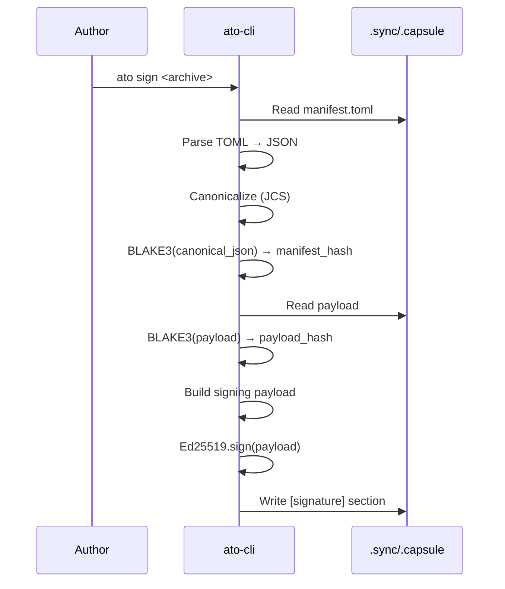
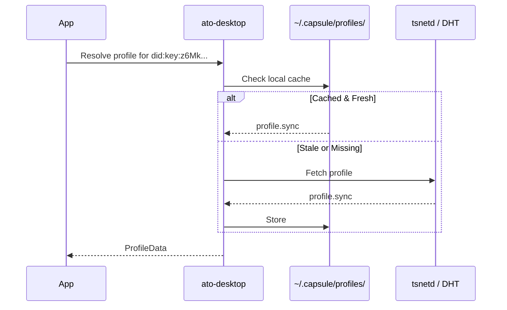

# Identity Layer Specification

## 1. 目的

- **データ主権の証明**: 誰がデータを作成したかを暗号学的に証明する
- **サーバーレス信頼**: 中央認証局なしでオフラインでIDを生成・検証可能にする
- **相互運用性**: Web標準 (DID) に準拠し、外部システムとの連携を可能にする

---

## 2. スコープ

### 2.1 スコープ内
- ID フォーマット (`did:key`)
- 鍵生成・保管・変換
- 署名スキーム (JCS + Ed25519)
- Profile Capsule (`profile.sync`)

### 2.2 スコープ外
- Trust UX (TOFU/Petnames) → `TRUST_AND_KEYS.md`
- 失効リスト → `TRUST_AND_KEYS.md`
- ライセンス署名 → `LICENSE_SPEC.md`

---

## 3. ID フォーマット

### 3.1 標準: `did:key` (Ed25519)

Magnetic Web のすべてのIDは **`did:key`** メソッドに準拠する。

**仕様準拠:**
- [W3C DID Core](https://www.w3.org/TR/did-core/)
- [did:key Method](https://w3c-ccg.github.io/did-method-key/)

**フォーマット:**
```
did:key:z6Mk<multibase-encoded-ed25519-public-key>
```

**例:**
```
did:key:z6MkhaXgBZDvotDkL5257faiztiGiC2QtKLGpbnnEGta2doK
```

**構成要素:**
| 部分 | 説明 |
|---|---|
| `did:key:` | DID メソッドプレフィックス |
| `z` | Multibase: base58btc エンコード |
| `6Mk` | Multicodec: Ed25519 公開鍵 (0xed01) |
| 残り | Ed25519 公開鍵 (32 bytes) |

### 3.2 内部表現: `ed25519:base64`

既存の `capsule-core` との互換性のため、内部ストレージでは以下のフォーマットを維持する。

```
ed25519:<base64-encoded-public-key>
```

**例:**
```
ed25519:dGVzdC4uLg==
```

### 3.3 変換ロジック

`capsule-core` に以下の変換ユーティリティを実装する。

```rust
// capsule-core/src/identity.rs

/// ed25519:base64 → did:key 変換
pub fn to_did_key(internal: &str) -> Result<String>;

/// did:key → ed25519:base64 変換
pub fn from_did_key(did: &str) -> Result<String>;

/// 公開鍵バイト列 → did:key 生成
pub fn public_key_to_did(public_key: &[u8; 32]) -> String;

/// did:key → 公開鍵バイト列 抽出
pub fn did_to_public_key(did: &str) -> Result<[u8; 32]>;
```

**依存クレート:**
- `multibase` - Base58btc エンコード/デコード
- `unsigned-varint` - Multicodec プレフィックス

---

## 4. 鍵管理

### 4.1 鍵の種類

| 種類 | 用途 | 保管場所 | 管理者 |
|---|---|---|---|
| **Developer Key** | Capsule署名、アプリ公開 | ファイル (`~/.capsule/keys/`) | `ato-cli` |
| **User Key** | ライセンス所有証明、P2P認証 | OS Keychain | `ato-desktop` |
| **Device Key** | デバイス間同期、Tailnet認証 | Keychain + tsnetd | システム |

### 4.2 Developer Key (ato-cli)

**保管場所:** `~/.capsule/keys/<name>.json`

**構造 (StoredKey):**
```json
{
  "key_type": "ed25519",
  "public_key": "<base64>",
  "secret_key": "<base64>"
}
```

**パーミッション:** `0600` (owner read/write only)

**CLI コマンド:**
```bash
# 鍵生成
ato keygen --name default --json

# 鍵一覧
ato key list

# 署名
ato sign <artifact> --key default
```

### 4.3 User Key (ato-desktop)

**保管場所:**
| OS | ストレージ | サービス名 |
|---|---|---|
| macOS | Keychain | `com.capsule.identity` |
| Windows | Credential Locker | `Capsule Identity` |
| Linux | Secret Service (libsecret) | `capsule-identity` |

**Tauri 統合:**
```rust
// ato-desktop/src-tauri/src/identity.rs

pub struct IdentityManager {
    // OS Keychain へのハンドル
}

impl IdentityManager {
    /// 新しいユーザー鍵を生成し Keychain に保存
    pub fn generate_key(&self) -> Result<String>; // did:key を返す
    
    /// 現在のユーザー DID を取得
    pub fn get_did(&self) -> Result<String>;
    
    /// データに署名
    pub fn sign(&self, data: &[u8]) -> Result<Signature>;
    
    /// 鍵が存在するか確認
    pub fn has_key(&self) -> bool;
}
```

**Tauri Commands:**
```typescript
// Frontend API
invoke('identity_get_did') → string | null
invoke('identity_generate') → string  // 新規生成
invoke('identity_sign', { data: Uint8Array }) → Uint8Array
```

---

## 5. 署名スキーム

### 5.1 アルゴリズム

- **鍵アルゴリズム:** Ed25519
- **正規化:** JCS (JSON Canonicalization Scheme, RFC 8785)
- **ハッシュ:** BLAKE3 (payload ハッシュ)

### 5.2 署名対象

`.sync` / `.capsule` の署名対象は以下の構造とする。

```json
{
  "manifest_hash": "<BLAKE3 hash of canonicalized manifest.toml as JSON>",
  "payload_hash": "<BLAKE3 hash of payload>",
  "timestamp": "<ISO 8601 timestamp>",
  "signer": "<did:key of signer>"
}
```

### 5.3 署名フロー



### 5.4 manifest.toml への署名埋め込み

```toml
# manifest.toml

[sync]
version = "1.0"
content_type = "text/markdown"

[meta]
created_by = "did:key:z6MkhaXgBZDvotDkL5257faiztiGiC2QtKLGpbnnEGta2doK"
created_at = "2026-02-02T00:00:00Z"

# ... other sections ...

[signature]
algo = "Ed25519"
manifest_hash = "blake3:abc123..."
payload_hash = "blake3:def456..."
timestamp = "2026-02-02T00:00:00Z"
value = "<base64-encoded-signature>"
```

### 5.5 検証フロー

```rust
pub fn verify_signature(archive: &SyncArchive) -> Result<VerificationResult> {
    // 1. manifest.toml を読み込み
    let manifest = archive.read_manifest()?;
    
    // 2. [signature] セクションを除いた manifest を正規化
    let canonical = canonicalize_manifest(&manifest)?;
    
    // 3. manifest_hash を再計算
    let computed_hash = blake3::hash(&canonical);
    
    // 4. 記録されたハッシュと比較
    if computed_hash != manifest.signature.manifest_hash {
        return Ok(VerificationResult::ManifestTampered);
    }
    
    // 5. payload_hash を再計算・比較
    let payload_hash = blake3::hash(archive.read_payload()?);
    if payload_hash != manifest.signature.payload_hash {
        return Ok(VerificationResult::PayloadTampered);
    }
    
    // 6. 署名検証
    let signer_pubkey = did_to_public_key(&manifest.meta.created_by)?;
    let signing_payload = build_signing_payload(&manifest.signature)?;
    
    if !verify_ed25519(&signer_pubkey, &signing_payload, &manifest.signature.value) {
        return Ok(VerificationResult::InvalidSignature);
    }
    
    Ok(VerificationResult::Valid)
}
```

---

## 6. Profile Capsule

### 6.1 概要

ユーザーのパブリックプロファイルを `.sync` カプセルとして配布する。

**ファイル名:** `profile.sync` または `<did-suffix>.profile.sync`

**Content-Type:** `application/vnd.capsule.profile`

### 6.2 構造

```toml
# profile.sync / manifest.toml

[sync]
version = "1.0"
content_type = "application/vnd.capsule.profile"
display_ext = "profile"

[meta]
created_by = "did:key:z6MkhaXgBZDvotDkL5257faiztiGiC2QtKLGpbnnEGta2doK"
created_at = "2026-02-02T00:00:00Z"

[profile]
display_name = "Alice"
bio = "Building the Magnetic Web"
avatar_hash = "blake3:..."  # payload 内の avatar ファイルへの参照

[policy]
ttl = 86400  # 24時間
timeout = 10

[permissions]
allow_hosts = []
allow_env = []

[signature]
algo = "Ed25519"
# ... (自己署名)
```

**Payload 構造:**
```
payload/
├── avatar.png (optional)
└── links.json (optional)
```

**links.json 例:**
```json
{
  "website": "https://alice.example.com",
  "github": "https://github.com/alice",
  "twitter": "https://twitter.com/alice"
}
```

### 6.3 Profile 解決



---

## 7. 実装チェックリスト

### 7.1 Phase A-1: capsule-core 拡張

- [ ] `src/identity.rs` モジュール作成
- [ ] `to_did_key()` / `from_did_key()` 実装
- [ ] `multibase`, `unsigned-varint` 依存追加
- [ ] 既存 `StoredKey` との統合
- [ ] ユニットテスト

### 7.2 Phase A-2: ato-desktop Keychain 統合

- [ ] `keyring` クレート導入
- [ ] `IdentityManager` 構造体実装
- [ ] Tauri Command 実装
- [ ] Frontend hooks (`useIdentity`)
- [ ] 設定画面: DID 表示

### 7.3 Phase A-3: 署名フロー統合

- [ ] `ato sign` コマンドの `did:key` 対応
- [ ] `[signature]` セクションのTOMLシリアライズ
- [ ] `sync-format` への検証ロジック追加

### 7.4 Phase A-4: Profile Capsule

- [ ] `profile.sync` スキーマ定義
- [ ] `ato profile create` コマンド
- [ ] Desktop での Profile 表示
- [ ] P2P Profile 解決 (Phase D 連携)

---

## 8. セキュリティ考慮事項

### 8.1 秘密鍵の保護

- **Desktop:** OS Keychain 以外への保存禁止
- **CLI:** ファイルパーミッション `0600` 強制
- **メモリ:** 使用後のゼロ化 (`zeroize` クレート)

### 8.2 署名の悪用防止

- **タイムスタンプ必須:** リプレイ攻撃防止
- **スコープ限定:** 署名対象に `target` フィールドを含める（ライセンス用）

### 8.3 鍵漏洩時の対応

→ `TRUST_AND_KEYS.md` の失効リスト仕様に従う

---

## 9. 未決事項

### 9.1 Multi-Device 同期

- 複数デバイスで同一ユーザー鍵を使用するか？
- 案A: デバイスごとに別鍵 → Profile に複数鍵をリスト
- 案B: 鍵の安全な同期（iCloud Keychain 等）

### 9.2 Recovery

- 鍵紛失時の回復手段
- Social Recovery の導入検討

### 9.3 Key Derivation

- 用途別に派生鍵を使用するか？
- 例: `did:key:...#signing`, `did:key:...#encryption`

---

## 10. 参照

- [W3C DID Core](https://www.w3.org/TR/did-core/)
- [did:key Method Specification](https://w3c-ccg.github.io/did-method-key/)
- [RFC 8785 - JSON Canonicalization Scheme](https://tools.ietf.org/html/rfc8785)
- [Ed25519 Signature Algorithm](https://ed25519.cr.yp.to/)
- [TRUST_AND_KEYS.md](TRUST_AND_KEYS.md)
