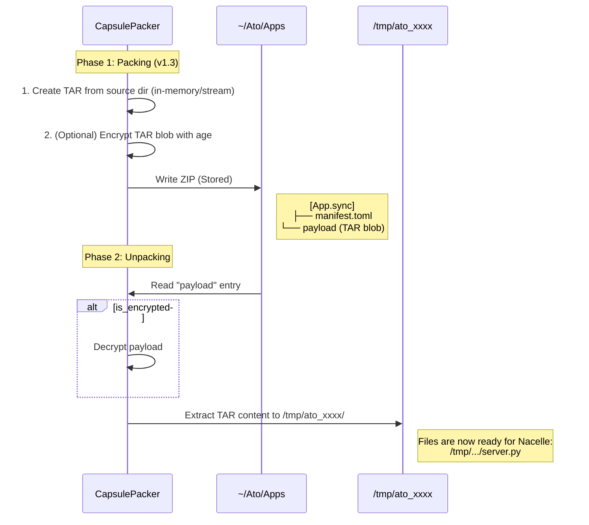

# .sync Specification v1.3 (Proposed)

v1.2（Implementation-aligned）との互換性を維持しつつ、暗号化（Vault Mode）を拡張します。現行実装で未対応の項目は明記します。

---

## 1. 目的

- Self-Updating Data Archive の統一規格
- Open時に `payload` を即時表示し、必要に応じて更新可能
- 暗号化された `.sync` を統一的に扱う

## 2. コンテナ定義

- **拡張子:** `.sync`
- **コンテナ:** Standard ZIP
- **圧縮要件:**
  - `payload` は **Stored (無圧縮)** 必須
  - それ以外のエントリも **Stored 推奨**（現行 SyncBuilder は全エントリ Stored）
- **MIMEタイプ:** `application/vnd.magnetic.sync+zip`（情報目的）

## 3. ファイルレイアウト

ZIPルート直下に以下を配置します。`sync-format` は `manifest.toml` と `sync.wasm` を必須とします。

```text
[Filename.sync] (ZIP Archive)
├── manifest.toml     (必須)
├── payload           (必須: Stored, 単一ファイル)
├── sync.wasm         (必須)
├── context.json      (任意)
└── sync.proof        (任意: 署名/検証)
```

## 4. `manifest.toml`

必須セクションは `[sync]`, `[meta]`, `[policy]`。
`[permissions]`, `[ownership]`, `[verification]`, `[encryption]` は省略可能（デフォルト値あり）。

```toml
[sync]
version = "1.3"
content_type = "application/x-capsule+tar"  # 復号後payloadのMIMEタイプ（唯一の正）
variant = "vault"                            # 省略可: "vault" | "plain"
display_ext = "vault"

[meta]
created_by = "sync-fs"
created_at = "2026-02-05T00:00:00Z"  # RFC3339
hash_algo = "blake3"

[policy]
ttl = 3600                 # 秒
timeout = 30               # 秒

[permissions]              # 省略可（デフォルトは空配列）
allow_hosts = ["api.example.com"]
allow_env = ["API_TOKEN"]

[ownership]                # 省略可
owner_capsule = "capsule:example"
write_allowed = false

[verification]             # 省略可（現行実装は検証しない）
enabled = false
vm_type = "sp1"
proof_type = "stark"

[encryption]
enabled = true
algorithm = "age-v1"

[encryption.meta]
# UI/UX向けヒント情報（信頼源ではない）
keys = ["OPENAI_API_KEY", "AWS_ACCESS_KEY_ID"]
recipients = ["did:key:z6Mk..."]
kdf = "scrypt"
hint = "Use your master password"
```

### 4.1 既定値

- `[permissions]`: `allow_hosts=[]`, `allow_env=[]`
- `[ownership]`: `owner_capsule=null`, `write_allowed=false`
- `[verification]`: `enabled=false`, `vm_type=null`, `proof_type=null`
- `[encryption]`: `enabled=false`, `algorithm=null`

## 5. `payload`

- **役割:** スナップショット実体（**単一ファイル**）
- **形式:** `sync.content_type` に準拠（復号後の型）
- **要件:** ZIP内で **Stored (無圧縮)**
- **構造:** ZIPエントリ名は `payload`（ディレクトリではない）

### 5.1 ディレクトリ構造の表現（Capsule App等）

アプリや複数ファイルを含む場合は、**ディレクトリ全体をTARで固めて単一の`payload`エントリに格納**する。

```text
[App.sync] (ZIP Archive, Stored)
├── manifest.toml
├── payload           <-- TAR blob (server.py, requirements.txt, ...)
└── sync.wasm
```

- `content_type = "application/x-capsule+tar"` または `application/x-tar`
- TARも**無圧縮 (ustar/pax)** を推奨（二重圧縮回避）

### 5.2 なぜディレクトリではなくTARか？

1. **暗号化の簡素化**: 単一バイナリを暗号化するだけで済む
2. **署名の一貫性**: payload全体のハッシュが一意に決まる
3. **互換性**: 既存の`SyncArchive`のオフセット参照ロジックを維持できる

### 5.3 ゼロコピーの制約

- **Plain (平文)**: ZIP Stored + TAR Stored であれば、理論上はオフセット参照可能。ただし現行実装は一時ディレクトリへの展開を行う。
- **Encrypted**: ゼロコピー不可。復号のためバッファリングが必須。

## 6. 暗号化（Vault Mode）

`encryption.enabled = true` の場合、`payload` は暗号化バイナリ（age形式）になる。

### 6.0 Vault Payload（固定名）

Vault用途では、TAR内部のファイル名を **`secrets.json` に固定**する。

```text
payload (Encrypted TAR)
└── secrets.json
```

これにより、復号後に特定エントリのみをストリームで読み出せる。

### 6.1 署名

- **Encrypted-then-Signed**: 署名は暗号化後のZIPバイト列に対して行う。
- `sync.proof` の形式は [docs/SIGNATURE_SPEC.md](../SIGNATURE_SPEC.md) に従う。

### 6.2 信頼源

- 復号に必要な真のメタ情報は **payload内の暗号ヘッダ** を信頼する。
- `encryption.meta` は **UI/UX向けヒント情報** のみ。

## 7. VFS / Runtime 挙動

### 7.1 マウント戦略

| 状態      | payload        | VFS 実装                     | パフォーマンス         |
| --------- | -------------- | ---------------------------- | ---------------------- |
| Plain     | 生データ (TAR) | DirectSlice (mmap/offset)    | **Zero-Copy** (理論上) |
| Encrypted | ageバイナリ    | DecryptionStream (Read-only) | **Buffered / CPU負荷** |

### 7.2 ライフサイクル

1. **Open**: Manifest を読み、暗号化フラグを確認
2. **Unlock**: `encryption.enabled = true` なら認証（パスフレーズ/秘密鍵）
3. **Decrypt**: payloadヘッダを検証し復号キーを導出
4. **Unpack**: TAR を展開して一時ディレクトリに配置（現行実装）
5. **Mount/Execute**: 展開されたディレクトリをrootとしてランタイム起動

## 8. `sync.wasm`

- **役割:** ゲストロジックの本体（ホストアプリが実行）
- **要件:** **必須**（存在のみ検証）
- **備考:** `sync-rs` 自体はWasm実行環境を持たない

### 8.1 将来拡張

Capsule（アプリケーションパッケージ）を `.sync` 形式で配布する場合、`sync.wasm` は以下の役割を担うことを想定：

- **アップデータ (Updater):** アプリの最新版を取得し、`payload` を更新
- **差分同期:** 変更されたファイルのみを効率的に同期
- **マイグレーション:** アプリのバージョンアップ時にデータ移行を実行

現時点では最小限のダミー（8バイトの有効な Wasm ヘッダ）を配置。

## 9. `context.json`（任意）

- **役割:** 実行時パラメータのJSON
- **実装:** 形式/スキーマは未定義（存在確認のみ）
- **注意:** 秘密情報は格納しない

## 10. `sync.proof`（任意）

- **役割:** 署名/検証情報
- **実装:** 保存・存在確認のみ（検証は未実装）
- **形式:** [docs/SIGNATURE_SPEC.md](../SIGNATURE_SPEC.md) に準拠

## 11. 互換性

- v1.2互換：`payload` は単一ファイル、Stored必須
- 暗号化非対応の実装でも `manifest.toml` は読めるため、適切なエラーメッセージを表示可能

---

## 付録A: Packing / Unpacking フロー

### A.1 実装要件（capsule_packer）

**Packing（ディレクトリ → .sync）:**
1. **入力**: ディレクトリ (例: `MyCapsule/`)
2. **TARアーカイブ化**: メモリ上（または一時ファイル）で **TAR (無圧縮/ustar)** にまとめる
3. **暗号化分岐**:
   - `encryption=true`: TARバイナリを `age` で暗号化
   - `encryption=false`: TARバイナリをそのまま使用
4. **ZIP格納**: `payload` エントリ（**STORED**）として書き込み
5. **補助ファイル**: `manifest.toml`, `sync.wasm`, `capsule.toml`（任意）を追加

**Unpacking（.sync → ディレクトリ）:**
1. ZIP から `payload` エントリを読み取り
2. 暗号化フラグ確認、必要なら復号
3. TARを展開して一時ディレクトリに配置

### A.2 シーケンス図



## 付録B: ゲスト実行契約（guest.v1）

v1.2と同一。詳細は別ドキュメント参照。

### B.1 Request

- `version`: 固定値 `guest.v1`
- `request_id`: 一意ID
- `action`: `ReadPayload` | `ReadContext` | `WritePayload` | `WriteContext` | `ExecuteWasm` | `UpdatePayload`
- `context`: ゲストコンテキスト
- `input`: JSON値

### B.2 Response

- `version`, `request_id`
- `ok`: 成否
- `result`: 任意JSON
- `error`: `{ code, message }`
