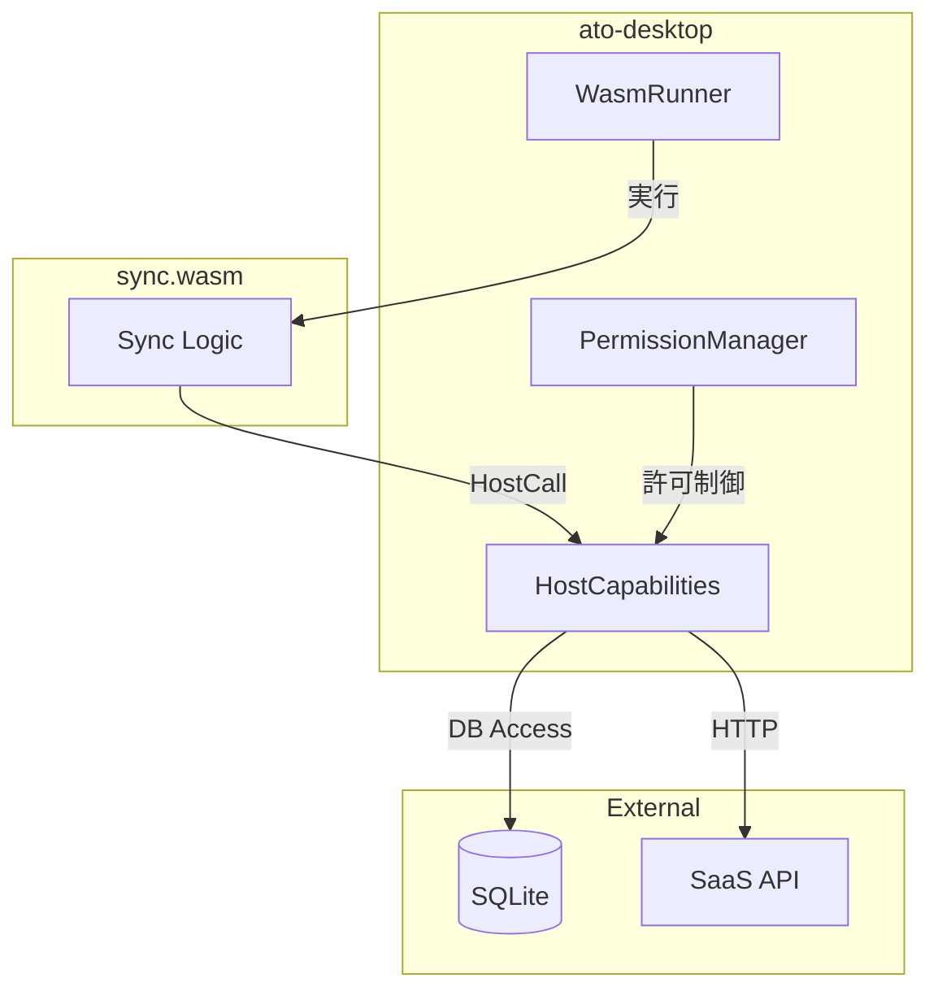
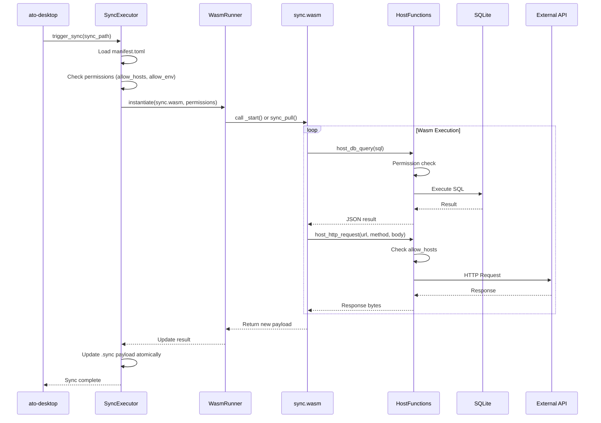

# Sync.wasm 実行基盤仕様書

## 1. 概要

本仕様書は、ato-desktop における `sync.wasm` 実行基盤の設計を定義します。
これにより、外部SaaS（Notion, GitHub, Google Sheets等）との双方向同期を
sync.wasm 内のロジックで実現し、.sync ファイルを
「ローカルデータのポータブルスナップショット」として機能させます。

### 1.1 目的

- **外部SaaS連携**: sync.wasm が外部APIと通信し、ローカルDBとの同期を実行
- **セキュアな実行**: サンドボックス内でWasmを実行し、ホスト関数経由でのみリソースアクセス
- **ポータブルスナップショット**: 同期結果を .sync の payload として保存

### 1.2 スコープ



---

## 2. アーキテクチャ

### 2.1 コンポーネント構成

```text
apps/ato-desktop/src-tauri/
├── src/
│   ├── wasm/                      # Wasm実行基盤
│   │   ├── mod.rs
│   │   ├── runner.rs              # WasmRunner (wasmtime integration)
│   │   ├── host_functions.rs      # ホスト関数エクスポート
│   │   ├── permission_guard.rs    # 権限チェック
│   │   └── resource_limiter.rs    # CPU/メモリ制限
│   ├── sync/
│   │   ├── sync_executor.rs       # .sync の sync 実行管理
│   │   └── ...
│   └── ...
└── Cargo.toml                     # + wasmtime dependency
```

### 2.2 実行フロー



---

## 3. ホスト関数 (Host Functions) 仕様

sync.wasm が呼び出せるホスト関数のAPI定義。

### 3.1 エラーコード体系

すべてのホスト関数は共通のエラーコードを使用します。

| コード | 定数名 | 説明 |
|--------|--------|------|
| `0` | `SUCCESS` | 成功 |
| `-1` | `ERR_PERMISSION_DENIED` | 権限なし |
| `-2` | `ERR_RESOURCE_LIMIT` | リソース制限超過 |
| `-3` | `ERR_INVALID_ARGUMENT` | 不正な引数 |
| `-4` | `ERR_HOST_INTERNAL` | ホスト内部エラー |
| `-5` | `ERR_NETWORK` | ネットワークエラー |
| `-6` | `ERR_DB` | データベースエラー |
| `-7` | `ERR_IO` | I/Oエラー |

### 3.2 データベースアクセス

```rust
/// ホスト関数: SQLiteクエリ実行
/// 
/// # Arguments
/// * `db_name` - データベース識別子 (e.g., "chat", "notes")
/// * `query` - SQL文字列
/// * `params` - JSONエンコードされたパラメータ配列
/// 
/// # Returns
/// * JSON配列 (SELECT) または affected_rows (INSERT/UPDATE/DELETE)
/// 
/// # Permissions
/// * Requires: manifest.permissions.allow_db = ["chat", "notes"]
#[host_function]
fn host_db_query(db_name: &str, query: &str, params: &str) -> Result<String, i32>;

/// ホスト関数: トランザクション開始
#[host_function]
fn host_db_begin(db_name: &str) -> Result<i32, i32>;  // Returns tx_id

/// ホスト関数: トランザクションコミット
#[host_function]
fn host_db_commit(tx_id: i32) -> Result<(), i32>;

/// ホスト関数: トランザクションロールバック
#[host_function]
fn host_db_rollback(tx_id: i32) -> Result<(), i32>;
```

**DBスキーマ管理について:**
- `sync.wasm` の `sync_init` エクスポート関数で `CREATE TABLE IF NOT EXISTS` を発行
- ホスト側はスキーマ管理に関与せず、クエリ実行のみを担当

### 3.3 HTTP通信

```rust
/// ホスト関数: HTTP リクエスト
/// 
/// # Arguments
/// * `url` - リクエストURL
/// * `method` - "GET", "POST", "PUT", "DELETE", etc.
/// * `headers` - JSON object {"Content-Type": "application/json", ...}
/// * `body` - リクエストボディ (NULL可)
/// 
/// # Returns
/// * JSON: {"status": 200, "headers": {...}, "body": "..."}
/// 
/// # Permissions
/// * URL host must be in manifest.permissions.allow_hosts
#[host_function]
fn host_http_request(
    url: &str, 
    method: &str, 
    headers: &str, 
    body: Option<&[u8]>
) -> Result<String, i32>;
```

### 3.4 環境変数

```rust
/// ホスト関数: 環境変数取得
/// 
/// # Permissions
/// * Key must be in manifest.permissions.allow_env
#[host_function]
fn host_env_get(key: &str) -> Result<Option<String>, i32>;
```

### 3.5 ファイルシステム（制限付き）

```rust
/// ホスト関数: 一時ファイル書き込み
/// 
/// # Note
/// * サンドボックス内の一時ディレクトリにのみ書き込み可能
#[host_function]
fn host_fs_write_temp(filename: &str, data: &[u8]) -> Result<String, i32>;  // Returns temp path

/// ホスト関数: Payload読み出し
#[host_function]
fn host_payload_read() -> Result<Vec<u8>, i32>;

/// ホスト関数: Payload書き込み（最終結果）
#[host_function]
fn host_payload_write(data: &[u8]) -> Result<(), i32>;
```

### 3.6 ログ・デバッグ

```rust
/// ホスト関数: ログ出力
#[host_function]
fn host_log(level: &str, message: &str);  // level: "debug", "info", "warn", "error"
```

---

## 4. manifest.toml 拡張

### 4.1 権限セクション拡張

```toml
[sync]
version = "1.3"
content_type = "application/vnd.ato.chat+json"

[permissions]
# 既存
allow_hosts = ["api.notion.com", "api.github.com"]
allow_env = ["NOTION_API_KEY", "GITHUB_TOKEN"]

# 新規追加
allow_db = ["chat", "notes"]           # アクセス可能なDB名
allow_db_write = true                   # DB書き込み許可 (default: false)
max_http_requests = 100                 # 1回のsync実行あたりの最大HTTPリクエスト数
max_db_queries = 1000                   # 1回のsync実行あたりの最大DBクエリ数

[policy]
ttl = 3600                              # 自動sync間隔（秒）
timeout = 30                            # sync.wasm実行タイムアウト（秒）
max_payload_size = 10485760             # 最大payloadサイズ（10MB）

[execution]
# Wasm実行リソース制限
cpu_limit_ms = 5000                     # 最大CPU時間（ミリ秒）
memory_limit_mb = 64                    # 最大メモリ（MB）
fuel_limit = 1000000                    # wasmtime fuel制限
```

---

## 5. WasmRunner 実装仕様

### 5.1 初期化

```rust
pub struct WasmRunner {
    engine: wasmtime::Engine,
    linker: wasmtime::Linker<HostState>,
    config: WasmConfig,
    /// コンパイル済みモジュールのキャッシュ
    module_cache: RwLock<HashMap<PathBuf, (SystemTime, wasmtime::Module)>>,
}

pub struct HostState {
    permissions: WasmPermissions,
    db_pool: Arc<DbPool>,
    http_client: reqwest::Client,
    temp_dir: PathBuf,
    request_count: AtomicU32,
    query_count: AtomicU32,
    output_payload: Option<Vec<u8>>,
}

impl WasmRunner {
    pub fn new(config: WasmConfig) -> Result<Self> {
        let mut engine_config = wasmtime::Config::new();
        engine_config.consume_fuel(true);  // CPU制限有効化
        engine_config.epoch_interruption(true);  // タイムアウト有効化
        
        let engine = wasmtime::Engine::new(&engine_config)?;
        let mut linker = wasmtime::Linker::new(&engine);
        
        // ホスト関数を登録
        host_functions::register_all(&mut linker)?;
        
        Ok(Self { 
            engine, 
            linker, 
            config,
            module_cache: RwLock::new(HashMap::new()),
        })
    }
}
```

### 5.2 モジュールキャッシュ

```rust
impl WasmRunner {
    /// キャッシュからモジュールを取得、またはコンパイル
    fn get_or_compile_module(&self, wasm_path: &Path, wasm_bytes: &[u8]) -> Result<wasmtime::Module> {
        let modified = std::fs::metadata(wasm_path)?.modified()?;
        
        // キャッシュチェック
        if let Some((cached_time, module)) = self.module_cache.read()?.get(wasm_path) {
            if *cached_time == modified {
                return Ok(module.clone());
            }
        }
        
        // コンパイル
        let module = wasmtime::Module::new(&self.engine, wasm_bytes)?;
        
        // キャッシュ更新
        self.module_cache.write()?.insert(wasm_path.to_path_buf(), (modified, module.clone()));
        
        Ok(module)
    }
}
```

### 5.3 実行

```rust
impl WasmRunner {
    pub async fn execute_sync(
        &self,
        wasm_path: &Path,
        wasm_bytes: &[u8],
        permissions: WasmPermissions,
        mode: SyncMode,  // Pull or Push
    ) -> Result<SyncResult> {
        // 1. Module のコンパイル（キャッシュ利用）
        let module = self.get_or_compile_module(wasm_path, wasm_bytes)?;
        
        // 2. HostState の準備
        let state = HostState::new(permissions, self.db_pool.clone())?;
        let mut store = wasmtime::Store::new(&self.engine, state);
        
        // 3. リソース制限の設定
        store.set_fuel(self.config.fuel_limit)?;
        store.epoch_deadline_trap();
        
        // 4. インスタンス化
        let instance = self.linker.instantiate(&mut store, &module)?;
        
        // 5. 初期化関数呼び出し（存在する場合）
        if let Ok(init_fn) = instance.get_typed_func::<(), i32>(&mut store, "sync_init") {
            init_fn.call(&mut store, ())?;
        }
        
        // 6. エントリポイント呼び出し
        let entry_fn = match mode {
            SyncMode::Pull => instance.get_typed_func::<(), i32>(&mut store, "sync_pull")?,
            SyncMode::Push => instance.get_typed_func::<(), i32>(&mut store, "sync_push")?,
        };
        
        // 7. タイムアウト付き実行
        // Note: ゲスト側は同期的に記述、ホスト関数内で非同期処理
        let result = tokio::time::timeout(
            Duration::from_secs(self.config.timeout_secs),
            async { entry_fn.call_async(&mut store, ()).await }
        ).await??;
        
        // 8. 結果の取得
        let payload = store.data().take_output_payload()?;
        
        Ok(SyncResult { payload, exit_code: result })
    }
}
```

### 5.4 非同期処理モデル

```text
┌─────────────────────────────────────────────────────────────┐
│                     sync.wasm (Guest)                       │
│                                                             │
│   fn sync_pull() {                                          │
│       let data = host_http_get("https://api.example.com");  │
│       //         ↑ ブロッキングに見える                      │
│       host_payload_write(&data);                            │
│   }                                                         │
└─────────────────────────────────────────────────────────────┘
                           │
                           │ Host Function Call
                           ▼
┌─────────────────────────────────────────────────────────────┐
│                     Host (ato-desktop)                      │
│                                                             │
│   async fn host_http_get_impl(...) -> Result<...> {         │
│       let response = self.http_client                       │
│           .get(url)                                         │
│           .send()                                           │
│           .await?;  // ← 非同期、メインスレッドをブロックしない │
│       Ok(response.bytes().await?)                           │
│   }                                                         │
└─────────────────────────────────────────────────────────────┘
```

---

## 6. SyncExecutor 実装仕様

### 6.1 公開API

```rust
/// sync.wasm 実行を管理するサービス
pub struct SyncExecutor {
    wasm_runner: WasmRunner,
    sync_store: SyncStore,
}

impl SyncExecutor {
    /// 指定した .sync ファイルの同期を実行
    pub async fn trigger_sync(&self, sync_path: &Path, mode: SyncMode) -> AppResult<SyncReport> {
        // 1. manifest.toml 読み込み
        let archive = SyncArchive::open(sync_path)?;
        let manifest = archive.manifest();
        
        // 2. 権限チェック
        let permissions = self.build_permissions(&manifest)?;
        
        // 3. sync.wasm 読み込み
        let wasm_bytes = archive.read_wasm()?;
        
        // 4. 実行
        let result = self.wasm_runner.execute_sync(
            sync_path,
            &wasm_bytes, 
            permissions, 
            mode
        ).await?;
        
        // 5. payload 更新（成功時）
        if result.exit_code == 0 {
            archive.update_payload(&result.payload)?;
        }
        
        Ok(SyncReport {
            success: result.exit_code == 0,
            new_payload_size: result.payload.len(),
            duration_ms: result.duration.as_millis(),
        })
    }
    
    /// TTLに基づく自動sync（バックグラウンドタスク）
    pub async fn start_auto_sync_daemon(&self) {
        // ...
    }
}
```

---

## 7. セキュリティ

### 7.1 サンドボックス境界

```text
┌─────────────────────────────────────────────────────────────┐
│                    Trusted (ato-desktop)                    │
│  ┌───────────────────────────────────────────────────────┐  │
│  │                    WasmRunner                          │  │
│  │  ┌─────────────────────────────────────────────────┐  │  │
│  │  │              sync.wasm (Untrusted)              │  │  │
│  │  │                                                  │  │  │
│  │  │  ❌ Direct file system access                   │  │  │
│  │  │  ❌ Direct network access                       │  │  │
│  │  │  ❌ Direct DB access                            │  │  │
│  │  │  ❌ System calls                                │  │  │
│  │  │                                                  │  │  │
│  │  │  ✅ host_* functions (permission checked)       │  │  │
│  │  └─────────────────────────────────────────────────┘  │  │
│  │                         │                              │  │
│  │                   Host Functions                       │  │
│  │                         │                              │  │
│  │  ┌──────────┬──────────┬──────────┬──────────┐       │  │
│  │  │ DB Guard │HTTP Guard│ FS Guard │ Env Guard│       │  │
│  │  └──────────┴──────────┴──────────┴──────────┘       │  │
│  └───────────────────────────────────────────────────────┘  │
└─────────────────────────────────────────────────────────────┘
```

### 7.2 権限チェックロジック

```rust
impl PermissionGuard {
    pub fn check_http(&self, url: &str) -> Result<(), PermissionError> {
        let host = url::Url::parse(url)?.host_str().ok_or(PermissionError::InvalidUrl)?;
        
        if !self.allow_hosts.iter().any(|h| host.ends_with(h)) {
            return Err(PermissionError::HostNotAllowed(host.to_string()));
        }
        
        if self.request_count.fetch_add(1, Ordering::SeqCst) >= self.max_requests {
            return Err(PermissionError::RateLimitExceeded);
        }
        
        Ok(())
    }
    
    pub fn check_db(&self, db_name: &str, is_write: bool) -> Result<(), PermissionError> {
        if !self.allow_db.contains(&db_name.to_string()) {
            return Err(PermissionError::DbNotAllowed(db_name.to_string()));
        }
        
        if is_write && !self.allow_db_write {
            return Err(PermissionError::WriteNotAllowed);
        }
        
        Ok(())
    }
}
```

---

## 8. sync.wasm 開発者向けSDK

### 8.1 Rust SDK (将来)

```rust
// sync-wasm-sdk crate

use sync_wasm_sdk::prelude::*;

#[sync_entry]
fn sync_pull() -> Result<Vec<u8>, SyncError> {
    // DBからチャット履歴を取得
    let messages: Vec<Message> = db::query("chat", "SELECT * FROM messages ORDER BY created_at")?;
    
    // 外部APIと同期（例: Notion）
    let notion_pages = http::get("https://api.notion.com/v1/pages", &[
        ("Authorization", &format!("Bearer {}", env::get("NOTION_API_KEY")?)),
    ])?;
    
    // Markdown形式でpayloadを生成
    let markdown = render_markdown(&messages, &notion_pages)?;
    
    Ok(markdown.into_bytes())
}

#[sync_entry]
fn sync_push() -> Result<(), SyncError> {
    let payload = payload::read()?;
    // ... 外部APIへのプッシュロジック
    Ok(())
}
```

### 8.2 エクスポート規約

```wat
;; sync.wasm must export:
(export "sync_pull" (func $sync_pull))   ;; () -> i32 (exit code)
(export "sync_push" (func $sync_push))   ;; () -> i32 (exit code)

;; Optional exports:
(export "sync_init" (func $sync_init))   ;; () -> i32 (initialization)
(export "sync_version" (func $version))  ;; () -> i32 (version number)
```

---

## 9. 依存関係

### 9.1 Cargo.toml 追加

```toml
[dependencies]
wasmtime = { version = "20", features = ["async", "cranelift"] }
wasmtime-wasi = "20"  # オプション: WASI対応する場合
```

### 9.2 バイナリサイズ影響

| 依存 | サイズ増加 (概算) |
|------|------------------|
| wasmtime | ~15-20MB |
| wasmtime-wasi | ~5MB |

**Note**: リリースビルドではLTOと`strip`で削減可能。

---

## 10. 実装ロードマップ

### Phase 1: 基盤構築 (2-3週間)
- [ ] wasmtime 統合 (Cargo.toml, basic runner)
- [ ] ホスト関数フレームワーク (host_log のみ)
- [ ] 基本的なリソース制限 (fuel, timeout)
- [ ] モジュールキャッシュ

### Phase 2: ホスト関数実装 (2-3週間)
- [ ] host_http_request (allow_hosts チェック付き)
- [ ] host_env_get (allow_env チェック付き)
- [ ] host_payload_read / host_payload_write

### Phase 3: DB統合 (2週間)
- [ ] SQLite プール管理
- [ ] host_db_query / host_db_begin / host_db_commit
- [ ] トランザクション管理

### Phase 4: SyncExecutor (1-2週間)
- [ ] trigger_sync API
- [ ] 自動sync デーモン (TTLベース)
- [ ] Tauri コマンド統合

### Phase 5: SDK & ドキュメント (1週間)
- [ ] sync-wasm-sdk crate
- [ ] サンプル sync.wasm (Chat → Markdown)
- [ ] 開発者ドキュメント

---

## 付録A: 関連仕様

- [SYNC_SPEC.md](./SYNC_SPEC.md) - .sync フォーマット仕様
- [CAPSULE_SPEC.md](./CAPSULE_SPEC.md) - Capsule パッケージ仕様
- [NACELLE_SPEC.md](./NACELLE_SPEC.md) - Nacelle ランタイム仕様
