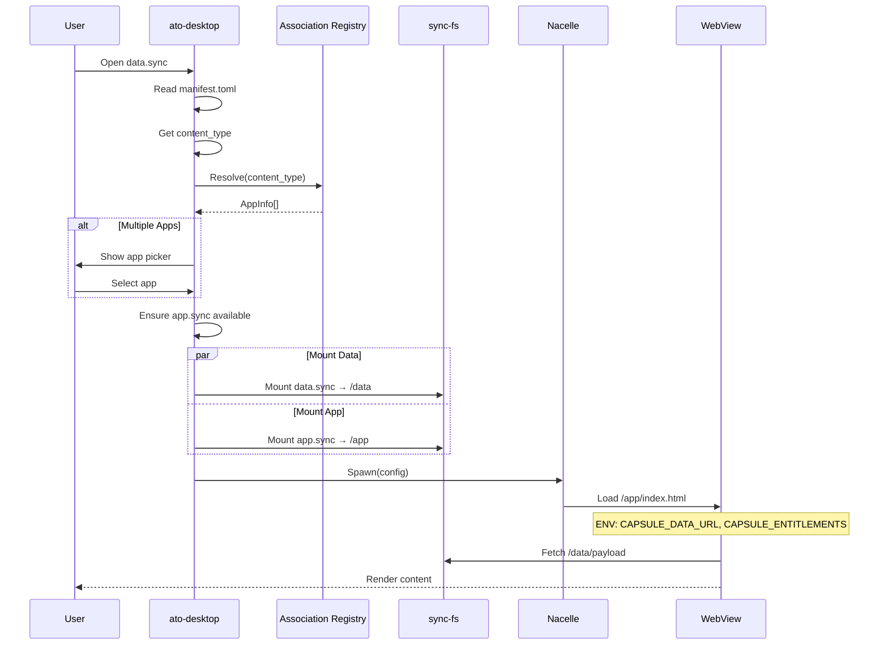

# Association & Dynamic Binding Specification

**Status:** v0.1 (Draft)  
**最終更新:** 2026-02-02  
**関連仕様:** [IDENTITY_SPEC.md](IDENTITY_SPEC.md), [SYNC_SPEC.md](SYNC_SPEC.md), [SCHEMA_REGISTRY.md](SCHEMA_REGISTRY.md)

---

## 1. 目的

- **動的結合**: データファイルを開く際に、最適なアプリを自動選択・起動する
- **データ中心設計**: アプリをインストールするのではなく、データが開かれる瞬間に結合する
- **Polymorphism**: 同じデータ型に対して複数のアプリが対応可能

---

## 2. スコープ

### 2.1 スコープ内
- Association Registry の構造とAPI
- Dual-Mount 起動フロー
- コンテキスト注入方式
- アプリ選択 UI

### 2.2 スコープ外
- P2P 分散 Registry → `REGISTRY_SPEC.md`
- Schema バージョニング → `SCHEMA_REGISTRY.md`

---

## 3. Association Registry

### 3.1 概要

Association Registry は、MIME Type (`content_type`) と App Capsule の対応関係を管理する。

**保存場所:** `~/.capsule/associations.json`

### 3.2 構造

```json
{
  "version": "1.0",
  "updated_at": "2026-02-02T00:00:00Z",
  "associations": [
    {
      "content_type": "text/markdown",
      "app_id": "did:key:z6MkMarkdownEditor...",
      "app_name": "Capsule Editor",
      "app_source": "local",
      "app_path": "~/.capsule/apps/editor.sync",
      "priority": 100,
      "is_default": true
    },
    {
      "content_type": "text/markdown",
      "app_id": "did:key:z6MkVSCode...",
      "app_name": "VS Code (External)",
      "app_source": "system",
      "app_path": "/Applications/Visual Studio Code.app",
      "priority": 50,
      "is_default": false
    },
    {
      "content_type": "application/vnd.capsule.todo",
      "app_id": "did:key:z6MkTodoApp...",
      "app_name": "Capsule Todo",
      "app_source": "registry",
      "app_url": "https://store.ato.run/capsules/koh0920/todo-sync",
      "priority": 100,
      "is_default": true
    }
  ],
  "fallback": {
    "app_id": "did:key:z6MkGenericViewer...",
    "app_name": "Capsule Viewer",
    "app_source": "builtin"
  }
}
```

### 3.3 フィールド定義

| フィールド | 型 | 説明 |
|---|---|---|
| `content_type` | string | MIME Type (完全一致またはワイルドカード) |
| `app_id` | string | アプリの DID |
| `app_name` | string | 表示名 |
| `app_source` | enum | `local` / `registry` / `system` / `builtin` |
| `app_path` | string | ローカルパス (local/system の場合) |
| `app_url` | string | ダウンロード URL (registry の場合) |
| `priority` | number | 優先度 (高い方が優先) |
| `is_default` | boolean | デフォルトアプリかどうか |

### 3.4 ワイルドカードサポート

```json
{
  "content_type": "text/*",
  "app_id": "did:key:z6MkTextEditor...",
  "priority": 10
}
```

**マッチング優先順位:**
1. 完全一致 (`text/markdown`)
2. サブタイプワイルドカード (`text/*`)
3. 全ワイルドカード (`*/*`)
4. フォールバック

---

## 4. Dual-Mount 起動フロー

### 4.1 概要

データとアプリを同時にマウントし、サンドボックス内で結合する。



### 4.2 マウントポイント

| パス | 内容 | 権限 |
|---|---|---|
| `/app` | アプリカプセル | Read-Only |
| `/data` | データカプセル | Read-Write (Owner) / Read-Only (Consumer) |
| `/shared` | 共有リソース | Read-Only |

### 4.3 WebDAV URL 構造

```
http://localhost:{port}/
├── app/
│   ├── index.html
│   ├── main.js
│   └── assets/
├── data/
│   ├── payload/
│   │   └── (actual content)
│   └── manifest.toml (read-only)
└── shared/
    └── (future: shared libraries)
```

---

## 5. コンテキスト注入

### 5.1 環境変数

アプリ起動時に以下の環境変数が注入される。

| 変数名 | 値 | 説明 |
|---|---|---|
| `CAPSULE_DATA_URL` | `http://localhost:port/data` | データマウントポイント |
| `CAPSULE_APP_URL` | `http://localhost:port/app` | アプリマウントポイント |
| `CAPSULE_DATA_DID` | `did:key:...` | データの作成者 DID |
| `CAPSULE_DATA_TYPE` | `text/markdown` | データの content_type |
| `CAPSULE_USER_DID` | `did:key:...` | 現在のユーザー DID |
| `CAPSULE_ENTITLEMENTS` | `pro,cloud` | カンマ区切りの権限リスト |
| `CAPSULE_WRITE_ALLOWED` | `true` / `false` | 書き込み可否 |

### 5.2 JavaScript API (Window)

```typescript
// アプリ側で利用可能な API
interface CapsuleContext {
  dataUrl: string;
  appUrl: string;
  dataDid: string;
  dataType: string;
  userDid: string;
  entitlements: string[];
  writeAllowed: boolean;
}

// Window に注入
declare global {
  interface Window {
    capsule: CapsuleContext;
  }
}
```

### 5.3 postMessage API

動的なデータ切替や追加コンテキスト取得に使用。

```typescript
// アプリ → ホスト
window.parent.postMessage({
  type: 'capsule:request',
  action: 'switchData',
  payload: { newDataDid: 'did:key:...' }
}, '*');

// ホスト → アプリ
window.addEventListener('message', (event) => {
  if (event.data.type === 'capsule:response') {
    const { action, payload } = event.data;
    // handle response
  }
});
```

**サポートされるアクション:**

| action | 説明 |
|---|---|
| `switchData` | 別のデータカプセルに切り替え |
| `saveData` | データを保存（Owner のみ） |
| `getProfile` | ユーザープロファイル取得 |
| `showToast` | ホスト側でトースト表示 |
| `requestPermission` | 追加権限の要求 |

---

## 6. アプリ選択 UI

### 6.1 デフォルト動作

- `is_default = true` のアプリがあれば自動起動
- なければアプリ選択ダイアログを表示

### 6.2 アプリ選択ダイアログ

```
┌─────────────────────────────────────────┐
│  Open "report.md.sync" with:            │
├─────────────────────────────────────────┤
│  ○ Capsule Editor (Recommended)         │
│  ○ VS Code                              │
│  ○ Browse for app...                    │
├─────────────────────────────────────────┤
│  ☑ Always use this app for .md files   │
│                                         │
│          [Cancel]  [Open]               │
└─────────────────────────────────────────┘
```

### 6.3 関連付け変更 (Settings)

**Settings > Default Apps:**

```
┌─────────────────────────────────────────┐
│  Default Applications                   │
├─────────────────────────────────────────┤
│  text/markdown         Capsule Editor ▼│
│  application/pdf       PDF Viewer     ▼│
│  image/*               Image Viewer   ▼│
│  (unknown)             Generic Viewer ▼│
├─────────────────────────────────────────┤
│  [Reset to Defaults]                    │
└─────────────────────────────────────────┘
```

---

## 7. アプリカプセル (`app.sync`)

### 7.1 構造

```toml
# app.sync / manifest.toml

[sync]
version = "1.0"
content_type = "application/vnd.capsule.app"
display_ext = "app"

[meta]
created_by = "did:key:z6MkDeveloper..."
created_at = "2026-02-02T00:00:00Z"

[app]
name = "Capsule Editor"
version = "1.2.0"
description = "A simple markdown editor"

# サポートする content_type のリスト
supports = [
  "text/markdown",
  "text/plain",
  "text/x-rst"
]

# エントリーポイント
entrypoint = "index.html"

# 最小権限
min_entitlements = []  # 無料で使える
premium_features = ["cloud_sync", "export_pdf"]

[policy]
ttl = 604800  # 1週間ごとに更新チェック
timeout = 30

[permissions]
allow_hosts = ["api.myapp.example.com"]
allow_env = []

[signature]
# ...
```

### 7.2 payload 構造

```
payload/
├── index.html           # エントリーポイント
├── main.js              # アプリケーションロジック
├── style.css            # スタイル
├── assets/              # 静的リソース
│   ├── icons/
│   └── fonts/
└── wasm/                # WASM モジュール (オプション)
    └── editor.wasm
```

### 7.3 App Manifest の登録

アプリインストール時に Association Registry へ自動登録。

```rust
// ato-desktop/src/associations.rs

pub fn register_app(app: &SyncArchive) -> Result<()> {
    let manifest = app.read_manifest()?;
    let app_info = AppInfo {
        app_id: manifest.meta.created_by.clone(),
        app_name: manifest.app.name.clone(),
        app_source: AppSource::Local,
        app_path: app.path().to_string(),
    };
    
    for content_type in &manifest.app.supports {
        registry.add_association(content_type, app_info.clone())?;
    }
    
    Ok(())
}
```

---

## 8. Tauri Commands

```typescript
// Association 管理
invoke('association_list') → Association[]
invoke('association_get', { contentType: string }) → Association[]
invoke('association_set_default', { contentType: string, appId: string }) → void
invoke('association_remove', { contentType: string, appId: string }) → void

// アプリ起動
invoke('open_data', { dataPath: string }) → void  // デフォルトアプリで開く
invoke('open_data_with', { dataPath: string, appId: string }) → void  // 指定アプリで開く

// アプリ管理
invoke('app_list') → AppInfo[]
invoke('app_install', { source: string }) → AppInfo  // URL or ファイルパス
invoke('app_uninstall', { appId: string }) → void
invoke('app_update', { appId: string }) → AppInfo
```

---

## 9. 実装チェックリスト

### 9.1 Phase C-1: Association Registry

- [ ] `associations.json` スキーマ定義
- [ ] Registry 管理モジュール (`associations.rs`)
- [ ] MIME Type マッチングロジック
- [ ] Tauri Commands 実装

### 9.2 Phase C-2: Dual-Mount System

- [ ] `sync-fs` のマルチマウント対応
- [ ] ポート管理・衝突回避
- [ ] マウントポイント URL 生成

### 9.3 Phase C-3: コンテキスト注入

- [ ] 環境変数注入ロジック
- [ ] `window.capsule` オブジェクト注入
- [ ] postMessage ハンドラー

### 9.4 Phase C-4: UI

- [ ] アプリ選択ダイアログ
- [ ] Settings > Default Apps 画面
- [ ] アプリインストールフロー

### 9.5 Phase C-5: アプリカプセル

- [ ] `app.sync` スキーマ定義
- [ ] `app.supports` による自動登録
- [ ] サンプルアプリ (Hello Capsule)

---

## 10. セキュリティ考慮事項

### 10.1 マウント権限

- `/app` は常に **Read-Only**
- `/data` は `ownership.write_allowed` に従う
- Cross-origin 制限を適用（WebView の CSP）

### 10.2 postMessage の検証

- Origin を検証
- 許可されたアクションのみ処理
- レート制限

### 10.3 アプリの信頼性

- 署名検証済みのアプリのみ起動
- 未署名アプリは警告ダイアログ表示

---

## 11. 未決事項

### 11.1 複数データの同時オープン

- 複数の `.sync` を同時にマウントするか？
- 案: `/data/primary`, `/data/secondary` のようなマルチマウント

### 11.2 アプリ間通信

- 異なるアプリ間でのデータ受け渡し
- 案: `postMessage` ベースのブロードキャスト

### 11.3 外部アプリ連携

- `.sync` を外部アプリ（VS Code等）で開く
- 案: 一時ファイルへのエクスポート + ファイル監視

---

## 12. 参照

- [SYNC_SPEC.md](SYNC_SPEC.md) - `.sync` カプセルの基本仕様
- [SCHEMA_REGISTRY.md](SCHEMA_REGISTRY.md) - content_type とスキーマの関係
- [IDENTITY_SPEC.md](IDENTITY_SPEC.md) - アプリ署名と DID
