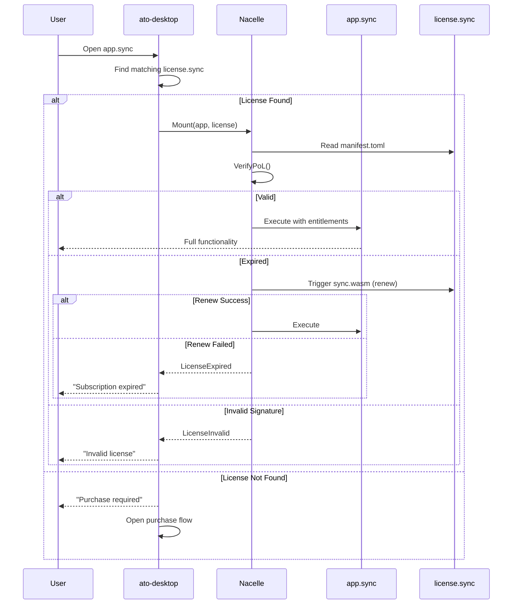
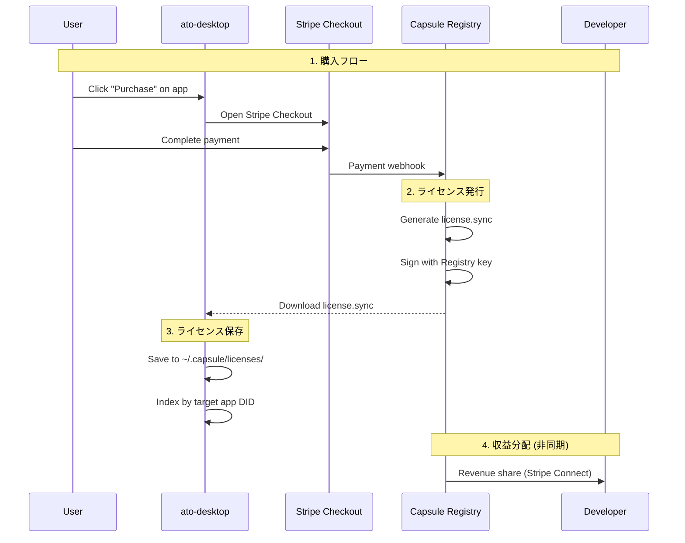

# License Protocol Specification

**Status:** v0.1 (Draft)  
**最終更新:** 2026-02-02  
**関連仕様:** [IDENTITY_SPEC.md](IDENTITY_SPEC.md), [SYNC_SPEC.md](SYNC_SPEC.md)

---

## 1. 目的

- **所有権の証明**: ユーザーがアプリ/コンテンツの利用権を持つことを暗号学的に証明する
- **オフライン検証**: ネットワーク接続なしでライセンスを検証可能にする
- **自己更新**: サブスクリプションの期限更新を `.sync` の仕組みで自動化する

---

## 2. スコープ

### 2.1 スコープ内
- `license.sync` カプセルの構造
- Proof of License (PoL) 検証ロジック
- Registry によるライセンス発行フロー
- オフライン検証とグレース期間

### 2.2 スコープ外
- 決済連携の詳細 → `REGISTRY_SPEC.md`
- 開発者ダッシュボード → Coordinator 仕様

---

## 3. ライセンスカプセル (`license.sync`)

### 3.1 概要

ライセンスは `.sync` カプセルとして発行・配布される。

**Content-Type:** `application/vnd.capsule.license`

**自己更新:** サブスクリプションモデルの場合、`sync.wasm` がライセンスサーバーと通信して期限を更新する。

### 3.2 manifest.toml 構造

```toml
# license.sync / manifest.toml

[sync]
version = "1.0"
content_type = "application/vnd.capsule.license"
display_ext = "license"

[meta]
created_by = "did:key:z6Mk..."   # 発行者 (Registry または Developer)
created_at = "2026-02-02T00:00:00Z"

[license]
# ライセンス付与先 (購入者)
grantee = "did:key:z6Mk..."

# 対象アプリ/コンテンツ
target = "did:key:z6Mk..."

# ライセンスタイプ
type = "perpetual"  # perpetual | subscription | trial

# 有効期限 (subscription/trial の場合必須)
expiry = "2027-02-02T00:00:00Z"

# 機能フラグ (オプション)
entitlements = ["pro", "cloud_sync", "priority_support"]

# 発行元メタデータ
issuer_name = "Capsule Registry"
issuer_url = "https://api.ato.run"

# ライセンス固有ID (重複発行防止)
license_id = "lic_abc123def456"

[policy]
ttl = 86400       # 24時間ごとに更新チェック
timeout = 30

[permissions]
allow_hosts = ["api.ato.run"]  # ライセンス更新サーバー
allow_env = []

[signature]
algo = "Ed25519"
manifest_hash = "blake3:..."
payload_hash = "blake3:..."
timestamp = "2026-02-02T00:00:00Z"
value = "<base64-signature>"
```

### 3.3 payload 構造

```
payload/
├── license.json      # 構造化ライセンスデータ (manifest の [license] と同等)
├── receipt.json      # 決済レシート (オプション)
└── terms.md          # 利用規約 (オプション)
```

**license.json 例:**
```json
{
  "grantee": "did:key:z6Mk...",
  "target": "did:key:z6Mk...",
  "type": "subscription",
  "expiry": "2027-02-02T00:00:00Z",
  "entitlements": ["pro", "cloud_sync"],
  "license_id": "lic_abc123def456",
  "issued_at": "2026-02-02T00:00:00Z"
}
```

### 3.4 sync.wasm (Subscription 用)

サブスクリプションライセンスの場合、`sync.wasm` は以下の処理を行う:

```
SYNC_MODE=pull の場合:
1. license.json から現在の expiry を読み取り
2. 残り日数が threshold (例: 7日) 以下なら更新リクエスト
3. POST https://api.ato.run/v1/licenses/{license_id}/renew
   - Header: Authorization: Bearer <device_token>
   - Body: { "grantee": "did:key:..." }
4. レスポンスの新しい license.json を stdout に出力
5. ランタイムが payload をアトミック更新
```

---

## 4. Proof of License (PoL) 検証

### 4.1 検証タイミング

| イベント | 検証 |
|---|---|
| アプリ起動時 | **必須** |
| 機能フラグ参照時 | 任意（キャッシュ利用可） |
| 定期チェック (hourly) | 任意 |

### 4.2 検証フロー



### 4.3 検証ロジック

```rust
// nacelle/src/license.rs

#[derive(Debug)]
pub enum LicenseVerificationResult {
    Valid {
        entitlements: Vec<String>,
        expiry: Option<DateTime<Utc>>,
    },
    Expired {
        expired_at: DateTime<Utc>,
        grace_remaining: Option<Duration>,
    },
    InvalidSignature,
    TargetMismatch,
    GranteeMismatch,
    MalformedLicense,
}

pub fn verify_license(
    license: &SyncArchive,
    app_did: &str,
    user_did: &str,
) -> Result<LicenseVerificationResult> {
    let manifest = license.read_manifest()?;
    
    // 1. 署名検証
    if !verify_signature(license)? {
        return Ok(LicenseVerificationResult::InvalidSignature);
    }
    
    // 2. ターゲット検証
    if manifest.license.target != app_did {
        return Ok(LicenseVerificationResult::TargetMismatch);
    }
    
    // 3. 所有者検証
    if manifest.license.grantee != user_did {
        return Ok(LicenseVerificationResult::GranteeMismatch);
    }
    
    // 4. 有効期限検証
    if let Some(expiry) = manifest.license.expiry {
        let now = Utc::now();
        if now > expiry {
            let grace_end = expiry + Duration::days(GRACE_PERIOD_DAYS);
            let grace_remaining = if now < grace_end {
                Some(grace_end - now)
            } else {
                None
            };
            return Ok(LicenseVerificationResult::Expired {
                expired_at: expiry,
                grace_remaining,
            });
        }
    }
    
    Ok(LicenseVerificationResult::Valid {
        entitlements: manifest.license.entitlements.clone(),
        expiry: manifest.license.expiry,
    })
}
```

### 4.4 グレース期間

| ライセンスタイプ | グレース期間 | 動作 |
|---|---|---|
| `perpetual` | なし | 期限なし |
| `subscription` | 7日 | 警告表示、フル機能利用可 |
| `trial` | 0日 | 即時停止 |

**グレース期間中の UX:**
- アプリ起動時に「サブスクリプションが期限切れです。更新してください」バナー表示
- 機能制限なし
- グレース期間終了後は起動拒否

---

## 5. ライセンス発行フロー

### 5.1 Registry 代理署名モデル (Phase B)



### 5.2 開発者直接署名モデル (Phase D)

将来的には、開発者が自身のサーバーでライセンスを発行する分散モデルをサポートする。

```toml
# app.sync / manifest.toml

[meta]
created_by = "did:key:z6MkDeveloper..."

[distribution]
# 開発者が運営するライセンスサーバー
license_server = "https://licenses.myapp.example.com"
# 支払い方法
payment_methods = ["stripe", "btc_lightning"]
```

---

## 6. ライセンス管理 (Desktop)

### 6.1 保存場所

```
~/.capsule/
├── licenses/
│   ├── <license_id>.sync          # ライセンスカプセル
│   └── index.json                  # インデックス
```

**index.json 構造:**
```json
{
  "licenses": [
    {
      "license_id": "lic_abc123",
      "target": "did:key:z6MkApp...",
      "type": "subscription",
      "expiry": "2027-02-02T00:00:00Z",
      "file": "lic_abc123.sync",
      "last_verified": "2026-02-02T00:00:00Z"
    }
  ]
}
```

### 6.2 Tauri Commands

```typescript
// Frontend API
invoke('license_list') → License[]
invoke('license_get', { appDid: string }) → License | null
invoke('license_import', { path: string }) → License
invoke('license_refresh', { licenseId: string }) → License  // sync.wasm 実行
invoke('license_remove', { licenseId: string }) → void
```

### 6.3 UI コンポーネント

**Settings > Licenses:**
- ライセンス一覧表示
- 有効期限の視覚化
- 手動更新ボタン
- ライセンスファイルのインポート

---

## 7. entitlements (機能フラグ)

### 7.1 概念

`entitlements` は、ライセンスが付与する機能/権限のリスト。

**例:**
- `"pro"` - Pro 機能の解放
- `"cloud_sync"` - クラウド同期機能
- `"export_pdf"` - PDF エクスポート
- `"unlimited_projects"` - プロジェクト数無制限

### 7.2 アプリ側での参照

```rust
// App の sync.wasm または Host Bridge 経由

fn check_entitlement(name: &str) -> bool {
    // nacelle が環境変数として注入
    let entitlements = std::env::var("CAPSULE_ENTITLEMENTS")
        .unwrap_or_default();
    entitlements.split(',').any(|e| e == name)
}
```

**環境変数注入:**
```
CAPSULE_ENTITLEMENTS=pro,cloud_sync,export_pdf
```

### 7.3 Graceful Degradation

アプリは entitlement がない場合も起動可能であるべき（Free tier として動作）。

```javascript
// Web アプリの例
if (hasEntitlement('export_pdf')) {
  showExportPDFButton();
} else {
  showUpgradePrompt();
}
```

---

## 8. 実装チェックリスト

### 8.1 Phase B-1: license.sync フォーマット

- [ ] manifest.toml スキーマ定義
- [ ] `capsule-core` に License 型追加
- [ ] license.json パーサー
- [ ] sync.wasm テンプレート (renewal)

### 8.2 Phase B-2: nacelle 検証ロジック

- [ ] `verify_license()` 実装
- [ ] グレース期間ロジック
- [ ] entitlements 環境変数注入
- [ ] 検証結果のキャッシュ

### 8.3 Phase B-3: Desktop 統合

- [ ] licenses/ ディレクトリ管理
- [ ] index.json 管理
- [ ] Tauri Commands 実装
- [ ] Settings UI

### 8.4 Phase B-4: Registry 連携

- [ ] 発行 API 仕様
- [ ] Webhook 処理
- [ ] 署名ロジック

---

## 9. セキュリティ考慮事項

### 9.1 ライセンス偽造防止

- **署名必須:** すべてのライセンスは発行者の秘密鍵で署名される
- **発行者検証:** アプリの manifest に `trusted_issuers` リストを記載可能

### 9.2 ライセンス共有防止

- **Grantee 検証:** ライセンスは特定の `did:key` に紐付け
- **デバイス制限:** 将来的に `device_id` フィールドを追加可能

### 9.3 失効対応

- ライセンス失効は `expiry` の即時設定で対応
- グレース期間中に `sync.wasm` が失効フラグを取得

---

## 10. 未決事項

### 10.1 ライセンス転送

- ユーザー間でのライセンス譲渡をサポートするか？
- 案: `transfer_allowed = true` フラグと転送トランザクション

### 10.2 Family Sharing

- 複数デバイス/ユーザーへの共有
- 案: `grantee` を複数 DID のリストにする

### 10.3 Volume Licensing

- 企業向け一括ライセンス
- 案: `grantee_pattern = "did:key:org:*"` のようなワイルドカード

---

## 11. 参照

- [IDENTITY_SPEC.md](IDENTITY_SPEC.md) - 署名と DID の詳細
- [SYNC_SPEC.md](SYNC_SPEC.md) - `.sync` カプセルの基本仕様
- [TRUST_AND_KEYS.md](TRUST_AND_KEYS.md) - 失効と信頼モデル
