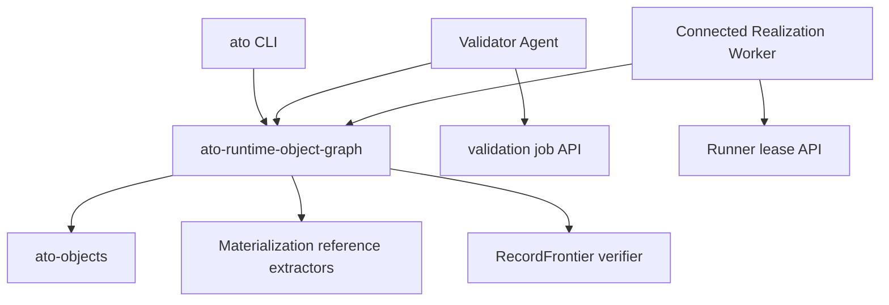

# Runtime Object Graph Agents

Status: Draft

## Context

Content-addressed upload validation and hosted restore are separate trust
boundaries, but both must apply the same semantic graph checks. Keeping the
wire types and traversal logic in `ato-cli` made it impossible for a Validator
Agent or Connected Realization Worker to validate independently without
copying application logic.

This RFC adds no Semantic Core noun. It defines an application component over
existing Computation, Materialization, RecordFrontier, Port, and Binding
objects.

## Decision

`ato-runtime-object-graph` owns:

```text
transport adapter
  -> index bytes + declared object bytes
  -> isolated FsObjectStore
  -> decoded reference registry traversal
  -> exact declared/derived closure comparison
  -> VM target + RecordFrontier verification
  -> derived Port/Binding/materialization report
```

The CLI, Validator Agent, and Connected Realization Worker depend on this one
component. HTTP authentication and lease/job authorization remain adapters at
the application boundary.

The Validator Agent receives only `CAPSULE_VALIDATOR_AGENT_TOKEN`. It does not
receive a Runner token, user session, KVM access, or Firecracker control.

## Dependency direction



The shared application crate may depend on extension schemas needed to decode
physical descriptors. None of those dependencies point back into the
application layer.

## Validation rules

1. Verify index digest and canonical JCS before using its declarations.
2. Download every declared object into a new filesystem CAS.
3. Verify object length and content identity on insertion.
4. Traverse decoded Computation and Materialization content using the standard
   reference registry. Declared `references` never drive traversal.
5. Require exact equality between derived and declared closure.
6. Require VM descriptor target equality with the graph root.
7. Verify the complete RecordFrontier segment, order, watermark, causal-cut,
   and payload closure.
8. Derive exported Ports from the root Computation boundary and required
   Bindings from the resolved runtime residual. Require equality with the
   transport summaries.

## Testing strategy

- Unit tests use an isolated in-memory source and filesystem destination.
- Adversarial tests forge semantic references, VM target, RecordFrontier
  watermark/closure, Port summaries, and downloaded object bytes.
- HTTP adapters are covered separately from semantic validation.
- Staging acceptance must prove that rejection came from the agent process,
  then delete the private malicious graph.

## Consequences

- Validator PASS and Runner-local PASS remain independent trust decisions.
- CLI upload performs the same checks before transport.
- Adding a semantics or Materializer requires registering its reference
  extractor once in the shared application component.
- This RFC does not change ComputationRef, Record, RecordFrontier, or
  Materialization identity.
