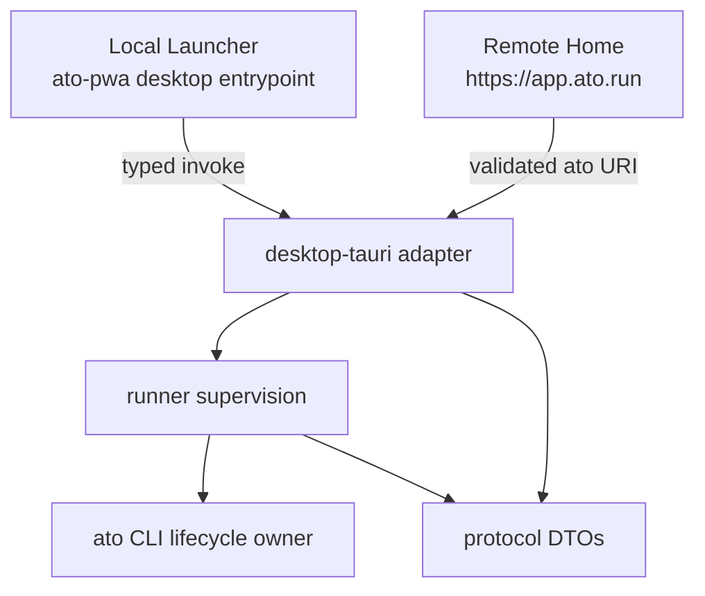

# Tauri Desktop Migration

## Context

The GPUI + Wry Desktop remains the reference implementation for installed-app,
revision, and session lifecycle behavior. The Tauri migration must not fork
capsule execution or introduce a second owner of `~/.ato` state.

The original `feat/tauri-migration` branch established useful boundaries but
predated the current lifecycle model. The migration is therefore reconstructed
from current `main`; the old branch is a donor, not a branch to rebase.

## Decision

1. `ato` CLI remains the sole capsule execution and lifecycle owner.
2. `runner` contains host-independent process supervision and retention policy.
3. `protocol` contains transport-neutral DTO and intent vocabulary.
4. `desktop-tauri` is a composition root and native adapter only.
5. `ato-pwa` produces a separate offline Launcher entrypoint. The browser PWA
   and Desktop Launcher do not share routing, auth state, or window lifecycle.
6. The GPUI Desktop is retained until parity is demonstrated.

Dependency direction is inward: Tauri depends on `runner` and `protocol`;
neither crate depends on Tauri, GPUI, Wry, React, or WebView types.

## Window trust model

| Window | Content | Native capability | Allowed top-level navigation |
|---|---|---|---|
| `main` | bundled Launcher assets | yes | local asset origin only |
| `home` | `https://app.ato.run` | no | exact trusted HTTPS origin only |
| `app:*` | capsule session surface | no | the launched loopback HTTP(S) origin only |

The `main` capability is defense in depth, not the sole authorization check.
Every custom command verifies the caller label. Remote Home communicates using
an `ato://` navigation intercepted and classified by Rust; JavaScript cannot
submit a pre-classified privileged enum.

External HTTP(S) navigations are cancelled in the WebView and sent to the OS
browser. `atoview://` is unavailable as a top-level navigation. Its native HTTP
client accepts only one-label `*.app.ato.run` session hosts over HTTPS and
revalidates every redirect target.

## Frontend materialization

`ato-pwa` owns the source and produces `dist-desktop/index.html` through
`npm run build:desktop`. `desktop-tauri/build.rs` runs that declared build and
copies the result into its ignored `frontend/` materialization directory before
Tauri embeds the assets.

The source checkout therefore contains declarations and source only; generated
assets are materialized at build time. `ATO_DESKTOP_PWA_DIR` may point to a
non-sibling checkout. `ATO_DESKTOP_SKIP_FRONTEND_BUILD=1` is an explicit opt-in
for release jobs that already staged a verified frontend.

## Testing strategy

- `protocol`: DTO serialization and intent parser unit tests.
- `runner`: fake-host supervision tests plus native process-group teardown.
- `desktop-tauri`: caller-label, exact-origin, URI fail-closed, redirect, and
  proxy host-allowlist unit tests.
- `ato-pwa`: TypeScript checking and a production Desktop build.
- Integration: build with no pre-existing `desktop-tauri/frontend` directory.
- Parity gate: existing GPUI Desktop test result must remain unchanged.

## Runner command boundary

`RunnerHost::spawn` is reserved for supervised, long-lived children.
Short-lived CLI operations use `RunnerHost::run_to_completion(CommandSpec)` and
return exit code, stdout, and stderr as `CompletedCommand`. This separation
prevents a session from filling an undrained capture buffer while still giving
JSON commands a deterministic response boundary.

`InstalledAppsClient` owns the `ato app installed ...` command vocabulary.
`SessionClient` owns `ps`, detached launch, and stop. Window focus is injected
as host presentation policy and never implemented by the CLI or runner crate.

The Tauri adapter emits these stable event names after operations:

- `desktop://library-changed`
- `desktop://session-changed`
- `desktop://operation-progress`
- `desktop://operation-failed`

## Installed library CLI contract

Desktop shells do not read the instance store, installed-state SQLite DB, or
session record directory directly. The CLI exposes:

- `ato app installed list --json`
- `ato app installed inspect <install-profile-key> --json`
- `ato app installed remove <install-profile-key> --json`
- `ato app installed remove <install-profile-key> --purge-state --json`

Install sources are likewise explicit CLI lanes owned by `ato`, never by the
shell:

- Store: `ato install <publisher/slug> ...`
- GitHub: `ato install --from-gh-repo <owner/repository> ...`
- local source tree: `ato install --from-local <directory> ...`
- local artifact: `ato install --from-capsule <file.capsule> ...`

The local-artifact lane derives capsule name and version from the capsule
artifact, assigns the non-registry `local` publisher namespace, and enters the
same install finalization path as Store and GitHub. This preserves the shared
installed-app/profile/revision identity derivation instead of creating Desktop
records directly.

Their shared wire types live in `protocol::desktop_library`. Card identity is
always `install_profile_key`; handle, revision, and session identities are
metadata only. Reads fail closed on corrupt revision metadata. Remove refuses a
live profile. Normal remove archives the final app registration but preserves
app-owned state and immutable revisions. `--purge-state` additionally removes
app-owned state and the profile's installed-state ledger rows; it is refused
while another profile of the same app remains. External state-binding target
directories are never deleted by this command.

## Consequences

### Positive

- Framework and UI migration cannot change capsule execution semantics.
- Remote web content has no direct native command surface.
- The Launcher starts offline and can evolve independently from Home.
- Existing GPUI lifecycle behavior remains available for parity comparison.

### Cost

- The Desktop build currently requires sibling `ato` and `ato-pwa` checkouts or
  an explicit `ATO_DESKTOP_PWA_DIR`.
- Native dialogs are required for install approval and destructive removal, so
  a compromised bundled document cannot silently approve a mutation.
- Linux bundle validation requires a native Linux CI runner because WebKitGTK
  and DBus cannot be meaningfully cross-linked from macOS.

## Phase 0/1 acceptance

- [x] Reconstruct integration branches from current `main`.
- [x] Restore `runner`, shared protocol DTOs, and `desktop-tauri` without
  changing the GPUI Desktop implementation.
- [x] Produce a separate offline Desktop Launcher build.
- [x] Separate local Launcher and remote Home windows.
- [x] Deny native commands from non-`main` callers.
- [x] Pin Launcher and Home top-level navigation origins.
- [x] Revalidate `atoview://` redirects.
- [x] Add the host-agnostic one-shot command and typed client boundary.
- [x] Add Installed Apps read/remove model through CLI JSON contracts.
- [x] Register Installed Apps/session commands in the Tauri adapter and emit
  lifecycle events.
- [x] Add `app:*` windows and lifecycle parity.
- [x] Add multi-platform bundle/release CI.

## Phase 2–6 acceptance

- [x] Install from Store, GitHub, local source trees, and local `.capsule`
  artifacts through typed CLI lanes.
- [x] Persist the Launcher library through CLI-owned installed state.
- [x] Keep Launch, Focus, Close (hidden warm retention), and Stop as distinct
  operations.
- [x] Limit remote Home handoff to a validated
  `ato://desktop/install?kind=store|github&source=...` intent.
- [x] Keep all Tauri commands unavailable to remote Home and guest windows;
  commands also reject every caller label other than `main`.
- [x] Serialize Desktop inspect/launch to enforce single-instance focus and
  stop a newly launched session if its window cannot be presented.
- [x] Supervise runner and install children as process groups; cancellation,
  readiness failure, shell shutdown, and retained-session expiry reap owned
  processes.
- [x] Add Launcher app detail, revision update/rollback, repair, and native
  confirmed remove/remove-with-data flows.
- [x] Bundle `ato` and `ato-netd`; define native macOS, Windows, and Linux
  bundle jobs.
